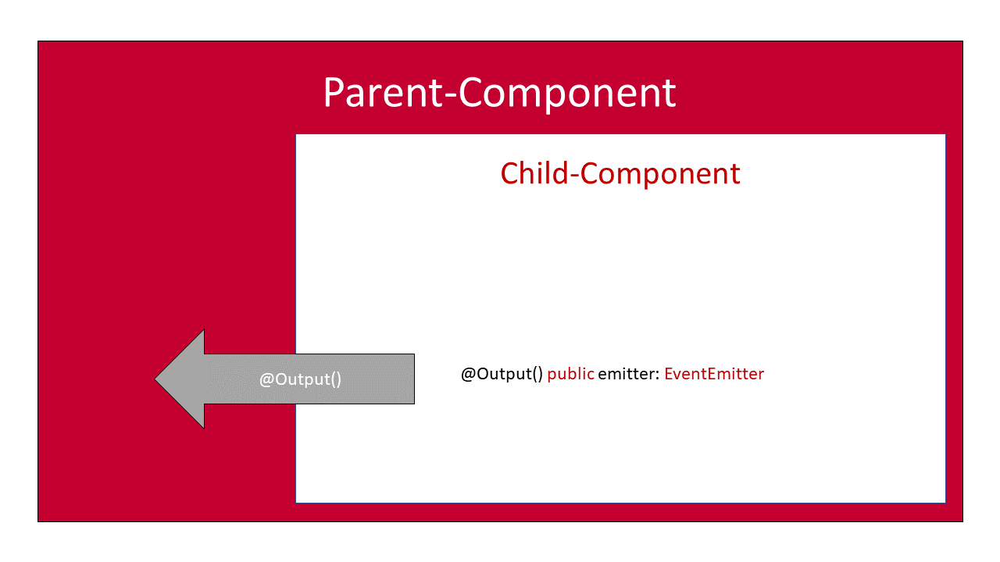

You want to learn how to build Angular applications?

You have come to the right place!

In this getting started tutorial, I want to take you by the hand and give you a gentle introduction to the angular ecosystem.

We will start from scratch and build our first example angular app.

You will discover the angular fundamentals step by step with a practical example on each topic.

This guide aims at giving you a quick start, as well as explaining angular concepts in detail.

It does not require any knowledge in AngularJs or Angular (the current version) at all.

After reading this angular tutorial, you will be able to write your own, fully featured angular applications with ease. You will know about all the critical part of such an app and know exactly what they are doing.

Ready?

Let's get started!


## What is Angular?

Let's see, what the angular developers have to say about that:

> "Angular is a platform that makes it easy to build applications with the web. Angular combines declarative templates, dependency injection, end to end tooling, and integrated best practices to solve development challenges. Angular empowers developers to build applications that live on the web, mobile, or the desktop"
> [https://angular.io/docs](https://angular.io/docs)

Sounds great, doesn't it? But what does this all mean?

### Single Page Applications

Basically, when people talk about Angular, they talk about it as a JavaScript framework. It is used to build so-called Single Page Applications (SPA). These SPA's typically (but not only) use the browsers JavaScript environment to emulate the behavior of normal websites. But they are so much more...


Because they don't rely on a server at all, they can do things, that we would expect from native applications. They have the ability to manage their state completely client-side, enabling a richer and much more fluent user experience.

Furthermore. server-round-trips can be avoided to a bare minimum, resulting in an overall more responsive application.


Thanks to technologies like [Service Workers](https://malcoded.com/posts/angular-service-worker) and [Progressive Web Apps](https://developers.google.com/web/progressive-web-apps/), these applications can become almost indistinguishable from native applications, especially on mobile (Android) devices.

### The Framework

The Angular framework enables us to write these single page applications with ease. It comes with features like data-binding, change-detection, forms, routing & navigation and an HTTP-implementation right out of the box.

Angular was originally intended to be used with the programming languages JavaScript, TypeScript and Dart. And although it is still possible to use it with all of these languages, the by far most popular language of choice became TypeScript.

I would highly recommend using TypeScript, as the other versions are not only lacking documentation and community, but updates are also released much later (months not days) than for the TypeScript version.

### The Platform

Over time, the angular developers have developed a great ecosystem around the framework.

Tools like the Angular-Cli, Angular Universal and Angular Material got added to the project. These tools added great features like fast project generation, server-side rendering, and stunning UI components, that are not coupled with the core-framework itself, but completely optional.

That is why angular is referred to as a platform. It provides all the tools, that you need, to develop great angular applications, without relying too much on third-party libraries. Because of this opinionated approach, most developers are using these tools, resulting in a great documentation, community help, and blog posts.


## Is it called AngularJS or Angular 7?

Maybe one of the greatest downsides of angular, to me, is the version and naming chaos that emerged after the Angular 2 release. Google decided to row back from the terms Angular 2, Angular 4, Angular 5, but to refer to them as just "Angular".

Don't get me wrong, having the universal "Angular" name for all version 2+ was the right decision, in my opinion. But this more general term makes searching (Google etc.) and finding the right information really hard.

Not only do people still get confused between AngularJS(v.1.x.x) and Angular (2+), but also use the "Angular 2", "Angular 4" and "Angular 5" terms in their posts and articles and especially headlines.

Furthermore, you also get AngularJS results, when searching for angular terms. At least this problem can be solved though...

### Removing AngularJS from your Search

You can easily exclude AngularJS search results form your search by using Google's search operators. By appending -angularjs to your search term, you only get true angular results. This can be a huge lifesaver!

### Just Call it Angular!

At this point, I would like to suggest, that you always refer to angular version 2 or higher as just angular. This greatly increases search-ability and communication in the angular community. Of course, you can and should clarify the version if you are using features that rely on a certain version. Maybe just don't do so in your article's title...


## The Angular-CLI & our first App

Let's talks about my favorite topic: The angular-cli !

I mentioned it already in the introduction. Angular-land was once covered in darkness, terrorized by wild seed-projects and a number of build tools. No seriously, it was not all bad. But I think the angular-cli made things a lot better. So what is this mysterious angular-cli .

CLI stands for command line interface and the angular-cli is literally that. A small tool that can be used via the command line.

### Generating a Project with the Angular-CLI

The most common use case for it is the generation of new angular projects. A typical angular project consists of a bunch of files. That much, that we don't want to create them by hand, every time we start a new project.

That is why the seed-projects on GitHub existed and still exist. The pure laziness of the developers... :D

Fortunately, the angular-cli can resolve that issue by generating all that files for us. When it is done, we have a basic angular project, that is already run-able and contains all we need to continue.

To use the angular-cli, you need to have [Node.js](https://nodejs.org/en/) & [npm ](https://docs.npmjs.com/getting-started/what-is-npm)installed on your machine.

You can then install the cli using [npm](https://docs.npmjs.com/getting-started/what-is-npm), by typing the following command into your command line:

```
 npm install -g @angular/cli

```

This tells [npm](https://docs.npmjs.com/getting-started/what-is-npm), to install the angular-cli on your machine. The -g flag is used to install it globally, accessible from every directory on your computer.

Afterward, we can go ahead and create a new project. For that, open a command line in the directory you want to create your project in.

Using the ng new command, we can then generate a new project. This command takes the name of the project as a parameter. I this case "angular-project".

```
 ng new angular-project

```

### Flags of ng new

We can use additional flags with ng new, to alter the output accordingly. If you are new to angular, I recommend not to use any of these flags.

**\-\-directory:**
Normally, the angular-cli creates a new folder that is named like the project in the current directory. It then generates the project files inside of that directory. With this command, you can change the name of the folder.

**\-\-dry-run:**
Using this option, the angular-cli will not make any changes to your file system. It will print the changes it would have made to the console. That way you can check if the result would be as you want. Very useful option, especially when getting started.

**\-\-inline-style:**
Using angular, you can choose, whether you want to use inline css styles or a separate style-sheet file. The default is the separate file and I would definitely recommend that. Only use this flag if you want inline styles.

**\-\-inline-template:**
Just as you can choose to inline your css, you can do the same with your html. The default is a separate html file and you should really keep that! It get's really messy, really fast otherwise. Only use this flag if you want inline html templates.

**\-\-minimal:**
Just as you would expect, creates a minimalist angular application. Maybe not the best option to start with, but can be useful, to reduce unnecessary bloat files.

**\-\-prefix:**
Every component in angular has a so-called selector that is later used in the html template to create a component. These selectors usually have a prefix, to avoid duplicate names. The default prefix is "app". Use this flag to change that.

**\-\-routing:**
Generates an additional module to contain the angular routing definitions. This is turned off by default.

**\-\-skip-commit:**
The angular-cli does not only initialize a Git repository for your project by default but also issues a commit after file generation is done. Use this option to turn that off.

**\-\-skip-git:**
Turns off the automatic Git repository initialization for your project.

**\-\-skip-install:**
After creating all files, the angular-cli runs an npm install command, to download and install all required dependencies. Because this process can take a while, it can be very useful to turn that behavior off. Especially when there is no or a bad internet connection.

**\-\-skip-tests:**
Per default, the cli generates test files for each component (.spec files). With this option, you can turn that off. Who needs tests anyway (sarcasm)?

**\-\-source-dir:**
The cli generates all source files inside of an "src" directory. With this flag, you can change the directory for your source files.

**\-\-style:**
The angular-cli leaves it up to you, whether you want to use a css pre-compiler. It generates plain css files per default. With this option you can change that. Possible values are css, scss, less, sass, styl (stylus).

**\-\-verbose:**
Enables advanced detail logging.

### Generating Angular's Building-Blocks

The angular-cli can do more for you than you might think. You can not only generate entirely new projects, but also the fundamental "components" of an angular application, like classes, components, modules, service and pipes.
The full list includes:

- Component
- Directive
- Pipe
- Service
- Class
- Guard
- Interface
- Enum
- Module

All these structures can be generated using the ng generate (ng g in short) command. For example this command:

```
 ng g module new-module
```

It generates a new module called new-module.

```
 ng g component my-new-component

```

This generates a new component with the name my-new-component.

Using these commands, the cli creates one or more files, that contain the necessary boilerplate code already.

I really like this feature of the cli, because it reduces a lot of repetitive work. It almost feels like visual studio grade tooling, that enables you to move along that much quicker.
I can imagine, that this is especially useful for beginners, as you don't have to know the structure of a "component" by heart immediately.

If you are using Visual Studio Code, I highly recommend the [Angular Files extension](https://marketplace.visualstudio.com/items?itemName=alexiv.vscode-angular2-files). It wraps all these commands behind a nice user interface inside of the editor.

### Running your Angular Application with the CLI

Generating new code is not everything the CLI can do. The CLI also helps you to start (serve) your application. All we need to do is to call the ng serve command.

```
 ng serve

```

This command will run your application in a debug configuration. This means, that your app is not compiled ahead of time, so everything stays nice and human readable. Also, metadata like the source-maps are generated and served with the application to enable a nice debugging experience.

Also, there are no files created on your disk. The debugging server keeps them all in memory only.

However, if you want to ship your application, the CLI helps you with that, as well. You can either serve your app in production mode, by using the \-\-prod flag,

```
 ng serve --prod

```

or write your application files to disk using

```
 ng build --prod

```

The prod-flag will cause the CLI to use [ahead-of-time compilation](https://angular.io/guide/aot-compiler) (AOT). Additional bloat like source-maps are not included in the build.

It is important to know, that the server, that comes with the angular-cli , is not intended to be an internet-facing production server. It is just for debugging and testing purposes. So even if you use ng serve \-\-prod, this is just for testing, not for actual production.

### Common Flags of ng serve

**\-\-port \[port-number\]:**
This comes in handy, if the default port (4200) is already in use, e.g. when running multiple CLI-projects at one. With this flag, you can change the port over which your application is served.

**\-\-host:**
With this options, you can change the host of your application. The default is localhost, which prevents your application to be accessible from the local network. Change this to your network ip-address, to make it accessible. Again, the server is not meant to be used as a production server. This option is useful if you want to test your application on other devices e.g. your phone.

A [full list of possible options can be found here](https://github.com/angular/angular-cli/wiki/serve).

### Building your Angular Application

If you want the CLI, to write your application files to disk, use the

```
 ng build

```

command.

Just like the serve command, the build command does build the debug configuration by default. If you want a production build, use the \-\-prod flag.

### Common Flags of ng build

We have already discussed the \-\-prod flag. The \-\-prod flag is a preset, that includes a bunch of default values of different options. Depending if you build for dev or prod, these presets apply. I do not recommend to change these presets, unless you know what you're doing. No seriously, in almost all of the cases, the default presets are working just fine.

If you want to learn more about each option, here is [the complete list](https://github.com/angular/angular-cli/wiki/build).

Task: To continue, please generate a new project in a directory of your choice. Do you remember how to do so?


## Angular Project Structure

Now that we have a fresh angular-cli project in front of us, let's take a closer look, what it consists of.

### e2e-directory

This directory is used to create and configure end-to-end (e2e) testing. In short, with end-to-end testing, we test the interaction of separate parts of our application, including calls to the back-end etc. Basically, the application is tested, like a user would use it.

Angular is using [Protractor ](http://www.protractortest.org/#/)for end-to-end testing. Protractor is e2e testing framework, that was built specifically for angular.

This directory is only relevant if you want to do testing. Otherwise, you can ignore this directory.

### node_modules-directory

If you have used npm or yarn with other projects before, this folder should be familiar.

When your package manager installs all the dependencies (of Angular or third party ones) on your machine, it does so in the node_modules directory. If you take a look inside of that folder, you will find many sub-directories, that are named after the name of the package.

For example, you should see a folder called @angular right at the top. This folder contains all the packages related to the official angular project. Third party libraries for angular are not installed inside of here, but in a separate folder, because they are not part of the angular collection.

It is normal for this directory to be a couple hundred megabytes in size.

### src-directory

As you would expect, all the source-code of the actual application is located inside the src-directory.

### src/app-directory

Inside of the app directory, you place all files that alter the look or functionality of your application. This includes components, modules, services, guards and pipes.

If you take a look inside, you will notice, that the CLI has already generated a component called AppComponent for us. It consists of three files (app.component.ts, app.component.html & app.component.css). It also created a new module here, called AppModule (app.module.ts).

### src/assets-directory

You can place assets, that are required for your application, inside of this folder. Assets include images, icons, fonts & more. The CLI will serve these files together with you application.

### src/environments-directory

Does contain files, that define the environment variables of your application.

### src/index.html

The base version of your index.html. This is the root file of your application, as it is the only html file, that is delivered to the browser. However, it is not served as is. The CLI will add code to this file (the script tags for the angular JavaScript files) at build time.

This file does contain all the meta information of your app. It also has to contain the tag of your app's root element inside of the body. The default is

```
 <app-root></app-root>

```

Aside from that, it is just a normal html-file, you can edit however you like.

### src/main.ts

The main.ts file is the entry point of your angular application. All that is in here, is the function call to actually bootstrap the application itself. You can specify here which angular module should be bootstrapped. Normally, this is the AppModule

```
 platformBrowserDynamic().bootstrapModule(AppModule);

```

### src/polyfills.ts

Polyfills are little JavaScript snippets, that re-implement JavaScript features for older versions of JavaScript. By adding these polyfills to your application, you get the benefit of using modern JavaScript language features, without losing the compatibility to older browsers.

Angular itself relies on polyfills to work properly for example on Internet Explorer 11 or older.

This file is meant to be a template for you, to add polyfills as needed. It already contains all the necessary import statements, but most are the are commented out. That way, you can decide if you want to support legacy browsers at all and at which level.
It also includes great documentation, when to use which module to support browser x with version y.

### src/styles.css

This is the global stylesheet. Styles defined in here are applied to the whole application.

### src/test.ts

This is like the main.ts, but for testing. It contains additional configuration required for Karma unit tests.

### src/tsconfig.app.json

This is a typescript configuration file, that includes information, how the TypeScript should be compiled to JavaScript. You can read [more about the tsconfig.json here](https://www.typescriptlang.org/docs/handbook/tsconfig-json.html).

### src/tsconfig.spec.json

Same as tsconfig.app.json. This configuration gets only applied when testing.

### .angular-cli.json

This is the main configuration file for the angular-cli . Inside of here, you can change almost every default behavior of the CLI. This is especially useful if you want to use a different folder structure. Then you can tell the CLI, where the essential files, like the main.ts are located.

You can also define more than one application in here. This is useful if you want a build file, that is specific for server-side rendering. More on that in the chapter about angular universal.

### .gitignore

This file is not specific to angular, but for the git version control system. Inside of this text-based file, you can define the files and folders, that should not be included in version control. An example for that is the node_module folder, which should not be included in version control.

Also, files that contain sensitive information, like API-keys, have to be strictly excluded. Otherwise, you risk leaking this information.

The CLI has already filled this file with a typical configuration for angular projects.

### karma.conf.js

A configuration file for the [Jasmine unit testing framework](https://jasmine.github.io/) and the [Karma test runner](https://karma-runner.github.io/1.0/index.html).

### package.json

The package.json file stores all the metadata about your application. It does contain the name, the version and the license of your project. Of course, it is up to you to change these accordingly.

It also contains information about all the dependencies of your application, which makes it kind of important. This file is what package managers like npm or yarn use, to install all the required dependencies. These dependencies are then downloaded into the node_modules directory.

I recommend you do not change any of these dependencies by editing the file directly unless you know exactly what you are doing. I have rendered countless of my projects useless, in the beginning. Once broken, it can be pretty hard recovering from that, especially if you are a beginner.

### protactor.conf.js

Again, a file to configure a test framework, This time it is for [protractor](http://www.protractortest.org/#/), the tool used for end-to-end (e2e) testing.

### tsconfig.json

This is a typescript configuration file, that includes information, how the TypeScript should be compiled to JavaScript. You can read [more about the tsconfig.json here](https://www.typescriptlang.org/docs/handbook/tsconfig-json.html).


## Convention over Configuration

Angular is an opinionated framework. What does that mean?

It means, that the developers of angular, had a clear way in mind, how things should be done. The whole framework is designed to make things as easy as possible if you stay on the way.

This can be beneficial for numerous reasons.

First, you don't have to come up with a solution yourself. Because other people have thought before you about certain problems, you can just follow their example and implement things exactly like they did. That does not only save time but headaches as well.

Second, it is very good for finding information online. Because almost everybody is doing it the same way, people can focus on writing good tutorials and guides instead of figuring out new genius ways. This results in a very consistent knowledge-base.

Last, there is the aspect of team communication. Hiring a new angular developer? Chances are, that he is developing angular in exactly the same way, your team is doing already, making him an immediate fit for the team.

### The Cost

The cost could be the reason, you are reading this tutorial. It appears to be relatively hard for developers to get started with angular, because you have to get used to all the implications and conventions first.

Don't worry. Once you got used to the angular way of things, developing applications gets that much easier!

Another problem emerges, if you don't like the way, stuff is done in angular. While you can always do your own thing using angular, it becomes that much harder.

So here is my advice:

If you don't want to follow the conventions of angular (or any other opinionated framework) just leave it!

There are plenty of other great JavaScript frameworks, that can do exactly the same things angular can do. And don't let yourself get confused by all of these "framework vs. framework" bullshit out there. It is not a question about functionality anymore.

It is just about personal taste, and I think that is a good thing!


## Angular Components

In programming, we are always told to split up things. We separate our code into namespaces, classes and functions. We even split our problems into many small problems, to be able to solve them better. That is what we are good at.
Concentrating on one thing at a time.

It does not only help us to build things faster, it also gives us a feeling of structure and tidiness. Instead of trying to build a house all in one giant effort, we instead create these small building blocks called bricks. They are not only much better to transport, place or rearrange, but are also incredibly easy to make. At least compared to creating a house in one go.

That is what components are in angular. They are small building blocks, that, once arranged together, result in a beautiful and functional application. They are flexible and easy to use and most importantly fast to create.

Not only that, but they tidy up our application incredibly, as the abstract things away. The bricklayer does not care what the brick is made of when he places it on the wall. It's just a brick.

The same goes for the component. We just place them in our application. Let's say we have a super shiny button. Once we have built our super shiny button, it becomes irrelevant how that button works internally. All we then want to do is to place it where we want it to go. Done!

### What Components look like

So what do components look like in angular.

Components in angular consist of three things/files.


#### TypeScript File

First a TypeScript file, containing the component itself. It contains a class, that is marked as a component by the @component decorator. You may know the decorator concept from other languages like Java (annotations) or C# (attributes). A decorator is basically metadata (data about data) about the class. With the @component decorator, we tell angular, that this class should be considered a component. This file is the heart of the component, because the location of the other two files is described in here.

When looking at angular files, identifying the components is really simple. That is because every developer is following a so-called naming convention. Or at least everybody should. Again: Convention over Configuration.
This convention is the rule of naming every file, that is related to a component in the same way.

The file we are currently talking about, the TypeScript file, is typically named like this:

```
{name of the component}.component.ts
```

You should always call your files after this convention.

This is what a naked component called "example" looks like:

```typescript title=example.component.ts
import { Component } from '@angular/core'

@Component({
  selector: 'app-example',
  templateUrl: './example.component.html',
  styleUrls: ['./example.component.css'],
})
export class ExampleComponent {}
```

#### The Html-Template

The second file is the template file. Although the template does not have to be located in a separate file, I recommend that you do so. This does not only enable your development environment to give you html-syntax highlighting but clearly separates the view from the business logic.

Because that is what a template is. An html-representation of the view. Everything that has to do with displaying stuff on a screen should go inside of the template.

A template in angular does look like a normal piece of html, but it is not. Its syntax has been extended to allow for custom component selectors, data-binding and directives. We will discuss that in detail in the chapter "Templates & Directives". It is just important to note, that browsers are not able to fully understand the bare template. It has to be interpreted by the angular framework first.

The template file does follow the same naming convention as the component-file itself. It starts with the components name, followed by the word component and finally the file extension all separated by a full-stop.

```
{name of the component}.component.html
```

The template file is typically placed right next to the other component files. One component typically has its separate folder.
Technically it does not have to be this way, because you can change the location of the template file in the components decorator. Just change the "templateUrl" option to you templates location.
Again, I do not recommend to do so.

Here is what the CLI creates when it creates a new component.

```html title=example.component.html
<p>example works!</p>
```

#### The Stylesheet

The last file for a component is the stylesheet. Well, you already guessed it, it contains your css-styles.

One thing to notice may be, that the styles of a component are scoped by default. That means, that if you have two components that both have the css-class "container" (that are supposed to look different= do no interfere with each other.
You can also disable this behavior using the [encapsulation ](https://blog.thoughtram.io/angular/2015/06/29/shadow-dom-strategies-in-angular2.html)option in the components decorator.

Again, the file follows the same naming convention.

```
{name of the component}.component.css
```

As stated before, you do not have to use plain css but can also use pre-processed formats like scss.

### Creating a new Component

To give you an example, we are going to create an actual component step-by-step. Let's pick up the example of the shiny button, we've used before. Just for demonstration purposes.

Let's make a button, that has a random color and changes its color, every time it is clicked.

First, we need to create a new component. As we have learned in the section about the angular-cli, we can do so, by using the ng generate command. So if we want to call our component ShinyButtonComponent, we need to use the following command.

```
 ng generate component shiny-button

```

Now that we have our component scaffold out, we can start implementing our behavior. The first thing we need to implement is a method, that is generating a random hex color. We call this method generateRandomColor. It is not to important to understand what this method exactly does at this point. Just add it to your application.

Here is what your component should look afterward.

```typescript title=src/app/shiny-button/shiny-button.component.ts
import { Component, OnInit } from '@angular/core'

@Component({
  selector: 'app-shiny-button',
  templateUrl: './shiny-button.component.html',
  styleUrls: ['./shiny-button.component.css'],
})
export class ShinyButtonComponent implements OnInit {
  constructor() {}

  ngOnInit() {}

  generateRandomColor() {
    return '#' + ((Math.random() * 0xffffff) << 0).toString(16)
  }
}
```

Notice, that the CLI generated a method called [ngOnInit ](https://angular.io/guide/lifecycle-hooks#oninit)for us. This method is a so-called [lifecycle-hook](https://angular.io/guide/lifecycle-hooks).

When it comes to visuals, our button is just a button after all. To prepare our template, just add an ordinary button to it like so:

```html title=src/app/shiny-button/shiny-button.component.html
<button></button>
```

To make our button a little bit more visually appealing than the default html implementation, we add these styles to our component's stylesheet (optional):

```css title=src/app/shiny-button/shiny-button.component.css
button {
  overflow: hidden;
  padding: 8px;
  border-width: 0;
  outline: none;
  border-radius: 1px;
  box-shadow: 0 1px 4px rgba(0, 0, 0, 0.6);
}
```

Adding our Component to the Application
To make our new component show up in our application, we need to add it to a template, that is already part of the app. When starting a new application, the only component we can use for that is the AppComponnet.

To add our component, we use the selector for it. The selector is defined in the "selector" option of our component's decorator. In our case, the selector is named "app-shiny-button".
The selector of a component can be used just like any other html-tag. It's just like we have defined our own html-tag to use.

For example, if we want to add our component to the AppComponent (app.component.ts) we just add a tag with our selector like so:

```html title=src/app/app.component.html
<app-shiny-button> </app-shiny-button>
```


### Data-Binding

So how do we get our generated random color to show up in our template? Because that value is variable, we can not simply type it into our template, right?

For that, angular uses a concept called data-binding. That concept is not new but is used for a while now in a couple of different front-end frameworks.

What it does, is to connect the logic-layer (our component class) with the view (our template). Exactly what we want to do.

The data-binding concept is typically applied to properties. Because we don't have a property in our class jet, let's go ahead and create one.

We will use this variable to store our current color, so let's call it color. Because the value will be a hexadecimal string value, the type of that property is string.

As it is a property, it has to be placed inside of the class itself.

```typescript title=src/app/shiny-button/shiny-button.component.ts
 public color: string;

```

Interpolation in Tags

To display the value as the text of our button, we just insert the name of our property (color) inside of double curly-braces inside of the button tag. The double curly-braces are called interpolation.

```html title=src/app/shiny-button/shiny-button.component.html
<button>{{color}}</button>
```

When we run our application now (ng serve - remember?) you should see an empty button. Makes sense right? Because our property is still undefined, angular is showing just nothing.

To actually assign a value to our property. We can either use the components constructor or the ngOnInit lifecycle-hook. The purpose of a constructor is to initialize a class' properties, so this would be a good place to do so. We use ngOnInit for anything that is more work than initializing a variable. It is common practice to avoid any "work" in the constructor. It is already questionable at this point if generating random values isn't too much.

So let's assign the value:

```typescript title=src/app/shiny-button/shiny.button.component.ts
 constructor() {
  this.color = this.generateRandomColor();
}

```

When we start our application now, we should see a random hexadecimal value inside of our button.

Interpolation in Attributes
We can not only interpolate our hex-value into a tag but also into the attributes of an html-tag.
Again we are just using double curly-braces to do so,

```typescript title=src/app/shiny-button/shiny-button.component.ts
<button title="{{color}}">{{ color }}</button>
```

An alternative and more common writing style is to use square-brackets to mark the attribute as interpolation.

```typescript title=src/app/shiny-button/shiny-button.component.ts
 <button [title]="color" >
  {{color}}
</button>

```

### Component Inputs & Outputs

For now, our component is completely isolated from other components, as it does not rely on any input and does not provide any output. I think that is the best possible component to come up with, as it is incredibly easy to test and validate its behavior.

There might be some use-cases though, where your component needs additional input data. Or we want to propagate a result to the outside.

That is why angular components can have inputs and outputs.

For example, we could tell the button its initial color, instead of generating it randomly.

Input-properties, as well as output properties are marked as such with the @Input/@Output decorator.

Input

To make our color-property an input-property, we just need to assign the @Input-decorator to it. But first, we also need to import decorator from the angular core.

```typescript title=src/app/shiny-button/shiny-button.component.ts
import { Component, OnInit, Input } from '@angular/core'
```

Afterward, we apply the input-decorator:

```typescript title=src/app/shiny-button/shiny-button.component.ts
 @Input('color') public color: string;

```

Now we can send values into our component from the parent-component by using the string (e.g. color) we specified inside of the @Input-decorator. It can be used just like any other html-attribute.

```html title=src/app/app.component.html
<app-shiny-button color="#abc"> </app-shiny-button>
```

Now, our button always shows in this gray/blue color. We can also learn from that, that the input value is applied after the constructor, which makes absolute sense.


Since our new input can be treated just like any other html-attribute, we could also interpolate a value into it. You should be careful with that though, as these data-binding-chains become very confusing very fast and very hard to debug. Instead, you should try using a [service](https://malcoded.com/posts/angular-fundamentals-services).

Output
Outputs work a little bit different than output. They follow an event-like style.

When we are interested in the output of a component, we pass in a callback, that is called when we fire an event from inside of the component. So the output of a component is not a fixed, value. Instead, it is more a stream of events, that is flowing out of it.

To implement an output for our shiny-button-component, we want to fire an output event, every time a new random color is generated, so everybody knows what we have accomplished.

For that, we need to create a new property of the type [EventEmitter](https://angular.io/api/core/EventEmitter). The EventEmitter is a class of the angular framework and represents our communication-channel to the outside world (of our component). We can pass messages (objects) into it, that are then delivered to the listening parent component and it's assigned callback.



But let's take a look at the import first. We are going to need Output and EventEmitter. Both are from the angular-core package.

```typescript title=src/app/shiny-button/shiny-button.component.ts
import { Component, OnInit, Input, Output, EventEmitter } from '@angular/core'
```

Next, we create a new property called colorEventEmitter and decorate it with the @Output decorator. This property is of type EventEmitter, because we want to send the new color (string) to our parent-component. We initialize the property right there, as well.

```typescript title=src/app/shiny-button/shiny-button.component.ts
 @Output('onColorChange') public colorEventEmitter: EventEmitter<string> = new EventEmitter();

```

Again, the string inside of the decorator is the name of the attribute, we can use, to access the output from our parent-component.

Sending Output

Now we have to actually fire an event at some point. We do so, whenever the generateRandomColor method is called. The value of the event is the newly generated color.

To publish a new value to our event emitter, we use the next() method of the emitter itself. This method publishes the new value to the output stream.

```typescript title=src/app/shiny-button/shiny-button.component.ts
   generateRandomColor(){
    const newColor = '#'+(Math.random()*0xFFFFFF<<0).toString(16);
    this.colorEventEmitter.next(newColor);
    return newColor;
  }

```

Receiving Output
To receive the output at our parent-component (AppComponent), we need to modify it a little bit.

First, we need to add our onColorChange attribute to the tag. But this time, we need to surround it by brackets. This tells angular, that we want to register a callback for this attribute.
The value of our attribute is then the name of the callback, we want to call. This has to be a method of the component (AppComponent). We will create that later.

It is important to not only add the name of the method but also add round brackets to it. Otherwise, it will not work.

Also notice, that we are passing "$event" into the callback. This basically tells angular, that we want to get the value of the event as our first parameter. This way of handling callbacks, enables us, to pass additional values into the callback at this point.
If you leave out the "$event" our callback will get called but without any parameter.

```html title=src/app/app.component.html
<app-shiny-button color="#abc" (onColorChange)="callback($event)">
</app-shiny-button>
```

Now that we have told angular about the "callback"-method, we do actually have to create it. Otherwise, our application will crash. To do so, we create a simple method named that way inside of our AppComponent. For demo purposes, we will just add a console log to it. Also, you can name that method however you want, as long as it matches with the name in your template. In fact, you should. Callback is a terrible name for a function.

```typescript title=src/app/app.component.ts
import { Component } from '@angular/core'

@Component({
  selector: 'my-app',
  templateUrl: './app.component.html',
  styleUrls: ['./app.component.css'],
})
export class AppComponent {
  public callback(color: string) {
    console.log(color)
  }
}
```

### Two-Way-Binding

Using either input or output, we can only get communication in one direction. But what do we do need communication in both directions?
When thinking about it, we could create a two-way-data-binding by combining an input and an output for the same property.

Let's take a simple input field as an example. When the user is entering text, we want our property to update accordingly. On the other hand, we want that input field to update as well, when we change the property via code.
This actually can be done with input and output decorators. So how does this look like?


First, to do this with plain input fields, we need to add the angular FormsModule. How do we do that?

We actually have to take a short look at a file we have ignored till now. The AppModule (app.module.ts). Open that file now.
To add the FormsModule to our app, we need to add it to the modules import section.

```typescript title=src/app/app.module.ts
import { NgModule } from '@angular/core'
import { BrowserModule } from '@angular/platform-browser'
import { FormsModule } from '@angular/forms' //<--- add this

import { AppComponent } from './app.component'
import { HelloComponent } from './hello.component'
import { ShinyButtonComponent } from './shiny-button/shiny-button.component'

@NgModule({
  imports: [BrowserModule, FormsModule], // <--- add this
  declarations: [AppComponent, HelloComponent, ShinyButtonComponent],
  bootstrap: [AppComponent],
})
export class AppModule {}
```

By adding the module, we get access to the ngModel attribute of the input tag. Don't worry how it got there. Just use it for now.

This ngModel attribute allows us to bind a property to the text-field's value. Basically, it works just like the input of the component we have created our-self before.
Again, that is only working in one direction. But the FormsModule has also added an output to the input-tag. We can get notified about value-changes by subscribing to the ngModelChange-Event. This just works like the output of a component.

```typescript title=src/app/app.component.ts
 <input [ngModel]="text" (ngModelChange)="onModelChange($event)">

```

Just like when working with our component, we actually need to create that callback in our component. Inside of that, we set the received value to be the value of our property "text".

```typescript title=src/app/app.component.ts
import { Component } from '@angular/core'

@Component({
  selector: 'my-app',
  templateUrl: './app.component.html',
  styleUrls: ['./app.component.css'],
})
export class AppComponent {
  text = 'abc'

  public callback(color: string) {
    console.log(color)
  }

  onModelChange(value) {
    this.text = value
  }
}
```

### Using the Forms-Module for two-way Data-Binding

Setting all of this up, just for two-way data-binding isn't it?
The angular team probably thought that, as well. That is why they added a shorter and easier way. So why did I show you that stuff above?

Because what I am going to show you is just syntactical sugar. Under the hood, it is still working this way.

So how does it work? It is simple. Just use square-brackets and round-brackets inside of each other. Just like this:

```html title=src/app/app.component.html
<input [(ngModel)]="text" />
```

No need to define a callback method anymore and the html code is shorter as well! Great, isn't it?


## Angular Templates & Directives

There is much more you can do in templates than just data-binding. The next category of elements we are looking into are the directives.
On the first look, directives look like plain html-attributes, although they don't always have a value assigned, what looks a little bit odd.

Directives are very powerful. Imagine directives as components without a template. Instead of having that static template, they can be attached to any other html-tag or component like a plug-in.

Directives are divided into two sub-categories. Structural- and Attribute-Directives. We will take a close look at each of them.

### Structural Directives

Structural directives are meant to alter the structure of the DOM. For example by adding or removing elements. That way it is possible, to remove certain sections from the DOM, if certain conditions are not fulfilled. It is also possible to write a tag once, and let the directive repeat that tag, just like a for-loop.

Structural directives are typically starting with an asterisk. That way, they are easy to distinguish.

If-Directive
Let's take a look, how to remove elements from the DOM, if a certain condition is not meet. To do this, we can use the \*ngIf directive.

This directive takes a condition as a parameter. Note that this parameter is interpolated automatically, so it's value has to be a valid JavaScript expression within the parent-component.

For example, if the component we are currently editing, has a property "isVisible" (boolean), we can use that property to show or hide a section of our template.

```html title=null
<div *ngIf="isVisible">example</div>
```

We can also check logical expressions like this.

```html title=null
<div *ngIf="counter > 1">example</div>
```

Again, our component would require a property called "counter" for this to work.

Important: DOM-Sections that have a *ngIf directive are not hidden. They are completely removed from the DOM. That has some advantages like possible performance improvements but also has some caveats. So it is important, that you keep that in mind when you are using *ngIf.

Just like in any other programming language, it is also possible to have an else-block when using if. It looks like this:

```html title=null
<div *ngIf="counter > 1; else elseBlock">example</div>
<ng-template #elseBlock>else example</ng-template>
```

Switch-Directive
Are you familiar with the switch-statement e.g. in JavaScript. We can have that in our template, as well, by using the [ngSwitch-directive](https://angular.io/api/common/NgSwitch). Because I think using that directive is not very common, I will just show what it looks like, so you know that it exists. Personally, I have never used this directive.

Update: I have used this directive several times now and it comes in very handy when dealing with multiple conditions.

```html title=null
<container-element [ngSwitch]="switch_expression">
  <some-element *ngSwitchCase="match_expression_1">...</some-element>
  <some-element *ngSwitchCase="match_expression_2">...</some-element>
  <some-other-element *ngSwitchCase="match_expression_3"
    >...</some-other-element
  >
  <ng-container *ngSwitchCase="match_expression_3">
    <!-- use a ng-container to group multiple root nodes -->
    <inner-element></inner-element>
    <inner-other-element></inner-other-element>
  </ng-container>
  <some-element *ngSwitchDefault>...</some-element>
</container-element>
```

This example is taken from the [official documentation](https://angular.io/api/common/NgSwitch).

For-Loop-Directive
There is also a directive, that allows us to repeat sections of our template, just like a for-loop would. This directive is called \*ngFor.

I think it is the most important, but also the most complex (structural-) directive.

Elements, you apply this directive to are can be repeated as many times, as there are items in an array. So if you want, it is more like a for-each.

We use the \*ngFor directive by telling it the name of the array it should bind to. We also tell it, how each current-element should be called. Just like in a regular for-each-loop.

Again, the array we refer too, has to be a property of our current component, otherwise it will not work.

Here is how it may look like:

```html title=null
<div *ngFor="let item of items"><p>item.name</p></div>
```

In this example, we are binding to an array-property called items. We also define, that each "current"-element should be called "item". We then use that item-variable to print out the property name of each item.

There are also a bunch of useful variables we can use, to get more information about the current loop-state. For example, we can get the current index of the loop by using

```html title=null
<div *ngFor="let item of items; let i = index"><p>i + ' ' + item.name</p></div>
```

or get to know, if the current index is even or odd.

```html title=null
<div *ngFor="let item of items; let odd = odd">
  <p>odd + ' ' + item.name</p>
</div>
```

Once defined, we can also use these new variables in attributes of the same element.

```html title=null
<div *ngFor="let item of items; let odd = odd" [title]="odd">
  <p>odd + ' ' + item.name</p>
</div>
```

If you want to [learn how to create your own structural directive, you can learn more about that in this great article about that](https://angular-2-training-book.rangle.io/handout/advanced-angular/directives/creating_a_structural_directive.html).

### Attribute Directives

The other kind of directives are so-called attribute-directives. They are meant to change the visuals and behavior of the element they are attached to.
I like to think of them as plug-in-components, although that may not be too accurate, it helps me wrap my head around them.

Applying CSS Classes
There are two common examples from the angular framework for attribute directives.

The first one is the [ngClass-directive](https://angular.io/api/common/NgClass). With the help of this directive, you can map css-classes to properties of your component. This makes it very easy to toggle css classes in your templates.
You can also use this directive to apply variable css-classes to your element.

To do that, the directive either takes an array of class-names to apply (constant or variable) or a JavaScript object, defining the name and the state of a class. That way you can turn classes on or off.

To apply constant or variable class-names, you can use this example:

```html title=null
<div [ngClass]="['classOne', classTwo]"></div>
```

Notice that the first value of the array is a constant and the second one is a variable property binding.

To toggle class on or off, we need to pass in a JavaScript object as a map.

```html title=null
 <div [ngClass]="{'classOne' : true, 'classTwo' : isClassTwo }></div>

```

Again, the first value is constant (true) and the second value is bound to a component-property.

Same goes for Inline-Styles
Of course, you don't have to create a css-class for every style-adjustment you want to make. You can also add inline-style properties to your html-element or component.

We can do so, using the ngStyle directive. Again, we are pass in a JavaScript object, to supply the name of the css-property and it's value. The value can be either a constant or bound to a component-property.

```html title=null
 <div [ngStyle]="{'background-color' : '#123', 'color' : color}></div>

```

Once again, the first value is a constant ("#123"), while the second value is bound to a component-property.


## Angular Modules

Angular is organized in modules, although we have not seen too much of them. When you create a new application with the angular-cli, we start off with only one module. The App-Module.

A module is a mechanism to package angular components, services etc. together. That way, they can be used across multiple parts of your application without having duplicates.

They also enable us to lazy-load parts of our application. That means, that we only download parts of our application, for example when the user visits a certain page.

Generally, it is a good idea, to bundle related aspects of your app into modules.

Parts of the angular framework are bundled into modules as well. For example, we have used the Forms-Module already. This module architecture helps to keep your applications download-size as smell as possible. A module that you don't need (import) is not included in the final source-code.

### How does a Module look like?

Just like components are marked by a @Component decorator, are module classes marked by a @NgModule decorator. By the way: NG is a common short-term for aNGular.

We can use the angular-cli to generate a new module.

```typescript title=example.module.ts
import { NgModule } from '@angular/core'
import { CommonModule } from '@angular/common'
import { ExampleComponent } from './example.component'

@NgModule({
  imports: [CommonModule],
  declarations: [ExampleComponent],
})
export class ExampleModule {}
```

Just like the @Component decorator, the module's decorator does take a bunch of options. In this example, we can see two: The import-option and the declarations-option.

### imports

We can import stuff from other modules into our module if we require certain features. For example, we import the angular Common-Module. This module does provide all of the directives, we have discussed before. This option takes an array of modules.

### declarations

We define every component, pipe or directive, that belong to our module in here. A component, pipe or directive has to belong to exactly one module. They cannot be declared in multiple module.

### exports

By default, our module is a black-box. Nothing can reach in and nothing out. Typically we want our module to provide a certain set of components though. These components (pipes, directives) need to be defined in the exports array, to be accessible from the outside.

### providers

We haven't talked about services and [dependency injection](https://malcoded.com/posts/angular-fundamentals-dependency-injection), yet, but let's say you can services, that should be accessible in your module, here. They are then provided via dependency injection to every component in your module.

These are the most common options. See [all module-decorator-options](https://angular.io/api/core/NgModule) here.

You have probably noticed already, that there is naming-convention for module-files, as well. We name our module-files like this:

{module-name}.module.ts


## Services in Angular

Services are great! They centralize our business-logic and separate it from the view completely.

That way, we have all our related logic in one place, preventing us to introduce duplicate code to our application.

Thanks to dependency injection (see next chapter) they can easily be consumed in every component of our application.

Services are also created as [singletons](https://en.wikipedia.org/wiki/Singleton_pattern), making them a great solution for inter-component-communication.
As we have learned already, components are generally isolated and chaining to many inputs together gets confusing. A very elegant solution is using a service as a kind of man-in-the-middle to enable the transfer of information.

### How does a Service look like?

After all, a service is just a class. It is decorated by the @Injectable decorator. Basically, that's it.

```typescript title=example.service.ts
import { Injectable } from '@angular/core'

@Injectable()
export class ExampleService {
  constructor() {}
}
```

You can define any properties or methods inside of these class.

Services follow the {service-name}.service.ts naming convention.

### Why should I move my Logic into Services

Although components are just as able as services to calculate and do the logic, over the past years the trend is going more and more to "dump" components. Why is that?

Well mainly because of the reasons we have talked about already. Services are just easier to use and also to test and debug. Also, they are not very angular-specific, allowing you to easily move them into another framework or just plain old JavaScript.

Actually, if you are into testing, services are a big plus, because you can replace and mock them on the fly, allowing a much more consistent testing flow.


## Dependency Injection

The last topic today will be dependency injection.

Dependency injection allows us, to easily distribute services across our application, without creating hard-wired dependencies. Instead of new-ing up an instance of a class in every component, we request it in the constructor of our components.

The angular framework will then take care of that and deliver the requested instance of that class at runtime. This gives us great flexibility and allows us, to quickly change a dependency of a/all components.

Before we can actually request an instance of a class/service in our component, we need to provide it somewhere.

Typically this is done in a module, for example, the App-Module.

```typescript title=app.module.ts
import { NgModule } from '@angular/core'
import { CommonModule } from '@angular/common'
import { ExampleComponent } from './example.component'
import { ExampleService } from 'somewhere'

@NgModule({
  imports: [CommonModule],
  declarations: [ExampleComponent],
  providers: [ExampleService],
})
export class ExampleModule {}
```

Afterward, we can request an instance of ExampleService in any component, that is part or child of the provider-module.

```typescript title=example.component.ts
@Component({
  selector: 'app-example',
  templateUrl: './example.component.html',
  styleUrls: ['./example.component.css'],
})
export class ExampleComponent implements OnInit {
  constructor(private exampleService: ExampleService) {}

  ngOnInit() {
    this.exampleService.doSomething()
  }
}
```

For more details, you can read my [article about dependency injection](https://malcoded.com/posts/angular-fundamentals-dependency-injection).

## Conclusion

Congratulations, you now know the very basics of angular and how to get started.

There is still so much more to learn, though. Didn't get enough? Here is a list of topics, that you can/should continue with:

[HTTP in Angular](https://malcoded.com/posts/angular-fundamentals-http)

[Angular Services](https://malcoded.com/posts/angular-fundamentals-services)

[Routing with the Angular Router](https://malcoded.com/posts/angular-fundamentals-routing)

[Angular Modules](https://malcoded.com/posts/angular-fundamentals-modules)

[Dependency Injection in Angular](https://malcoded.com/posts/angular-fundamentals-dependency-injection)

I hope you liked this quite detailed introduction to angular. If you did, hit the share buttons below and help other people learning angular, as well!
