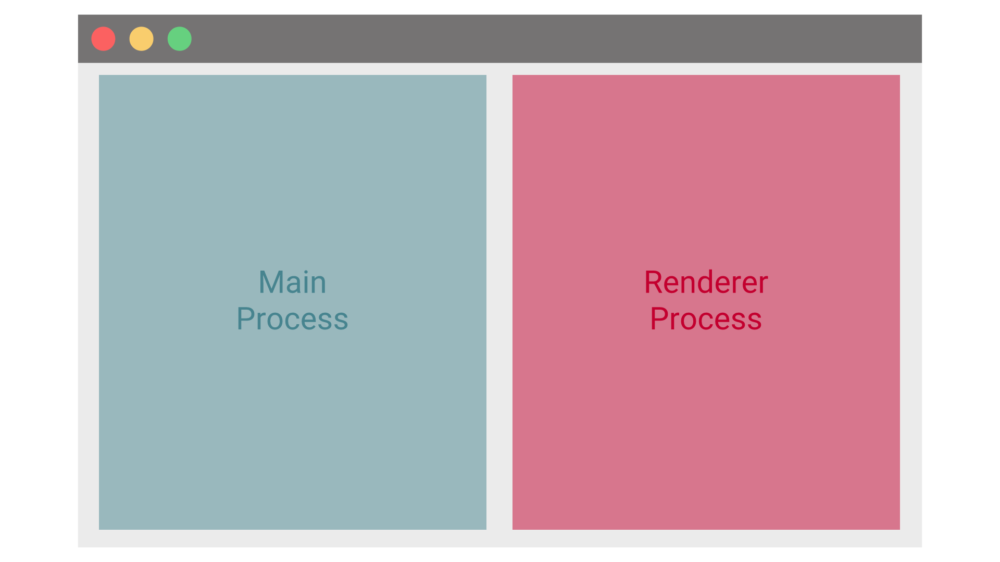

In this tutorial, we are going to take a look at how to turn any angular application into a native desktop app using electron.

You will learn how to set up an angular app and run it inside of electron using typescript all the way.

Also, you will discover how to use native APIs like the file system from your angular application using electrons IPC methods.

Ready?

Let's get started!


## Setup 

Before we can start working on our electron angular app, we need to set up some stuff first.

### Creating a new Angular project 

Following this tutorial, you can use any existing angular app you want and it should work out just fine.

For this tutorial, we are going to create a new angular project from scratch using the angular-cli.

To create a new project, install the angular-cli if you haven't done so already

```
 npm install -g @angular/cli
 
 ``` 
Next, create a new project using the following command:

```
 ng new angular-electron
 
 ``` 
angular-electron will be the name of our project. This will become important later.

### Adding electron to the project 

Afterward,  we need to install electron itself.

To do that, we switch to the projects root directory and add it to the project as dev-dependency like so:

```
 npm i -D electron
 
 ``` 
Why is it just a dev-dependency?

Because we don't want it to be included in our app itself. We only need it at build-time to build the desktop app.

### Installing types 

Because we will be using TypeScript for our angular application as well as in our electron-files, we need to add the corresponding type definitions to our project.

We can do so using npm again:

```
 npm i -D @types/electron
 
 ``` 
Because types are irrelevant for the running application, we add it as dev-dependency, as well.


## Configuring the electron app 

For now, we will leave the angular app as it is and focus on starting it inside of electron.

To do that, create a new directory called electron inside of the projects root directory. We will use that folder to place all electron-related files inside.

Afterward, make a new file and call it "main.ts" inside of the electron folder. This file will be the main starting point of our electron application.

Finally, create a new tsconfig.json file inside of the directory. We need that file to compile the TypeScript file into JavaScript one.

The content of that file looks quite similar to the one used in the angular application.
In fact, I did copy it from there...

The only thing we need to change is the module property. It has to be "commonjs" instead of "es2015". For simplicity, I have also changed the ourDir to just dist.
The whole file looks like this:

```
 {
  "compileOnSave": false,
  "compilerOptions": {
    "baseUrl": "./",
    "outDir": "./dist",
    "sourceMap": true,
    "declaration": false,
    "module": "commonjs",
    "moduleResolution": "node",
    "emitDecoratorMetadata": true,
    "experimentalDecorators": true,
    "target": "es5",
    "typeRoots": ["node_modules/@types"],
    "lib": ["es2018", "dom"]
  }
}
 
 ``` 
### Fire up the application 

Now it's time to fill the main.ts with some code.

First, we import the required dependencies:

```typescript title=electron/main.ts
 import { app, BrowserWindow } from "electron";
import * as path from "path";
import * as url from "url";
 
 ``` 
Afterward, we create a variable that will hold a reference to the browser window. This is the window electron spawns to host our angular application.

```typescript title=electron/main.ts
 let win: BrowserWindow;
 
 ``` 
Next, we register some listeners on the app object we imported above. 
These listeners will let us know when the application is ready to go.

```typescript title=electron/main.ts
 app.on("ready", createWindow);

app.on("activate", () => {
  if (win === null) {
    createWindow();
  }
});
 
 ``` 
The second listener for the "activate"-event is only required for macOS applications, as these behave a little bit differently.

### The application window 

Now we need to implement the createWindow function we called before.

This function will create a new electron window to host our angular application. In the background, this window is just a chrome-tab. This is why the class to create a new window is called BrowserWindow.

```typescript title=electron/main.ts
 function createWindow() {
  win = new BrowserWindow({ width: 800, height: 600 });
}
 
 ``` 
Inside of the BrowserWindow constructor, we define the dimensions of the new window.
You can also start the application in fullscreen-mode like this:

```typescript title=electron/main.ts
 function createWindow() {
  win = new BrowserWindow({ fullscreen: true });
}
 
 ``` 
### Spawning the angular application in electron 

Next, we need to fill our new browser window with content: Our angular app.

To do that the browser window provides a method called loadUrl.

We use this method to load the index.html of our (already build) angular application. 
The build output (when we call ng build) typically is located in a directory called dist in the project root.

Since angular 6 there is an additional sub-folder called like the project itself. In this case, it is "angular-electron".

```typescript title=electron/main.ts
 function createWindow() {
  win = new BrowserWindow({ width: 800, height: 600 });

  win.loadURL(
    url.format({
      pathname: path.join(__dirname, `/../../dist/angular-electron/index.html`),
      protocol: "file:",
      slashes: true
    })
  );

  win.webContents.openDevTools();

  win.on("closed", () => {
    win = null;
  });
}
 
 ``` 
We also add a function call to open the chrome dev-tools at the start. It's up to you if you want that and you definitely want to remove that when you ship the application. 

Also, we added an event listener to the window close event. Again, this is a special case required for macOS applications.


## Compiling main.ts & starting electron 

We are almost done now. 

All that's left to do is to compile our main.ts to JavaScript.

To do that, let's create a new script inside of our package.json's script section and call it electron. 

While we are at it, we also need to tell electron the entry point of our electron application. We do so by specifying the "main"-property in the package.json.

```
 {
  "name": "angular-electron",
  "version": "0.0.0",
  "main": "electron/dist/main.js",
  "scripts": {
    "ng": "ng",
    "start": "ng serve",
    "build": "ng build",
    "test": "ng test",
    "lint": "ng lint",
    "e2e": "ng e2e",
    "electron": "ng build --base-href ./ && tsc --p electron && electron ."
  },
...
 
 ``` 
That script first compiles our angular application using ng build.

Afterward, it compiles every typescript file inside of our electron folder.

Finally, it starts the electron application using the package.json at the projects' root.

We can now start our app using npm:

```
 npm run electron
 
 ``` 
Congratulations, you have created and launched your first electron application!


## Accessing the file system from Angular 

One of the core arguments of using electron over building a normal web application is the possibility of accessing features of the operating system only native application can access.

Common applications for that are the file system, external (USB) devices, printers and so on.

With electron, you can do everything a node.js application can do. This is because the main process of an electron application actually is a node.js program.

For this tutorial, we are going to take a look at reading the file-system with our angular application.

### How electron works 

Electron consists of two parts.

The first part is the main process which is a node.js application. This is the core of any electron program.



The code we defined in our main.ts file is running on the main process. 

Because the main.ts is running in node, we can make calls to the node.js API here.

This main process is then spawning the second one by opening the browser window, which is the second part of the app and runs our angular application.

This process is (almost) a regular chrome window and the JavaScript code running in that window has the same access as any other application running in a browser. 

We can't access the node.js API from here. Especially we do not have access to the file system.


### Inter-process Communication (IPC) 

But if we cant use the node.js API in our angular application, how do we get access to the file system?

The answer is called inter-process communication. It is a method the operating system provides so that two different processes can communicate with each other.

In our case, the main process has to communicate with the browser process and vice versa.

### Using electron IPC 


Now, IPC sounds highly technical and complicated and it really is. 

Luckily, electron provides a convenient way of implementing this using simple JavaScript methods.

There are two different parts we will use for this. One for the main process and on for our angular application.

### Setting up IPC in the main process 

The first part is the one for the main process and called ipcMain.

To use it, we import it at the beginning of our main.ts file.

```typescript title=electron/main.ts
 import { app, BrowserWindow, ipcMain } from "electron";
 
 ``` 
In this example, we want to listen to messages from the browser window. To do that we use ipcMain to notify us when a new message arrived.

Because we are not interested in every message, we also specify a so-called channel. Basically, channels are a way to organize messages by topic.

In our case, we listen to messages on a channel called "getFiles".

```typescript title=electron/main.ts
 ipcMain.on("getFiles", (event, arg) => {

});
 
 ``` 
We are following an idea called remote procedure calls (RPC) here by calling the channel like a function we later "call" remotely from our angular application.

Inside of the callback, we then get the required information using the node.js API and send back the response on a different channel called "getFilesResponse".

```typescript title=electron/main.ts
 ipcMain.on("getFiles", (event, arg) => {
  const files = fs.readdirSync(__dirname);
  win.webContents.send("getFilesResponse", files);
});
 
 ``` 
That's already it for the main process. Now we have to call our remote function from our angular application.


## Using IPC in Angular to communicate with the main process 

On the angular side, we want to encapsulate that functionality inside of a simple service.

So let's create a file service using the angular-cli.

```
 ng generate service file
 
 ``` 
Now,  we need to get the other part of the communication channel. For that, we need an object called ipcRenderer. This object is part of the electron package.

Because we want our application to be able to run without electron (in a browser) as well, we can't just import electron. That wouldn't run in a browser.

But we need that object from the electron package, so how do we get that?

### A simple workaround 


The solution is a method called require that electron injects into the window object at runtime. With that, we can import the required object.

And because we can check that require-method for null (as it does not exist in the browser window) we are still compatible with the web.

```typescript title=src/app/file.service.ts
 import { Injectable } from "@angular/core";
import { IpcRenderer } from "electron";

@Injectable({
  providedIn: "root"
})
export class FileService {
  private ipc: IpcRenderer;

  constructor() {
    if ((<any>window).require) {
      try {
        this.ipc = (<any>window).require("electron").ipcRenderer;
      } catch (error) {
        throw error;
      }
    } else {
      console.warn("Could not load electron ipc");
    }
  }
}
 
 ``` 
You might notice that we are importing IpcRenderer at the top. That is just the type and does not contain the actual logic.

### The getFiles method 

Now that we have our ipc-object, we can start communicating with our main process.

We do so by creating a method called getFiles that handles all the IPC communication for us and gives back the result.

```typescript title=src/app/file.service.ts
 async getFiles() {
    return new Promise<string[]>((resolve, reject) => {
      this.ipc.once("getFilesResponse", (event, arg) => {
        resolve(arg);
      });
      this.ipc.send("getFiles");
    });
  }
 
 ``` 
Again, we are defining a listener that is listening on the "getFilesResponse" channel. Because we do so by using the "once" method, it will unsubscribe itself after the first message.

Only after that, we send a request message on the channel "getFiles" to our main process. 

Please be aware that this is a small example that should not be used in production as it can result in the application waiting forever if the main process does not respond. A production-ready function would need some type of timeout.

Also, you would probably give every request an id, to identify which request got what answer.

Finally, you can use that service now anywhere in your application just like a normal service.

## Conclusion 

In this tutorial, you have learned how to run your angular application as a desktop application with electron.

We also discovered how we can use any native node.js API method to give an angular application the possibilities of a real native desktop app.

I hope you liked this article. If you did, please share it with your friends and colleges. It would mean a lot to me!

You can find the full source code in the corresponding [GitHub repository](https://github.com/LukasMarx/angular-electron).

Thanks for reading!
