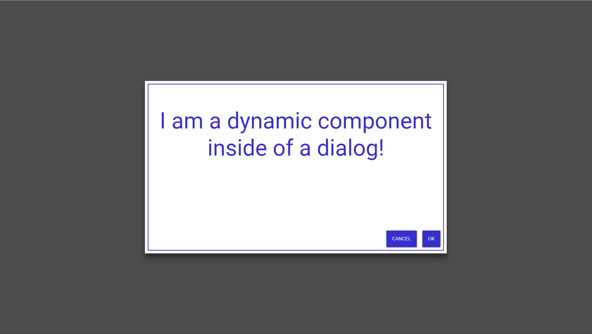

In this tutorial, you will learn what dynamic components are and how they work in angular.

You will do so by creating a very flexible dialog system, that demonstrates how dynamic components are used.

We will learn how to create dynamic components and attach them to the DOM or use them in other components.

Also, you will discover how to provide objects to these dynamic components using dependency injection and custom angular injectors.

At the end, we will come up with a dialog system that is quite similar to the one provided by angular material.



Of course, everything is reduced to the core and split up, so we don't lose the overview.

Ready to learn something new?

Let's get started!


## What are dynamic components in angular?

Before we start, let's make sure we know what "dynamic" components actually are.

### What dynamic components are

Dynamic means, that the components location in the application is not defined at buildtime.
That means, that it is not used in any angular template.

Instead, the component is instantiated and placed in the application at runtime.

### What dynamic components are not

Because of the broad use of the word "dynamic", one could think that you could "dynamically" load just any component from the internet at runtime.

This is not the case though.

Because of the way angular works, it has to know about every component at buildtime.

That means that the component has to be defined in the same project or has to be imported into an angular module of the project.


## Setting up a new angular project

Before we get started, we need an angular project to work on. In this tutorial, we are going to generate a new angular-cli project.
If you want to use an existing project, that should be fine, too.

To generate a new project, make sure you have the [angular-cli](https://malcoded.com/posts/angular-fundamentals-cli) installed and use this command at the desired project destination:

```
 ng new angular-dynamic-components

```

When the tool is done, we should be good to go.


## Creating an empty dialog component

To get started, let's create an empty dialog component. This component will consist of a white dialog area, while the rest of the screen is blurred.


We want the dialog to live in its own module.
To do that, we generate a new module using the anuglar-cli.

```
 ng generate module dialog

```

Afterward, we generate the dialog component like so:

```
 ng generate component dialog

```

The cli will add the component to the same folder as the module.
Also, make sure that the dialog component is declared in the dialog module instead of the app module.

### The dialog effect

Achieving his dialog-effect is actually quite simple and does only require a little bit of HTML and CSS.

Basically, the components template does only consists of two div-elements:

```html title=src/app/dialog/dialog.component.html
<div class="overlay" (click)="onOverlayClicked($event)">
  <div class="dialog" (click)="onDialogClicked($event)"></div>
</div>
```

The required CSS is nothing to fancy either:

```css title=src/app/dialog/dialog.component.css
.overlay {
  display: flex;
  flex-direction: column;
  position: fixed;
  top: 0;
  bottom: 0;
  left: 0;
  right: 0;
  background: rgba(0, 0, 0, 0.7);
  align-items: center;
  justify-content: center;
}

.dialog {
  box-shadow: 0 14px 28px rgba(0, 0, 0, 0.25), 0 10px 10px rgba(0, 0, 0, 0.22);
  background-color: white;
  width: 50%;
  height: 50%;
  display: flex;
  flex-direction: column;
  padding: 8px;
}
```

### Adding the callbacks to the component

Because we are already assigning click-callbacks in our template, let's make sure they are defined in our component-class, as well.

```typescript title=src/app/dialog/dialog.component.ts
import { Component, Type, OnDestroy, AfterViewInit } from '@angular/core'

@Component({
  selector: 'app-dialog',
  templateUrl: './dialog.component.html',
  styleUrls: ['./dialog.component.css'],
})
export class DialogComponent implements AfterViewInit, OnDestroy {
  childComponentType: Type<any>

  ngAfterViewInit() {}

  ngOnDestroy() {}

  onOverlayClicked(evt: MouseEvent) {
    // close the dialog
  }

  onDialogClicked(evt: MouseEvent) {
    evt.stopPropagation()
  }
}
```

Notice, that the component does implement the [AfterViewInit ](https://angular.io/api/core/AfterViewInit)and [OnDestroy ](https://angular.io/api/core/OnDestroy)interfaces, as we will the hooks later.

While we will implement onOverlayClicked later, we make sure that the click event on the dialog itself is not propagated to the parent elements.

Otherwise, the onOverlayClicked callback would always fire, even if we hit the dialog itself and not the overlay (the overlay is the gray area around the dialog).
We do so in the onDialogClicked method.

Also, the component has to know which type of component it will has to create later. For that, we are adding the property childComponentType.


## Using a service to append the dialog to the HTML-body

Now that we have a working dialog component, we could just add it to the app-component and it would work just fine.
Ok, maybe we would have to add an @Input to toggle it on and off, but that would not be an issue, right?

We will not do that in this tutorial!

Why?

Because this is all about dynamic components.
Also, we want our component to live in the HTML-body to make sure that the dialog always fills the whole screen.

So how do we do that then?

We will use a service to instantiate the component and place it into the body. Doesn't that sound crazy?

Actually, this approach is quite convenient to use. You maybe have used it already, as this is exactly the same approach as the guys from [angular material](https://material.angular.io/components/dialog/overview) are using for their dialog component.

### The service

So let's begin by creating a new service.

Again, we are using the angular-cli to do this:

```
 ng generate service dialog/dialog

```

Inside of the service class, we create a new method called "appendDialogComponentToBody".

Also, we need a property called dialogComponentRef, that will hold a reference to the instance of the DialogComponent that we will create.

Furthermore, we need to request a bunch of stuff via dependency injection.

```typescript title=src/app/dialog/dialog.service.ts
import {
  Injectable,
  ComponentFactoryResolver,
  ApplicationRef,
  Injector,
  EmbeddedViewRef,
  ComponentRef,
} from '@angular/core'

@Injectable({
  providedIn: DialogModule,
})
export class DialogService {
  dialogComponentRef: ComponentRef<DialogComponent>

  constructor(
    private componentFactoryResolver: ComponentFactoryResolver,
    private appRef: ApplicationRef,
    private injector: Injector
  ) {}

  appendDialogComponentToBody() {}
}
```

### Dynamically instantiating the dialog component using its factory

Angular is creating a factory for each component when building. At least when using ahead of time compilation (AOT).

Because this is the default configuration now, we are using AOT for this tutorial exclusively. When using just in time compilation (JIT) you may need to take additional steps.

To get the factory of our DialogComponent we can use the [ComponentFactoryResolver](https://angular.io/api/core/ComponentFactoryResolver) provided by angular.
This service is using the type of the component to look up the factory.

```typescript title=src/app/dialog/dialog.service.ts
 appendDialogComponentToBody(){
  const componentFactory = this.componentFactoryResolver.resolveComponentFactory(DialogComponent);
}

```

Once we have the factory, we can use it to create an instance of our DialogComponent.

```typescript title=src/app/dialog/dialog.service.ts
 appendDialogComponentToBody(){
  const componentFactory = this.componentFactoryResolver.resolveComponentFactory(DialogComponent);
  const componentRef = componentFactory.create(this.injector);
}

```

We are passing in the injector we requested in the constructor. This enables the dynamic component to make use of dependency injection itself.

Afterward, we need to attach the new component to the angular component tree (which is separate from the DOM).
We do so by using the [ApplicationRef ](https://angular.io/api/core/ApplicationRef)we requested.

```typescript title=src/app/dialog/dialog.service.ts
 appendDialogComponentToBody(){
  const componentFactory = this.componentFactoryResolver.resolveComponentFactory(DialogComponent);
  const componentRef = componentFactory.create(this.injector);
  this.appRef.attachView(componentRef.hostView);
}

```

Last but not least, we get the root DOM-element of our DialogComponent and attach it to the HTML-body.
Also, we assign the componentRef to our property.

```typescript title=src/app/dialog/dialog.service.ts
 private appendDialogComponentToBody(){
  const componentFactory = this.componentFactoryResolver.resolveComponentFactory(DialogComponent);
  const componentRef = componentFactory.create(this.injector);
  this.appRef.attachView(componentRef.hostView);

  const domElem = (componentRef.hostView as EmbeddedViewRef<any>).rootNodes[0] as HTMLElement;
  document.body.appendChild(domElem);

  this.dialogComponentRef = componentRef;
}

```

### Destroying the component

We also need a way to remove the component once the dialog is closed.

For that, we are creating a method called "removeDialogComponentFromBody".
Basically, it is undoing the steps we did before.

```typescript title=src/app/dialog/dialog.service.ts
 private removeDialogComponentFromBody() {
  this.appRef.detachView(this.dialogComponentRef.hostView);
  this.dialogComponentRef.destroy();
}

```


## Opening the dialog dynamically

Now that we are able to add the dialog to the DOM, all we need to do to open the dialog is to call our method.

To do that, we define a public method called "open".

```typescript title=src/app/dialog/dialog.service.ts
 public open() {
    this.appendDialogComponentToBody();
}

```

Inside of that method we call our appendDialogComponentToBody-method to open the empty dialog.

Because our DialogComponent is not used anywhere (in a template), angular will not include it in the final source code.
To prevent that, we can add it to the entryComponents of our DialogModule:

```typescript title=src/app/dialog/dialog.module.ts
import { NgModule } from '@angular/core'
import { CommonModule } from '@angular/common'
import { DialogComponent } from './dialog.component'
import { InsertionDirective } from './insertion.directive'

@NgModule({
  imports: [CommonModule],
  declarations: [DialogComponent, InsertionDirective],
  entryComponents: [DialogComponent],
})
export class DialogModule {}
```


## Injecting other components into the dialog

Because empty dialogs are quite useless, we will enable our dialog to show any other component, next.

Doing that, we will pass the Type of the component we want to spawn inside of our dialog to the services "open"-method.

```typescript title=src/app/dialog/dialog.service.ts
 public open(componentType: Type<any>) {
    this.appendDialogComponentToBody();

    this.dialogComponentRef.instance.childComponentType = componentType;
}

```

Inside of the method, we assign that type to our dynamically created DialogComponent.

Of course, our DialogComponent does not know what to do with that type, yet.

To change that, we need to modify our dialog to instantiate dynamic components and place them in itself.

This is done quite similar to how we dynamically created the DialogComponent. Except that we now don't want to place our component inside the HTML-Body but in a certain place in our DialogComponent.

To tell angular the exact place to inject our component into, we need to create a custom directive.

### Creating a custom directive to mark the insertion-point

Again, we are generating this directive using the angular-cli like so:

```
 ng generate directive dialog/insertion

```

We call this directive "insertion" as it will mark the point where the dynamic component will be inserted.

All we have to do with that directive is to add a [ViewContainerRef ](https://angular.io/api/core/ViewContainerRef)property.

```typescript title=src/app/dialog/insertion.directive.ts
import { Directive, ViewContainerRef } from '@angular/core'

@Directive({
  selector: '[appInsertion]',
})
export class InsertionDirective {
  constructor(public viewContainerRef: ViewContainerRef) {}
}
```

### Modifying the dialog to spawn a dynamic child-component

Now that we have our insertion-directive, we can mark the place for our dynamic child-component.

To do that, we simply add a ng-template and add the attribute "appInsertion" of our directive.

```html title=src/app/dialog/dialog.component.html
<div class="overlay" (click)="onOverlayClicked($event)">
  <div class="dialog" (click)="onDialogClicked($event)">
    <ng-template appInsertion> </ng-template>
  </div>
</div>
```

To get a reference to that insertion-directive in our component class, we add a @ViewChild decorated property called insertion point. Also, we need to request the CompoentFactoryResolver to our constructor.

```typescript title=src/app/dialog/dialog.component.ts
import {
  Component,
  Type,
  OnDestroy,
  AfterViewInit,
  ComponentFactoryResolver,
} from '@angular/core'
import { InsertionDirective } from './insertion.directive'

@Component({
  selector: 'app-dialog',
  templateUrl: './dialog.component.html',
  styleUrls: ['./dialog.component.css'],
})
export class DialogComponent implements AfterViewInit, OnDestroy {
  componentRef: ComponentRef<any>
  childComponentType: Type<any>

  // add this:
  @ViewChild(InsertionDirective)
  insertionPoint: InsertionDirective

  // and this:
  constructor(private componentFactoryResolver: ComponentFactoryResolver) {}

  ngAfterViewInit() {}

  ngOnDestroy() {}

  onOverlayClicked(evt: MouseEvent) {
    // close the dialog
  }

  onDialogClicked(evt: MouseEvent) {
    evt.stopPropagation()
  }
}
```

To actually load the child-component, we are going to create a new method called "loadChildComponent". This method takes the type of the child-component as a parameter.
We then use this type to resolve the factory for this component. With the help of the factory and the insertion point, we then instantiate the dynamic child-component.

```typescript title=src/app/dialog/dialog.component.ts
 loadChildComponent(componentType: Type<any>) {
    let componentFactory = this.componentFactoryResolver.resolveComponentFactory(componentType);

    let viewContainerRef = this.insertionPoint.viewContainerRef;
    viewContainerRef.clear();

    this.componentRef = viewContainerRef.createComponent(componentFactory);
}

```

We do so by getting the ViewContainerRef of the directive (we added that property to the directive before) and using it to create the component.

While we are at it, we also need to make sure, the child-component is property destroyed with its parent.
To do that, we call destroy on the componentRef on ngOnDestroy.

```typescript title=src/app/dialog/dialog.component.ts
 ngOnDestroy() {
  if (this.componentRef) {
    this.componentRef.destroy();
  }
}

```

### Loading the child component AfterViewInit

Because we are using a reference to the view in loadChildComponent, we need to make sure that the view is fully loaded before we use it. That is why we are calling the method in ngAfterViewInit.

There is only one problem: We are changing the view (by adding a child component) but angular thinks it is already done with the view-part. That's why the hook is called AFTERViewInit.

This would result in an [ExpressionChangedAfterItHasBeenCheckedError](https://blog.angularindepth.com/everything-you-need-to-know-about-the-expressionchangedafterithasbeencheckederror-error-e3fd9ce7dbb4). To prevent that, we need to tell angular to re-run change detection after we have added the component.

For that, we need to add the [ChangeDetectorRef ](https://angular.io/api/core/ChangeDetectorRef)to our constructor.

```typescript title=src/app/dialog/dialog.component.ts
 constructor(private componentFactoryResolver: ComponentFactoryResolver, private cd: ChangeDetectorRef) {}

```

We then trigger change detection, once our dynamic child-component is loaded.

```typescript title=src/app/dialog/dialog.component.ts
 ngAfterViewInit() {
  this.loadChildComponent(this.childComponentType);
  this.cd.detectChanges();
}
```


## A small example component to test the whole thing

That's it!

The DialogComponent is now able to load a dynamic child-component.

So why don't we create a component to test that real quick?

```
 ng generate component example

```

Here is what it looks like:

### Template

```html title=src/app/example/example.component.html
<div class="text-wrapper"><p>Test</p></div>
<div class="actions">
  <button class="button" (click)="onClose()">CANCEL</button>
  <button class="button" (click)="onClose()">OK</button>
</div>
```

### Class

```typescript title=src/app/example/example.component.ts
import { Component } from '@angular/core'

@Component({
  selector: 'app-example',
  templateUrl: './example.component.html',
  styleUrls: ['./example.component.css'],
})
export class ExampleComponent {
  onClose() {}
}
```

### Styles

```css title=src/app/example/example.component.css
:host {
  border: 2px #382ecc solid;
  font-size: 64px;
  color: #382ecc;
  display: flex;
  flex-direction: column;
  flex: 1;
}

.text-wrapper {
  display: flex;
  flex: 1;
  align-content: center;
  justify-content: center;
  text-align: center;
}

.actions {
  display: flex;
  flex-direction: row;
  justify-content: flex-end;
}
```

### Using the example component

To test this, we import our DialogModule into the AppModule:

```typescript title=src/app/app.module.ts
@NgModule({
  declarations: [AppComponent, ExampleComponent],
  imports: [BrowserModule, DialogModule],
  bootstrap: [AppComponent],
  entryComponents: [ExampleComponent],
})
export class AppModule {}
```

We can then use the DialogService to open a dialog with our ExampleComponent:

```typescript title=src/app/app.component.ts
import { Component } from '@angular/core'
import { DialogService } from './dialog/dialog.service'
import { ExampleComponent } from './example/example.component'

@Component({
  selector: 'app-root',
  templateUrl: './app.component.html',
  styleUrls: ['./app.component.css'],
})
export class AppComponent {
  constructor(public dialog: DialogService) {
    this.dialog.open(ExampleComponent)
  }
}
```

The result should look like this:


## Passing data to the service using dependency injection

Great! We can now place any component inside of our dialog!

Most of the time that isn't enough though...

We also need a way to communicate with the dialog. For example, we probably want to pass it some data.

There are many ways to achieve this. One very elegant one, used by the angular material library, is to pass a configuration object via dependency injection to the dialog.

We will do the same here, although in a much simpler and minimalist way.

But how do we dynamically provide an object via dependency injection?

The secret is called [Injector](https://angular.io/api/core/Injector). This thing controls which classes are available via dependency injection.

To extend the list of available classes, we need build to a custom injector.

### How to build a custom injector

A custom injector is just a TypeScript class that implements the Injector interface.

So to create our own injector, we first need to create a new file called "dialog-injector.ts" inside of the dialog directory.

Inside of there, we define a class called "DialogInjector".

Inside of there, we define a new property called \_additionalTokens, which will hold our additional classes for DI.

We then override the get-method in a way, that it is not only searching for matches in the parent-injector, but also in our \_additionalTokens map.

```typescript title=src/app/dialog/dialog-injector.ts
import { Injector, Type, InjectionToken, InjectFlags } from '@angular/core'

export class DialogInjector implements Injector {
  constructor(
    private _parentInjector: Injector,
    private _additionalTokens: WeakMap<any, any>
  ) {}

  get<T>(
    token: Type<T> | InjectionToken<T>,
    notFoundValue?: T,
    flags?: InjectFlags
  ): T
  get(token: any, notFoundValue?: any)
  get(token: any, notFoundValue?: any, flags?: any) {
    const value = this._additionalTokens.get(token)

    if (value) return value

    return this._parentInjector.get<any>(token, notFoundValue)
  }
}
```

### What does the data structure look like?

Next, we will use the custom injector to register our config-object.

But before we can do that, we need to define a class that describes that object.

To do that, create a new file called "dialog-config" inside of the dialog directory.

The class looks quite simple:

```typescript title=src/app/dialog/dialog-config.ts
export class DialogConfig<D = any> {
  data?: D
}
```

You can add many more properties to that class.
For example, angular material is using this object to define the size of the dialog.

### Modifying the DialogService to use the custom injector

Now we need to alter the DialogService to use the custom injector.

```typescript title=src/app/dialog/dialog.service.ts
const componentRef = componentFactory.create(this.injector)
```

Do you remember this line from the "appendDialogComponentToBody"-method?
Notice that we are already using an injector there.

We now have to replace that injector with our DialogInjector.

Also, the "appendDialogComponentToBody" now has to take a DialogConfig as a parameter, as well as the open method.

```typescript title=src/app/dialog/dialog.service.ts
 public open(componentType: Type<any>, config: DialogConfig) {
   this.appendDialogComponentToBody(config);

  this.dialogComponentRef.instance.childComponentType = componentType;

}

private appendDialogComponentToBody(config: DialogConfig) {
  // create a map with the config
  const map = new WeakMap();
  map.set(DialogConfig, config);

  const componentFactory = this.componentFactoryResolver.resolveComponentFactory(DialogComponent);

  // use our new injector
  const componentRef = componentFactory.create(new DialogInjector(this.injector, map));

  ...
 }

```

Our injector expects the old injector together with a [WeakMap](https://developer.mozilla.org/de/docs/Web/JavaScript/Reference/Global_Objects/WeakMap). We pass it the type of our DialogConfig together with the actual config-object.

### Requesting the DialogConfig in the dialogs' child-component

Now that we have fed our custom injector with the config-object, it is available to the DialogComponent and its children.

That enables us to use data of the config-object in our ExampleComponent:

```typescript title=src/app/example/example.component.ts
import { Component } from '@angular/core'
import { DialogConfig } from '../dialog/dialog-config'
import { DialogRef } from '../dialog/dialog-ref'

@Component({
  selector: 'app-example',
  templateUrl: './example.component.html',
  styleUrls: ['./example.component.css'],
})
export class ExampleComponent {
  constructor(public config: DialogConfig) {}
}
```

For example, we could display the data in our template:

```html title=src/app/example/example.component.html
<div class="text-wrapper"><p>{{config.data.message}}</p></div>
<div class="actions">
  <button class="button" (click)="onClose()">CANCEL</button>
  <button class="button" (click)="onClose()">OK</button>
</div>
```

For that to work, we also have to change the call of the open-method and pass in a config-object:

```typescript title=src/app/app.component.ts
@Component({
  selector: 'app-root',
  templateUrl: './app.component.html',
  styleUrls: ['./app.component.css'],
})
export class AppComponent {
  constructor(public dialog: DialogService) {
    this.dialog.open(ExampleComponent, {
      data: { message: 'I am a dynamic component inside of a dialog!' },
    })
  }
}
```

Here is what it should look like:


## How to get a result from the dialog

Often times, it is even more important to get a result from a dialog than it is to pass data in.

For example, to know which button the user pressed or what he typed into a form.

Also, we still need a way to close our dialog from within the dialogs' child component.

Again, we will take the angular material library as a reference to solve this issue.

We will create a class called DialogRef which has a property called afterClosed which is an observable.
We simply return that DialogRef with the call of the DialogServices' open method.

We can that subscribe to that observable and get notified once the dialog closed. The result of the dialog is transferred with this observable as well.

The class does also contain a close-method, which we will use to close the dialog from within the child-component.

```typescript title=src/app/dialog/dialog-ref.ts
import { Observable, Subject } from 'rxjs'

export class DialogRef {
  constructor() {}

  close(result?: any) {
    this._afterClosed.next(result)
  }

  private readonly _afterClosed = new Subject<any>()
  afterClosed: Observable<any> = this._afterClosed.asObservable()
}
```

We do make this DialogRef object available in our child-component using our custom injector again, so we need to modify the appendDialogComponentToBody"-method of the DialogService again.
Also, we want to return the DialogRef when calling the services' open-method. So we need to modify that, as well.

```typescript title=src/app/dialog/dialog.service.ts
 public open(componentType: Type<any>, config: DialogConfig) {
    const dialogRef = this.appendDialogComponentToBody(config);

    this.dialogComponentRef.instance.childComponentType = componentType;

    return dialogRef;
  }

private appendDialogComponentToBody(config: DialogConfig) {
    const map = new WeakMap();
    map.set(DialogConfig, config);

	// add the DialogRef to dependency injection
    const dialogRef = new DialogRef();
    map.set(DialogRef, dialogRef);

	// we want to know when somebody called the close mehtod
    const sub = dialogRef.afterClosed.subscribe(() => {
	  // close the dialog
      this.removeDialogComponentFromBody();
      sub.unsubscribe();
    });

    const componentFactory = this.componentFactoryResolver.resolveComponentFactory(DialogComponent);
    const componentRef = componentFactory.create(new DialogInjector(this.injector, map));

    this.appRef.attachView(componentRef.hostView);

    const domElem = (componentRef.hostView as EmbeddedViewRef<any>).rootNodes[0] as HTMLElement;
    document.body.appendChild(domElem);

    this.dialogComponentRef = componentRef;

    this.dialogComponentRef.instance.onClose.subscribe(() => {
      this.removeDialogComponentFromBody();
    });

	// return the dialogRef
    return dialogRef;
  }

```

### Using a DialogRef to control the dialog

Now, the dialogRef is available inside of the child-component.

Because of that, it is possible to close the dialog from our example.component.

```typescript title=src/app/example/example.component.ts
import { Component } from '@angular/core'
import { DialogConfig } from '../dialog/dialog-config'
import { DialogRef } from '../dialog/dialog-ref'

@Component({
  selector: 'app-example',
  templateUrl: './example.component.html',
  styleUrls: ['./example.component.css'],
})
export class ExampleComponent {
  constructor(public config: DialogConfig, public dialog: DialogRef) {}

  onClose() {
    this.dialog.close('some value')
  }
}
```

We simply request the DilaogRef via dependency injection in the constructor and then use it to close it when a button triggers the "onClose"-method. Using the close-method of DialogRef, we can also pass back the result of the dialog. For example "some value".

The result of the dialog can then be received by subscribing to the afterClosed-observable of the DialogRef when openeing the dilaog itself:

```typescript title=src/app/app.component.ts
import { Component } from '@angular/core'
import { DialogService } from './dialog/dialog.service'
import { ExampleComponent } from './example/example.component'

@Component({
  selector: 'app-root',
  templateUrl: './app.component.html',
  styleUrls: ['./app.component.css'],
})
export class AppComponent {
  constructor(public dialog: DialogService) {
    const ref = this.dialog.open(ExampleComponent, {
      data: { message: 'I am a dynamic component inside of a dialog!' },
    })

    ref.afterClosed.subscribe(result => {
      console.log('Dialog closed', result)
    })
  }
}
```

## Conclusion

In this tutorial, you have learned how you can utilize dynamic components to create a flexible and reusable dialog system.

I hope you stayed with til the end!

You can find the full source code at the corresponding [GitHub Repository](https://github.com/LukasMarx/angular-dynamic-components).

If you liked this article, please share it with your friends! It would mean a lot to me.

Happy coding!
