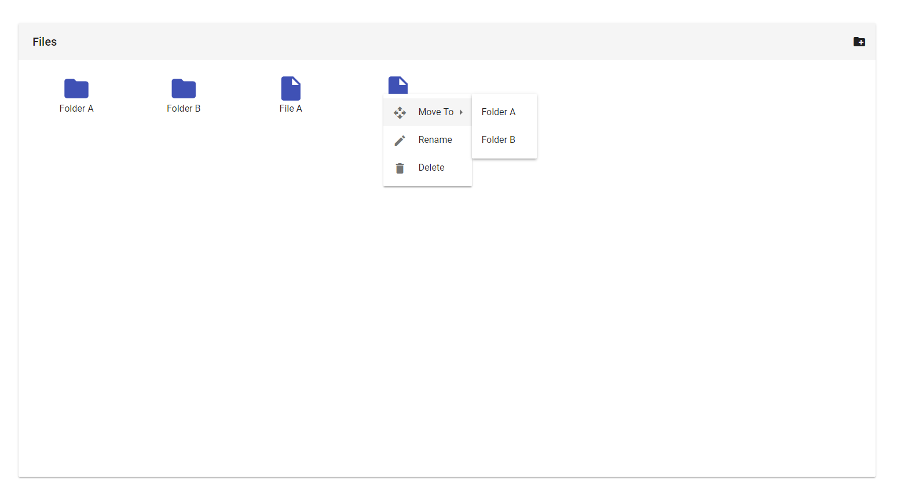
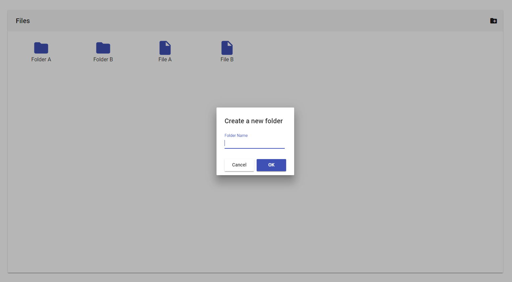

In this tutorial, we will learn how to create a file-explorer in angular.

Why? Because we can!

And it's fun!



We will explore how to use the angular material library to create a visual appealing component to manage our files.

Also, we take a look at how dumb components can help us re-using our components and keep them independent from the actual file-api of the backend.


Ready? 

Let's get started!


## Setting up a new Project 

First of all, we need to create a new angular project. In this tutorial, we are going to use the angular-cli for that.
With the cli, you can create a new project by using this command:

```
 ng new angular-file-explorer
 
 ``` 
To tidy things up, we will create our file-explorer-component in a separate feature-module. 
To create this module, use the following command at the root of our new project.

```
 ng generate module file-explorer
 
 ``` 
External Dependencies
In this tutorial, we are going to use the [angular material library](https://material.angular.io/). This library provides a set of UI-components that follow [google's material design paradigm](https://material.io/guidelines/#introduction-goals) and therefore look just awesome.

To use the library, we have to install it first. We do so by using npm with this command: 

```
 npm install --save @angular/material @angular/cdk
 
 ``` 
To import the styles that come along with the library, we need to import them into our style.css file:

```css title=src/style.css
 @import '~@angular/material/prebuilt-themes/indigo-pink.css';
 
 ``` 
We are also going to need the material design icons, so we add a link in our index.html file:

```html title=src/index.html
 <link href="https://fonts.googleapis.com/icon?family=Material+Icons" rel="stylesheet">
 
 ``` 
To align items nicely, we are also using flexbox:


```
 npm install --save @angular/flex-layout
 
 ``` 

Furthermore, we are going to need a small module to generate (pseudo)random ids.

```
 npm install --save uuid
 
 ``` 
Importing Stuff
Because angular material follows a modular approach, we need to import a lot of stuff into our file-explorer-module before we can start. So let's get that out of the way right now!

Basically what we have to do, is to adjust the file-explorer-module until it looks like this:

```typescript title=src/app/file-explorer/file-explorer.module.ts
 import { NgModule } from '@angular/core';
import { CommonModule } from '@angular/common';
import { MatToolbarModule } from '@angular/material/toolbar';
import { FlexLayoutModule } from '@angular/flex-layout';
import { MatIconModule } from '@angular/material/icon';
import { MatGridListModule } from '@angular/material/grid-list';
import { MatMenuModule } from '@angular/material/menu';
import { BrowserAnimationsModule } from '@angular/platform-browser/animations';
import { MatDialogModule } from '@angular/material/dialog';
import { MatInputModule } from '@angular/material/input';
import { MatButtonModule } from '@angular/material/button';
import { FormsModule } from '@angular/forms';
import { FileExplorerComponent } from './file-explorer.component';

@NgModule({
  imports: [
    CommonModule,
    MatToolbarModule,
    FlexLayoutModule,
    MatIconModule,
    MatGridListModule,
    MatMenuModule,
    BrowserAnimationsModule,
    MatDialogModule,
    MatInputModule,
    FormsModule,
    MatButtonModule
  ],
  declarations: [FileExplorerComponent],
  exports: [FileExplorerComponent],
  entryComponents: []
})
export class FileExplorerModule {}
 
 ``` 

## Everything is a FileElement 

The next thing we should do is to define a model for our files and folders. For that, we are going to create a new class inside of the file-explorer module.

```
 ng generate class file-explorer/model/fileElement
 
 ``` 
We will define everything that is displayed in our explorer using this FileElement class. Independent of whether it is a file or a folder.

The class is very basic. All it got is a name for the file/folder, an (optional) id, a parent folder and a flag whether it is a folder or a file.

```typescript title=src/app/file-explorer/model/element.ts
 export class FileElement {
  id?: string;
  isFolder: boolean;
  name: string;
  parent: string;
}
 
 ``` 

## Creating a Dumb Component 

One of the main goals of this guide, besides creating a functioning file-explorer of course, is to make the file-explorer-component as re-usable as possible.  Because there are so many ways to handle files in the backend, I decided to make the component itself as dumb as possible.

That way, it is completely independent of any server-logic. Also, it will have zero private states. That way it is possible to use this component with state-management libraries like ngrx.

To achieve that, everything is handled via [@Inputs](https://angular.io/guide/attribute-directives#pass-values-into-the-directive-with-an-input-data-binding) and [@Outputs](https://toddmotto.com/component-events-event-emitter-output-angular-2). All the component does is receive an array of FileElements and display them. Once the user takes action, the component fires an event to notify the parent component.

By doing it this way, we also get a nice separation between view and logic.

Here is how the component looks like with all the @Inputs and @Outputs defined:

```typescript title=src/app/file-explorer/file-explorer.component.ts
 import { Component, Input, Output, EventEmitter } from '@angular/core';
import { FileElement } from './model/element';

@Component({
  selector: 'file-explorer',
  templateUrl: './file-explorer.component.html',
  styleUrls: ['./file-explorer.component.css']
})
export class FileExplorerComponent {
  @Input() fileElements: FileElement[];
  @Input() canNavigateUp: string;
  @Input() path: string;

  @Output() folderAdded = new EventEmitter<{ name: string }>();
  @Output() elementRemoved = new EventEmitter<FileElement>();
  @Output() elementRenamed = new EventEmitter<FileElement>();
  @Output() elementMoved = new EventEmitter<{ element: FileElement; moveTo: FileElement }>();
  @Output() navigatedDown = new EventEmitter<FileElement>();
  @Output() navigatedUp = new EventEmitter();
}
 
 ``` 

## Implementing the Component Logic: Oh wait, there is none! 


All of these @Outputs need to be easily accessible in our component-template, as well.

To get that, we will implement tiny functions to emit a new event for each @Output. These functions are all placed inside of the FileExplorerComponent.


```typescript title=src/app/file-explorer/file-explorer.component.ts
 deleteElement(element: FileElement) {
    this.elementRemoved.emit(element);
  }

  navigate(element: FileElement) {
    if (element.isFolder) {
      this.navigatedDown.emit(element);
    }
  }

  navigateUp() {
    this.navigatedUp.emit();
  }

  moveElement(element: FileElement, moveTo: FileElement) {
    this.elementMoved.emit({ element: element, moveTo: moveTo });
  }

  openNewFolderDialog() {

  }

  openRenameDialog(element: FileElement) {

  }

  openMenu(event: MouseEvent, viewChild: MatMenuTrigger) {

  }
 
 ``` 

You will notice that there are three methods that are not implemented yet. 

Two of them are to open separate dialogues, to either rename or create a new folder.

The third will be responsible for opening the context (right-click) menu for each file/folder.

We will get to that. Let's take a look at how to create the dialogues first!


## Angular Material Dialogues 

Fortunately, angular material has already implemented a dialog-system for us. All we need to do is create a small component for every dialog we need. 

We will need two. First, the "newFolerDialog" and second the "renameDialog". 



Although the two are almost the same, we create them as separate components, to keep them independent from each other, in case one of them needs to change.

We can use the angular-cli to create the components for us:

```
 ng generate component file-explorer/modals/newFolderDialog
 
 ``` 
and

```
 ng generate component file-explorer/modals/renameDialog
 
 ``` 
The templates of these dialogues look like this:

```html title=src/app/file-explorer/modals/newFolderDialog/newFolderDialog.component.html
 <h1 mat-dialog-title>Create a new folder</h1>

<mat-dialog-content>
  <mat-form-field class="example-full-width">
    <input matInput placeholder="Folder Name" [(ngModel)]="folderName">
  </mat-form-field>
</mat-dialog-content>

<mat-dialog-actions>
  <button mat-raised-button mat-dialog-close>Cancel</button>
  <button mat-raised-button [mat-dialog-close]="folderName" color="primary">OK</button>
</mat-dialog-actions>
 
 ``` 

Except the title, the template of the rename dialog is just the same:


```html title=src/app/file-explorer/modals/renameDialog/renameDialog.component.html
 <h1 mat-dialog-title>Rename Element</h1>

<mat-dialog-content>
  <mat-form-field class="example-full-width">
    <input matInput placeholder="Folder Name" [(ngModel)]="folderName">
  </mat-form-field>
</mat-dialog-content>

<mat-dialog-actions>
  <button mat-raised-button mat-dialog-close>Cancel</button>
  <button mat-raised-button [mat-dialog-close]="folderName" color="primary">OK</button>
</mat-dialog-actions>
 
 ``` 

We also need to edit the .ts file of both components. Just add a field called folderName of type string to both of them.


## Opening the Dialogues 

Now that we have the dialogues in place, we can implement the two functions to open them in our FileExplorerComponent.

To do that, we need the dialog service from angular material. To use it in our component, we need to request it via dependency injection in the component's constructor. 

```typescript title=src/app/file-explorer/file-explorer.component.ts
 import { MatDialog } from '@angular/material/dialog';

...

constructor(public dialog: MatDialog) {}
 
 ``` 
We then use this service to open each dialog. Afterward, we subscribe to its result. 
Once the dialog is closed, the observable is fired and we either get the result or nothing.

If we get the result, we use that to fire either the folderAdded or elementRenamed @Output emitter.

```typescript title=src/app/file-explorer/file-explorer.component.ts
 openNewFolderDialog() {
  let dialogRef = this.dialog.open(NewFolderDialogComponent);
  dialogRef.afterClosed().subscribe(res => {
    if (res) {
      this.folderAdded.emit({ name: res });
    }
  });
}

openRenameDialog(element: FileElement) {
  let dialogRef = this.dialog.open(RenameDialogComponent);
  dialogRef.afterClosed().subscribe(res => {
    if (res) {
      element.name = res;
      this.elementRenamed.emit(element);
    }
  });
}
 
 ``` 

## Designing the File-Explorer 

Finally, it is time to set up our fileExplorerTemplate.
Unfortunately, it is kind of hard to describe it. I've arranged some angular-material components, used a little bit of flexbox and voila, here is the file explorer.

No, seriously! At this point, I will assume you know how to read angular templates and just show you the code.


```html title=src/app/file-explorer/file-explorer.component.html
 <mat-toolbar>
  <mat-icon *ngIf="canNavigateUp" class="pointer" (click)="navigateUp()">
    arrow_back
  </mat-icon>
  <span style="margin-left: 8px">
    {{path || 'Files'}}
  </span>
  <span class="spacer"></span>
  <mat-icon class="pointer" (click)="openNewFolderDialog()">
    create_new_folder
  </mat-icon>
</mat-toolbar>

<div class="container" fxFlex fxLayout="row" fxLayoutAlign="space-between stretch">

  <div class="content" fxFlex fxLayout="row">

    <mat-grid-list cols="8" rowHeight="100px" fxFlex>

      <mat-grid-tile *ngFor="let element of fileElements" class=file-or-folder>
        <span [matMenuTriggerFor]="rootMenu" 
              [matMenuTriggerData]="{element: element}" 
              #menuTrigger="matMenuTrigger">
        </span>
        <div  fxLayout="column" 
              fxLayoutAlign="space-between center" 
              (click)="navigate(element)" 
              (contextmenu)="openMenu($event, menuTrigger)">

          <mat-icon color="primary" 
                    class="file-or-folder-icon pointer" 
                    *ngIf="element.isFolder">
            folder
          </mat-icon>
          <mat-icon color="primary" 
                    class="file-or-folder-icon pointer" 
                    *ngIf="!element.isFolder">
            insert_drive_file
          </mat-icon>

          <span>{{element.name}}</span>
        </div>
      </mat-grid-tile>
    </mat-grid-list>
  </div>
</div>
 
 ``` 

Because of the way how angular menus work, we also have to place the menus in the template itself. These menus are not visible until they are opened by our component-logic.
[Learn more about angular material menus!](https://material.angular.io/components/menu/overview)


```html title=src/app/file-explorer/file-explorer.component.html
 <mat-menu #rootMenu="matMenu" [overlapTrigger]="false">
  <ng-template matMenuContent let-element="element">
    <button mat-menu-item [matMenuTriggerFor]="moveToMenu" [matMenuTriggerData]="{self: element}">
      <mat-icon>open_with</mat-icon>
      <span>Move To</span>
    </button>
    <button mat-menu-item (click)="openRenameDialog(element)">
      <mat-icon>edit</mat-icon>
      <span>Rename</span>
    </button>
    <button mat-menu-item (click)="deleteElement(element)">
      <mat-icon>delete</mat-icon>
      <span>Delete</span>
    </button>
  </ng-template>
</mat-menu>

<mat-menu #moveToMenu="matMenu">
  <ng-template matMenuContent let-self="self">
    <ng-container *ngFor="let element of fileElements">
      <button *ngIf="element.isFolder && element.id !== self.id" mat-menu-item (click)="moveElement(self, element)">{{element.name}}</button>
    </ng-container>
  </ng-template>
</mat-menu>
 
 ``` 

These menus are opened by the openMenu method in our fileExplorerComponent, which we have not implemented yet. So why don't we implement it right now?


```typescript title=src/app/file-explorer/file-explorer.component.ts
 openMenu(event: MouseEvent, element: FileElement, viewChild: MatMenuTrigger) {
  event.preventDefault();
  viewChild.openMenu();
}
 
 ``` 

We pass that method a menu-trigger, that is placed in our template. We then use that trigger to open the menu.

I've also used some styles:


```css title=src/app/file-explorer/file-explorer.component.css
 :host {
  height: 100%;
  display: flex;
  flex-direction: column;
  -webkit-touch-callout: none;
  -webkit-user-select: none;
  -khtml-user-select: none;
  -moz-user-select: none;
  -ms-user-select: none;
  user-select: none;
}

.file-or-folder {
  padding: 8px;
  overflow: hidden;
}

.file-or-folder-icon {
  width: 50px;
  height: 50px;
  font-size: 50px;
}

.pointer {
  cursor: pointer;
}

.spacer {
  flex: 1 1 auto;
}
 
 ``` 

## A Functioning Component 

We have done it! We have finished our component.

But because that component is "dumb", it does not do anything other than displaying items and passing through user interaction.

To make it work, we need to handle all the events outside of the component. 

At this point, you can either read further, and implement an in-memory solution with me, or go on your own and develop against your own API for example.

Did you decide to stay? Great! 

In the rest of the tutorial, we will discover how to use that component, we have built.

Make sure to import the FileExplorerModule into the AppModule to get started!


## The File Service 

That in-memory solution I've talked about will live inside of a separate service. Let's create one and call it fileService.

```
 ng generate service service/file
 
 ``` 
That service will implement an interface that looks like this:


```typescript title=src/app/service/file.service.ts
 export interface IFileService {
  add(fileElement: FileElement);
  delete(id: string);
  update(id: string, update: Partial<FileElement>);
  queryInFolder(folderId: string): Observable<FileElement[]>;
  get(id: string): FileElement;
}
 
 ``` 
Nothing special. Just a simple CRUD (create, read, update, delete) interface.

The core of the service is a map. This map will contain all of our FileElements.

The methods above just use the map.

Here is how the service looks like:


```typescript title=src/app/service/file.service.ts
 import { Injectable } from '@angular/core';

import { v4 } from 'uuid';
import { FileElement } from '../file-explorer/model/element';
import { BehaviorSubject } from 'rxjs/BehaviorSubject';
import { Observable } from 'rxjs/Observable';

export interface IFileService {
  add(fileElement: FileElement);
  delete(id: string);
  update(id: string, update: Partial<FileElement>);
  queryInFolder(folderId: string): Observable<FileElement[]>;
  get(id: string): FileElement;
}

@Injectable()
export class FileService implements IFileService {
  private map = new Map<string, FileElement>();

  constructor() {}

  add(fileElement: FileElement) {
    fileElement.id = v4();
    this.map.set(fileElement.id, this.clone(fileElement));
    return fileElement;
  }

  delete(id: string) {
    this.map.delete(id);
  }

  update(id: string, update: Partial<FileElement>) {
    let element = this.map.get(id);
    element = Object.assign(element, update);
    this.map.set(element.id, element);
  }

  private querySubject: BehaviorSubject<FileElement[]>;
  queryInFolder(folderId: string) {
    const result: FileElement[] = [];
    this.map.forEach(element => {
      if (element.parent === folderId) {
        result.push(this.clone(element));
      }
    });
    if (!this.querySubject) {
      this.querySubject = new BehaviorSubject(result);
    } else {
      this.querySubject.next(result);
    }
    return this.querySubject.asObservable();
  }

  get(id: string) {
    return this.map.get(id);
  }

  clone(element: FileElement) {
    return JSON.parse(JSON.stringify(element));
  }
}
 
 ``` 

## Using the FileService to Feed the FileExplorer 

Next, we use that file-service, to get our FileElements and make changes to them using the file-explorer.

To do that, we implement all events of the explorer in our app-component. Also, we provide the required inputs.


```html title=src/app/app.component.html
 <div style="padding: 100px; height: 100%; box-sizing: border-box;">
  <mat-card style="height: 100%; box-sizing: border-box; padding:0">
    <file-explorer  [fileElements]="fileElements | async"
                    [path]="currentPath" 
                    [canNavigateUp]="canNavigateUp" 
                    (folderAdded)="addFolder($event)"
                    (elementRemoved)="removeElement($event)" 
                    (navigatedDown)="navigateToFolder($event)" 
                    (navigatedUp)="navigateUp()" 
                    (elementRenamed)="renameElement($event)"
                    (elementMoved)="moveElement($event)">
    </file-explorer>
  </mat-card>
</div>
 
 ``` 

The first three inputs are just fields of our component:


```typescript title=src/app/app-component.ts
 fileElements: Observable<FileElement[]>;
currentRoot: FileElement;
currentPath: string;
canNavigateUp = false;
 
 ``` 

The addFolder, removeElement, moveElement and renameElement are basically just passing through the event-payload to the file-service.


```typescript title=src/app/app-component.ts
 addFolder(folder: { name: string }) {
  this.fileService.add({ isFolder: true, name: folder.name, parent: this.currentRoot ? this.currentRoot.id : 'root' });
  this.updateFileElementQuery();
}

removeElement(element: FileElement) {
  this.fileService.delete(element.id);
  this.updateFileElementQuery();
}

moveElement(event: { element: FileElement; moveTo: FileElement }) {
  this.fileService.update(event.element.id, { parent: event.moveTo.id });
  this.updateFileElementQuery();
}

renameElement(element: FileElement) {
  this.fileService.update(element.id, { name: element.name });
  this.updateFileElementQuery();
}
 
 ``` 

They also call the updateFileElementQuery method. This method causes the service to query all the FileElements for the current folder and update the array. If no currentRoot is specified, the constant 'root' is used instead of the id of the folder. That means we are currently at the root of the folder-tree.


```typescript title=src/app/app-component.ts
   updateFileElementQuery() {
    this.fileElements = this.fileService.queryInFolder(this.currentRoot ? this.currentRoot.id : 'root');
  }
 
 ``` 

The navigateUp and navigateToFolder methods are responsible for navigation. They change the state by updating the currentRoot element. Afterward, they also trigger an update of the fileElements array.


```typescript title=src/app/app-component.ts
 navigateUp() {
  if (this.currentRoot && this.currentRoot.parent === 'root') {
    this.currentRoot = null;
    this.canNavigateUp = false;
    this.updateFileElementQuery();
  } else {
    this.currentRoot = this.fileService.get(this.currentRoot.parent);
    this.updateFileElementQuery();
  }
  this.currentPath = this.popFromPath(this.currentPath);
}

navigateToFolder(element: FileElement) {
  this.currentRoot = element;
  this.updateFileElementQuery();
  this.currentPath = this.pushToPath(this.currentPath, element.name);
  this.canNavigateUp = true;
}
 
 ``` 

They also call the methods pushToPath and popFormPath. These methods are responsible for calculating the current file-path as a string. They are used to update the currentPath variable, which is passed to the file-explorer to be displayed in the header of the component.


```typescript title=src/app/app-component.ts
 pushToPath(path: string, folderName: string) {
  let p = path ? path : '';
  p += `${folderName}/`;
  return p;
}

popFromPath(path: string) {
  let p = path ? path : '';
  let split = p.split('/');
  split.splice(split.length - 2, 1);
  p = split.join('/');
  return p;
}
 
 ``` 

## Conclucion 

Puhh, this tutorial was a lot of coding.

I hope you liked it anyway!

If you did, please share it with your friends and colleges!

Of course you can look up the full source code at the corresponding [GitHub repository](https://github.com/LukasMarx/angular-file-manager).

Have a nice day and happy coding!
