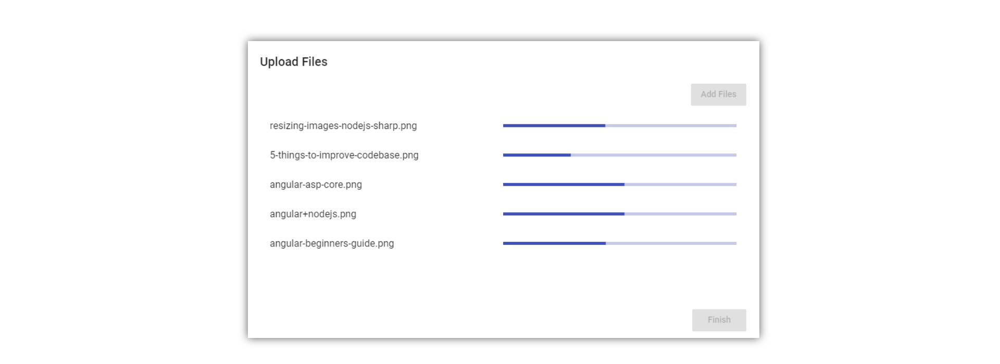

Creating file-upload components can be quite hard.

Not only because you need to deal with files in JavaScript. Also, because you need an API to test against before you can actually start coding.

In this tutorial, we will learn how to do both.

First, we will create a simple node.js express server with just one route to accept file uploads.

Afterward, we will create an angular application from scratch and build a beautiful file-upload component using the angular material ui-component-library.

Here is what the final result will look like:



Ready?

Let's start coding!


## Creating the Express server for the file upload

Before we can start writing our angular file-uploader, we need to have an API to upload to right?


In this tutorial, we are going to create a simple node.js server using express, that allows files to be uploaded in the multipart-format.

### Setting up a new project

To set up a new server project, create a new directory and initialize a new project using the

```
 npm init

```

command. It will ask you for some information. You can pass it in or just hit enter.

We will also need two JavaScript files. Create the following files in the project directory:

server.js
upload.js

### External dependencies

Our server will have three external dependencies.

The first one is obviously express. [Express](http://expressjs.com/de/) is a framework, that makes creating API very easy.
To install express, you can use this command

```
 npm install express --save

```

Because we want to access the API from an angular application, the server needs to allow cross-origin requests.
Therefore we are going to use a simple module called [CORS](https://de.wikipedia.org/wiki/Cross-Origin_Resource_Sharing).
To install it, type:

```
 npm install cors --save

```

Also, express itself is not very good at understanding forms. Because we will be uploading our files in the multipart/form-data format, we need to be able to parse this format.
The library "formidable" does this and is quite easy to use.
Install formidable using this command:

```
 npm install formidable --save

```


## Setting up a basic Express server

First, we need to create a basic express server in the server.js file. This part looks always the same and consists of only 3 lines.

```javascript title=server.js
const express = require('express')

const server = express()

server.listen(8000, () => {
  console.log('Server started!')
})
```

This is already a working express server. Although it is not doing anything useful, we could start it using the

```
 node server.js

```

command.

### Enabling CORS

To be able to access our API from an angular application, we need to enable cors.
To do so, we first need to require CORS.

```javascript title=server.js
const cors = require('cors')
```

Next, we configure it to allow any domain by creating an option-object.

```javascript title=server.js
var corsOptions = {
  origin: '*',
  optionsSuccessStatus: 200,
}
```

Finally, we tell express to use the cors-middleware with our configuration.

```javascript title=server.js
server.use(cors(corsOptions))
```

### Registering the upload route

Afterward, we need to configure a route for our file upload.

For that, we require our upload.js file and register a route with the HTTP-post method.

```javascript title=server.js
const upload = require('./upload')
server.post('/upload', upload)
```

Now we are done with the server.js file. It should look like this by now:

```javascript title=server.js
const express = require('express')
const upload = require('./upload')
const cors = require('cors')

const server = express()

var corsOptions = {
  origin: '*',
  optionsSuccessStatus: 200,
}

server.use(cors(corsOptions))

server.post('/upload', upload)

server.listen(8000, () => {
  console.log('Server started!')
})
```


## Implementing the upload route

Let's start implementing the upload functionality. We will place it into the upload.js file.

First, we need to require a class called IncomingForm from the "formidable" library.

```javascript title=upload.js
const IncomingForm = require('formidable').IncomingForm
```

After that, we need to export the callback function, we are using in our server.js to register the route. This function will be called, every time somebody hits the '/upload' URL.
This callback gives us a request-object (req), that stores information about the request that hit the route.

We also get a response-object (res). We can use this object, to send back a response.

```javascript title=upload.js
module.exports = function upload(req, res) {}
```

Inside that method, we create a new form.

```javascript title=upload.js
var form = new IncomingForm()
```

We then register callbacks on that form. The first callback is called for every file in the form:

```javascript title=upload.js
form.on('file', (field, file) => {
  // Do something with the file
  // e.g. save it to the database
  // you can access it using file.path
})
```

The uploaded files are stored in a temporary directory somewhere on your machine. To do something with them, you can copy them from there using the node.js file-system API.

The second callback is called when the form is completely parsed. In this case, we want to send back a success status code.

```javascript title=upload.js
form.on('end', () => {
  res.json()
})
```

We then trigger the parsing of the form using:

```javascript title=upload.js
form.parse(req)
```

That's all we will do for the upload functionality. It is not production ready, but it will help us to test our upload-component of the angular application we actually want to build.

Here is the complete upload.js file:

```javascript title=upload.js
const IncomingForm = require('formidable').IncomingForm

module.exports = function upload(req, res) {
  var form = new IncomingForm()

  form.on('file', (field, file) => {
    // Do something with the file
    // e.g. save it to the database
    // you can access it using file.path
  })
  form.on('end', () => {
    res.json()
  })
  form.parse(req)
}
```


## Creating a new Angular file upload project

Now that we have a working API we can code against, we can start creating the actual file-uploader.

For that, we first need to create a new angular project. We are going to use the [angular-cli](https://malcoded.com/posts/angular-fundamentals-cli) for this project.
Create a new application by opening a command prompt at the desired location and type:

```
 ng new file-upload

```

### External dependencies

Because we will need some complex ui-elements such as modal-windows, I decided to use the [angular material library](https://material.angular.io/) for this project.
To install this library, use this command:

```
 npm install --save @angular/material @angular/cdk

```

To make the css of this module available in our app, we need to import it into our app's global style.css file:

```css title=src/style.css
@import '~@angular/material/prebuilt-themes/indigo-pink.css';
```

Also, we are using a flexbox-design for this. To make flexbox a little bit easier to use with angular there is a library called "@angular/flex-layout".
Install the library like this:

```
 npm install --save @angular/flex-layout

```


## Creating a feature module

To make our desired file-upload component as re-usable as possible, I decided to bundle it into a separate feature module.

To create this module, just use this command:

```
 ng generate module upload

```

Next, we will need to import a lot of external modules into this new module. For example, we need to import all the angular material ui-components we are going to use.

Here is how this looks like:

```typescript title=src/app/upload/upload.module.ts
import { NgModule } from '@angular/core'
import { CommonModule } from '@angular/common'
import { UploadComponent } from './upload.component'
import {
  MatButtonModule,
  MatDialogModule,
  MatListModule,
  MatProgressBarModule,
} from '@angular/material'
import { BrowserAnimationsModule } from '@angular/platform-browser/animations'
import { FlexLayoutModule } from '@angular/flex-layout'
import { HttpClientModule } from '@angular/common/http'

@NgModule({
  imports: [
    CommonModule,
    MatButtonModule,
    MatDialogModule,
    MatListModule,
    FlexLayoutModule,
    HttpClientModule,
    BrowserAnimationsModule,
    MatProgressBarModule,
  ],
  declarations: [UploadComponent],
  exports: [UploadComponent],
})
export class UploadModule {}
```

Notice, that we are also exporting the UploadComponent, to make it available outside of this module.


## The file upload service

Before we can create the visuals of our file-uploader, we first need to implement the upload logic.
This logic will be placed in the UploadService.

Create that [service](https://malcoded.com/posts/angular-fundamentals-services) inside of the upload directory. Just use this command:

```
 ng generate service upload/upload

```

Inside of that service, we need to use the [HttpClient](https://angular.io/guide/http), so we request it using [dependency injection](https://malcoded.com/posts/angular-fundamentals-dependency-injection).
Also, the service will contain only one method called "upload".

```typescript title=src/app/upload/upload.service.ts
import { Injectable } from '@angular/core'
import {
  HttpClient,
  HttpRequest,
  HttpEventType,
  HttpResponse,
} from '@angular/common/http'
import { Subject } from 'rxjs/Subject'
import { Observable } from 'rxjs/Observable'

const url = 'http://localhost:8000/upload'

@Injectable()
export class UploadService {
  constructor(private http: HttpClient) {}

  public upload(
    files: Set<File>
  ): { [key: string]: { progress: Observable<number> } } {}
}
```

This upload method will return a map of progress objects. One for every file to upload. This object contains an observable of type number because it contains the progress of the upload in percent.

```typescript title=src/app/upload/upload.service.ts
 public upload(files: Set<File>):
	{ [key: string]: { progress: Observable<number> } } {

    // this will be the our resulting map
    const status: { [key: string]: { progress: Observable<number> } } = {};

    files.forEach(file => {
      // create a new multipart-form for every file
      const formData: FormData = new FormData();
      formData.append('file', file, file.name);

      // create a http-post request and pass the form
      // tell it to report the upload progress
      const req = new HttpRequest('POST', url, formData, {
        reportProgress: true
      });

      // create a new progress-subject for every file
      const progress = new Subject<number>();

      // send the http-request and subscribe for progress-updates
      this.http.request(req).subscribe(event => {
        if (event.type === HttpEventType.UploadProgress) {

          // calculate the progress percentage
          const percentDone = Math.round(100 * event.loaded / event.total);

          // pass the percentage into the progress-stream
          progress.next(percentDone);
        } else if (event instanceof HttpResponse) {

          // Close the progress-stream if we get an answer form the API
          // The upload is complete
          progress.complete();
        }
      });

      // Save every progress-observable in a map of all observables
      status[file.name] = {
        progress: progress.asObservable()
      };
    });

    // return the map of progress.observables
    return status;
  }

```

Inside of the upload-method, we package every file into a form, create an HTTP-post-request and send away that request with the form as payload. We then listen to the progress of every file-upload, calculate the upload-percentage and pass it to the progress-stream of that file. Every file has a progress-observable that is returned in a map.

Finally, we need to provide that service in our upload-module.


## The file upload dialog

Our UploadComponent will only consist of a single button. This button will then open a dialog to upload the files.
In this chapter, we are going to create this dialog.

Using angular material, a dialog is just a component. So let's create this DialogComponent:

```
 ng generate component upload/dialog

```

### Adding files

The first thing we need to do is to add a file input element to our component.

```html title=src/app/upload/dialog/dialog.component.html
<input
  type="file"
  #file
  style="display: none"
  (change)="onFilesAdded()"
  multiple
/>
```

This input element is the only way to trigger a file-selection menu of the operating system. But because it is quite ugly, we are going to hide it using "display: none". We then trigger this input using a click-event from our component-logic.

To do that, we need a reference to it in our component.ts. For that, we are using the ViewChild directive.
We will also need a place to store the files we want to upload.

For that, we create a Set of Files.

```typescript title=src/app/upload/dialog/dialog.component.ts
import { Component, OnInit, ViewChild } from '@angular/core'
import { MatDialogRef } from '@angular/material'
import { UploadService } from '../upload.service'
import { forkJoin } from 'rxjs/observable/forkJoin'

@Component({
  selector: 'app-dialog',
  templateUrl: './dialog.component.html',
  styleUrls: ['./dialog.component.css'],
})
export class DialogComponent {
  @ViewChild('file') file
  public files: Set<File> = new Set()
}
```

We can then use it to open a file-selection-menu by emulating a click:

```typescript title=src/app/upload/dialog/dialog.component.ts
 addFiles() {
    this.file.nativeElement.click();
  }

```

In our [template](https://angular.io/guide/template-syntax), we have defined that the file-selection-menu should call a method called "onFiledAdded" once the file-selection is complete.
In that method, we need to collect the files from the native HTML element and store them in our set.

```typescript title=src/app/upload/dialog/dialog.component.ts
 onFilesAdded() {
  const files: { [key: string]: File } = this.file.nativeElement.files;
  for (let key in files) {
    if (!isNaN(parseInt(key))) {
      this.files.add(files[key]);
    }
  }
}

```

### State

We will also need some state variables in the future, so we should add them to our DialogComponent.

```typescript title=src/app/upload/dialog/dialog.component.ts
progress
canBeClosed = true
primaryButtonText = 'Upload'
showCancelButton = true
uploading = false
uploadSuccessful = false
```

### DialogRef

Next, we need some control over the dialog itself. For example, we want to close the dialog from the dialog component.
To do that, we need to request the dialog reference via dependency injection in the DialogComponents' constructor. We also need to UploadService we have created earlier, so we request it, as well.

```typescript title=src/app/upload/dialog/dialog.component.ts
 constructor(public dialogRef: MatDialogRef<DialogComponent>, public uploadService: UploadService) {}

```

### Closing the dialog & uploading the files

Afterward, we take a look at the "closeDialog" method. We will be calling this method when the OK button of our dialog is pressed (it doesn't exist yet).
Depending on which state we are in, we want the button to behave differently.

When the state of the component is "uploadSuccessful" we just want to close the dialog. Else, we want to start the upload of the files.

```typescript title=src/app/upload/dialog/dialog.component.ts
 closeDialog() {
  // if everything was uploaded already, just close the dialog
  if (this.uploadSuccessful) {
    return this.dialogRef.close();
  }

  // set the component state to "uploading"
  this.uploading = true;

  // start the upload and save the progress map
  this.progress = this.uploadService.upload(this.files);

  // convert the progress map into an array
  let allProgressObservables = [];
  for (let key in this.progress) {
    allProgressObservables.push(this.progress[key].progress);
  }

  // Adjust the state variables

  // The OK-button should have the text "Finish" now
  this.primaryButtonText = 'Finish';

  // The dialog should not be closed while uploading
  this.canBeClosed = false;
  this.dialogRef.disableClose = true;

  // Hide the cancel-button
  this.showCancelButton = false;

  // When all progress-observables are completed...
  forkJoin(allProgressObservables).subscribe(end => {
    // ... the dialog can be closed again...
    this.canBeClosed = true;
    this.dialogRef.disableClose = false;

    // ... the upload was successful...
    this.uploadSuccessful = true;

    // ... and the component is no longer uploading
    this.uploading = false;
  });
}

```

### The full angular template

Here is the template of the dialog. It contains a button to add new files, a primary button (Upload/Finish) and a cancel button. Depending on the state of the component, these buttons can be disabled.

The main part of the dialog is the list of all files to upload. It contains the names of the files.

Once the files are uploading, a progress-bar for each file appears. This progress bar is using the progress-observable of each file.

```html title=src/app/upload/dialog/dialog.component.html
<input
  type="file"
  #file
  style="display: none"
  (change)="onFilesAdded()"
  multiple
/>
<div class="container" fxLayout="column" fxLayoutAlign="space-evenly stretch">
  <h1 mat-dialog-title>Upload Files</h1>
  <div>
    <button
      [disabled]="uploading || uploadSuccessful"
      mat-raised-button
      color="primary"
      class="add-files-btn"
      (click)="addFiles()"
    >
      Add Files
    </button>
  </div>

  <!-- This is the content of the dialog, containing a list of the files to upload -->
  <mat-dialog-content fxFlex>
    <mat-list>
      <mat-list-item *ngFor="let file of files">
        <h4 mat-line>{{file.name}}</h4>
        <mat-progress-bar
          *ngIf="progress"
          mode="determinate"
          [value]="progress[file.name].progress | async"
        ></mat-progress-bar>
      </mat-list-item>
    </mat-list>
  </mat-dialog-content>

  <!-- This are the actions of the dialog, containing the primary and the cancel button-->
  <mat-dialog-actions class="actions">
    <button *ngIf="showCancelButton" mat-button mat-dialog-close>Cancel</button>
    <button
      mat-raised-button
      color="primary"
      [disabled]="!canBeClosed"
      (click)="closeDialog()"
    >
      {{primaryButtonText}}
    </button>
  </mat-dialog-actions>
</div>
```

### The CSS styles

Here are the styles for the DialogComponent. I don't think there is explanation needed.

```css title=src/app/upload/dialog/dialog.component.css
.add-files-btn {
  float: right;
}

:host {
  height: 100%;
  display: flex;
  flex: 1;
  flex-direction: column;
}

.actions {
  justify-content: flex-end;
}

.container {
  height: 100%;
}
```


## Adding the DialogComponent as EntryComponent

For our dialog to work properly, we need to add it to the entry-components of our upload-module:

```typescript title=src/app/upload/upload.module.ts
import { NgModule } from '@angular/core'
import { CommonModule } from '@angular/common'
import { UploadComponent } from './upload.component'
import {
  MatButtonModule,
  MatDialogModule,
  MatListModule,
  MatProgressBarModule,
} from '@angular/material'
import { DialogComponent } from './dialog/dialog.component'
import { BrowserAnimationsModule } from '@angular/platform-browser/animations'
import { FlexLayoutModule } from '@angular/flex-layout'
import { UploadService } from './upload.service'
import { HttpClientModule } from '@angular/common/http'

@NgModule({
  imports: [
    CommonModule,
    MatButtonModule,
    MatDialogModule,
    MatListModule,
    FlexLayoutModule,
    HttpClientModule,
    BrowserAnimationsModule,
    MatProgressBarModule,
  ],
  declarations: [UploadComponent, DialogComponent],
  exports: [UploadComponent],
  entryComponents: [DialogComponent], // Add the DialogComponent as entry component
  providers: [UploadService],
})
export class UploadModule {}
```


## Modifying the Upload-Component

Finally, we need to modify the upload-component to trigger our new dialog. For that we create a simple button inside of the template of the component:

```html title=src/app/upload/upload.component.html
<button mat-raised-button (click)="openUploadDialog()">Upload</button>
```

Next, we implement the method we are referencing there in our component. But first, we need to request the MatDialog-service via dependency injection. This service allows us to open our DialogComponent.

All we need to do then is to call the open-method of this server, passing in our DialogComponent and the desired size of the dialog.

```typescript title=src/app/upload/upload.component.ts
import { Component } from '@angular/core'
import { MatDialog } from '@angular/material'
import { DialogComponent } from './dialog/dialog.component'
import { UploadService } from './upload.service'

@Component({
  selector: 'app-upload',
  templateUrl: './upload.component.html',
  styleUrls: ['./upload.component.css'],
})
export class UploadComponent {
  constructor(public dialog: MatDialog, public uploadService: UploadService) {}

  public openUploadDialog() {
    let dialogRef = this.dialog.open(DialogComponent, {
      width: '50%',
      height: '50%',
    })
  }
}
```

That's it. We now have a working file-uploader.


## Using the Upload-Component

All that's left to do, is to import the upload-module into our app-module and add the component to the app-component.

```typescript title=src/app/app.module.ts
import { BrowserModule } from '@angular/platform-browser'
import { NgModule } from '@angular/core'

import { AppComponent } from './app.component'
import { UploadModule } from './upload/upload.module'

@NgModule({
  declarations: [AppComponent],
  imports: [BrowserModule, UploadModule],
  providers: [],
  bootstrap: [AppComponent],
})
export class AppModule {}
```

And finally using the component in the app-component:

```html title=src/app/app.component.html
<app-upload></app-upload>
```

## Conclusion

In this tutorial, we learned how to set up a node.js server-application from scratch and created a very basic file-upload route.

We also created an angular file-upload component and styled it using the angular material UI-components.

You can find the full source code at the corresponding [GitHub repository](https://github.com/LukasMarx/angular-file-upload).

I hope you enjoyed this post.

If you did please hit the share buttons below and help other people building their own file-upload-components, as well.

Have a fantastic day!
