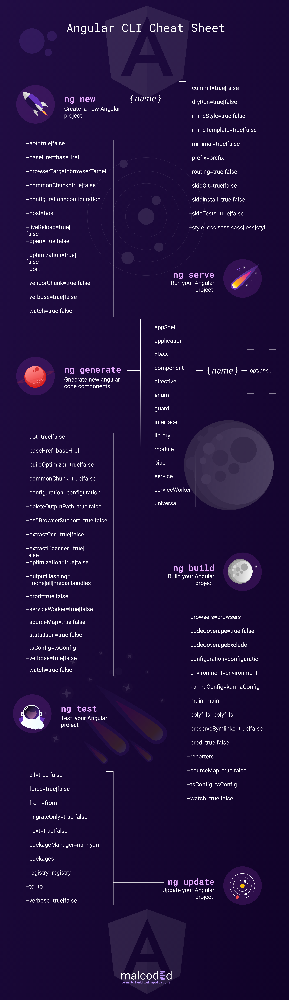

Setting up a new project and creating all these files for every new component can take a lot of time.

It is tedious work that takes a lot of fun from the development process.

Fortunately, there are tools like the angular-cli, that can do all that hard work for you!

<AffiliateAd tag="angular" />

In this tutorial, we are going to take a look at the angular-cli and how to use it properly.

We will discover all the different things the CLI can do for you: Creating new angular projects, generating components or services or hosting your application.

At the end you will get a cheat sheet so you can quickly look up what you might have forgotten at any time!

Let's get started!


## Setup

To use the [angular-cli](https://cli.angular.io/), we need to install it first.

Installing the angular-cli is quite easy. All you need to do, is to paste the following command into a terminal window.

```
 npm install @angular/cli -g

```

For this to work, you need to have node.js with npm installed on your machine.

The installation may take a while.


## Create your first Angular CLI app

Now it's time to create your first angular app with the CLI (Command Line Interface)

Doing so is not complex at all.

All you need to do, is choose a file-directory for your application to live in. Once that's done, open a terminal at that location and use the command

```
 ng new [project-name]

```

to generate a new project. Make sure to replace [project-name] with a actual project name of your choice.

The CLI will now go ahead and create a new directory named just like the project.

Inside of that folder, it will create all the files for a basic but already executable angular application.

It will also install all required external dependencies. This can actually take some time.


## ng new: Generate new angular projects

The command we used above is not the only way to create a new angular application.

In fact, the command itself as a ton of options, that are all controlled via additional flags.

<AffiliateAd tag="angular" />

Of course, you do not need to know all of them by heart, but some of them are pretty useful.

Here are some of them:

### \-\-dry-run: Try things out

Sometimes you want to try out, what a command does, before it actually does something.

Specifically if you are new to the CLI, the dry-run option will be very useful.

This option will stop the CLI from making any changes to the file system. Instead it will print everything it would have done to the console.
That way you can check if the command actually does what you thought it does, before it causes any harm.

For example, the option could be used like this:

```
 ng new example --dry-run

```

And will result in the following output:

```
create example/e2e/app.e2e-spec.ts (289 bytes)
create example/e2e/app.po.ts (208 bytes)
create example/e2e/tsconfig.e2e.json (235 bytes)
create example/karma.conf.js (923 bytes)
create example/package.json (1292 bytes)
create example/protractor.conf.js (722 bytes)
create example/README.md (1023 bytes)
create example/tsconfig.json (363 bytes)
create example/tslint.json (3012 bytes)
create example/.angular-cli.json (1242 bytes)
create example/.editorconfig (245 bytes)
create example/src/assets/.gitkeep (0 bytes)
create example/src/environments/environment.prod.ts (51 bytes)
create example/src/environments/environment.ts (387 bytes)
create example/src/favicon.ico (5430 bytes)
create example/src/index.html (294 bytes)
create example/src/main.ts (370 bytes)
create example/src/polyfills.ts (3114 bytes)
create example/src/styles.css (80 bytes)
create example/src/test.ts (642 bytes)
create example/src/tsconfig.app.json (211 bytes)
create example/src/tsconfig.spec.json (283 bytes)
create example/src/typings.d.ts (104 bytes)
create example/src/app/app.module.ts (316 bytes)
create example/src/app/app.component.html (1141 bytes)
create example/src/app/app.component.spec.ts (986 bytes)
create example/src/app/app.component.ts (207 bytes)
create example/src/app/app.component.css (0 bytes)

NOTE: Run with "dry run" no changes were made.

```

The last line is kind off important.

You can append it to almost all of the angular-cli commands.

### \-\-skip-install: Skip installation of external dependencies

There might be situations, where you don't want to install the external dependencies right after the creation of a new project.

One Example could be, that you don't have a internet connection. Or you don't want to wait forever, because you are on a slow machine right then.

That is, when the skip-install option comes in handy.

If you create a new application with this flag, it won't install external dependencies automatically.

```
 ng new example --skip-install

```

Unfortunately, you then have to install them manually at a later point in time.

You can use the following command at the root of your project to do so:

```
 npm install

```

Also, you have to have the external dependencies installed to run or test your application.

### \-\-skip-tests: Who needs tests anyway?

Seriously, there are legit scenarios where you just don't need them.

Creating a new project to try or demo something or reproducing a bug for example.

If you have taken a look at the project we created earlier, you probably noticed, that the CLI created files (.spec.ts) containing tests for every component.

These files only take up space and are cluttering your project if they are not needed anyway.

We can tell the CLI not to create test by using the --skip-tests option:

```
 ng new example --skip-tests

```

### \-\-style: Use a CSS preprocessor of choice

Using pre-processed Css like [Sass ](https://sass-lang.com/)has become quite popular.

But the CLI creates normal css-files for every component by default. If you don't want to change them manually every time, you can use the --style scss option to tell the CLI that you want to use Sass.

But not only Sass-files (.scss) are supported. You can find a list of all supported style-extensions at the [official angular-cli-wiki](https://github.com/angular/angular-cli/wiki/new).

```
 ng new example --style scss

```


## ng generate: Generate components using the Angular CLI

Generating working angular application with just one command is pretty convenient isn't it?

But the angular CLI can do so much more!

You have created a new project and started developing. It will not take to long for you to come to point, where you will need more files. You need a new component, module, service or any other angular construct.

I don't know if you have already notice this, but developers are generally pretty lazy people. So creating three (or four with tests) new files every time you need a new component seems like an impossible task.

That is why the angular-cli can create these files for you.

To do this, you can use the ng generate command.

For example, if you need a new component, you could open a terminal at the desired location and use the

```
 ng generate component [name]

```

command to generate all the files you need to create a new component.

The CLI will generate a new folder for you, as well. Isn't that great?

By the way, if you don't want that extra folder, you can use the --flat option:

```
 ng generate component [name] --flat

```

Of course this does not only work for components. You can create a whole bunch of different angular-blueprints by replacing component by one of the following.

class
directive
enum
guard
interface
module
pipe
service


## ng serve: Run your app with just one command

Once we are done creating and developing our angular application, we also want to test and run it.

Fortunately doing so is very easy as well, thanks to the CLI.

All we need to do, is to open a terminal at the root of our project and use the command

```
 ng serve

```

to start our application in development mode.

It will also watch the directory of our application for changes.

<AffiliateAd tag="angular" />

So if it detects a change, it will recompile the application (partly) and automatically update the application in the browser.

Personally, I have the app running in watch mode, almost all of the time during development.

It is important to know, that this feature is for development purposes only. Do not use this small web-server in an production environment!

### Building to files using ng build

When you are happy with your angular app, it is time to deploy it to a web-server.

To get the files, that are required for that, we can use the

```
 ng build

```

command.

This command will cause the CLI to build your application and places the output in a directory called "dist" (by default).

Using this command, the app is still in an development state.

This means, that certain optimizations where not performed and the app is still using the development[ environment variables](https://medium.com/beautiful-angular/angular-2-and-environment-variables-59c57ba643be).

To change that, use the --prod flag like this:

```
 ng build --prod

```


## ng eject: Pull the ripcord

Over the past year, the angular-cli has become more and more flexible.

But there might be still some scenarios that are not achievable with the CLI.

In this case, you can use the

```
 ng eject

```

command.

It will disable the CLI for your project and create you a webpack configuration file.

While the CLI was using webpack under the hood anyway, you now have full control over webpack.

That way you have the most possible felxibility, at the cost of all of the convenient features we discussed above.

The main point of this command is, that the angular-cli does not lock you in. You can decide to leave it behind at any time.
This is certainly important for large organisations.

However, keep in mind, that this command is a one way ticket.

There is no command that coverts the project pack to angular-cli-mode.

## Cheat Sheet

I know remembering the all the commands can be a bit rough at the beginning. So I made this cheat sheet for you:



## Conclusion

In this tutorial we learned how to set up the angular-cli and how to use it to do all the work, like-creating a new project or creating a bunch of files for a component, for us.

I hope you enjoyed this post.

<AffiliateAd tag="angular" />

If you did please hit the share buttons below and help other people enjoy angular a little bit more, as well.

Happy Coding!
