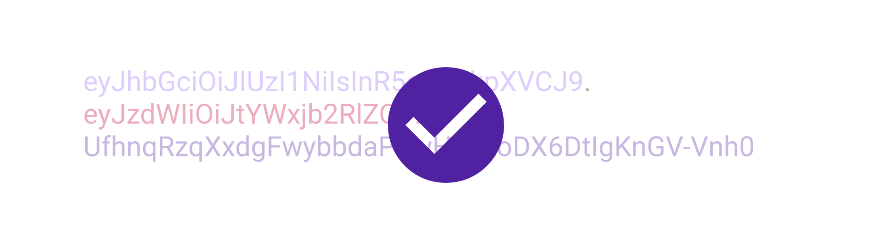

When I started with web development, I had a lot of trouble when I tried implementing a simple authentication system.
There are all these terms like signatures, sessions, hashes, encryption and whatnot that make it quite hard to get started.

Not to mention that doing this for a real project, I knew that if I mess this up, I would be in real trouble.

In this tutorial, I want to show you how to create a simple authentication system with angular and express.
To do that, we will use a technology called JSON Web Token (JWT). I'll tell you what that is in a moment.

This tutorial will cover the very basics of authentication and can't possibly touch every aspect of security.
If you feel like you need some more help with that topic, check out the security academy my friend Bartosz is teaching at [angular-academy.com\*](https://angular-academy.com/security/?aff=487495_ojaq3ozs).

<AffiliateAd tag="angular" />

Let's get started with the tutorial!


## What is a JSON Web Token

A JSON Web Token (short JWT) is just a token that contains some JSON data, although that is not obvious at first sight.
A JWT looks something like this:


To convert this to readable JSON, we first need to split the token up. This is because a JWT consists of three sections, each separated by a full stop (".").
The first section it the header section, the second is the payload and the third the signature.

After splitting the token up, we can take each of the parts (except for the signature) and decode it using a base64 decoder.

And there it is! The result is the JSON we talked about. This could look something like this:

```javascript title=Header
{
  "alg": "HS256",
  "typ": "JWT"
}
```

```javascript title=Payload
{
  "sub": "1234567890",
  "name": "John Doe",
  "iat": 1516239022
}
```

The signature is generated using the Signature Algorithm specified in the header. It takes the base64-url-encoded header and the base64-url-encoded payload
separated by a full stop (".") and signs it using a secret.

```
HMACSHA256(
  base64UrlEncode(header) + "." +
  base64UrlEncode(payload),
  secret)
```

You can use the online tool [jwt.io](https://jwt.io/) to encode, decode and verify your tokens. But please do not paste any working production tokens there (or anywhere else really). You can not trust anyone with your secrets!


## What makes JSON Web Tokens so useful

JWTs are typically generated by the server for example when a user logs in to an application. After providing the correct credentials,
the server generates a personalized Token for the user and signs it with a secret only the server knows. The token is then passed to the user.

To access the protected parts of the servers API, the user has to send the JWT with the corresponding request to get access to that API.
The token works just like a virtual entrance ticket in that way.

But what keeps a malicious user from faking the entrance ticket?

As you might have guessed already, it's the signature of the token. The server can verify the signature of the token by generating the signature as described above and compare it with the signature section of the JWT.

If the signatures match, the server can be sure that nobody forged that token. Typically the payload section contains the Id of the user, which the server can now use the check whether the user has access to the requested endpoint.

But this concept goes further than just the user-id. This means that we can hand any kind of data to the user that we might require for authentication or any other purpose. We can always be sure that the data was not modified.
For example, JWTs usually contain their date of expiration.


## Generating a JWT with node.js

Now that we know what JSON Web Tokens look like and how they work, let's take a look at how we can generate such tokens in node.js.

Let's begin by installing the jsonwebtoken package. Although we know how JWTs work and could easily create the logic ourselves, we don't.
The golden rule in cryptography is "never build your own crypto". It is just to easy to make small mistakes that render the whole security mechanism useless.

```bash
npm install jsonwebtoken
```

Generating a token is very easy. Just require 'jsonwebtoken' and use its `sign` function:

```javascript
var jwt = require('jsonwebtoken')
var token = jwt.sign({ foo: 'bar' }, 'thisIsASecret')
```

All it takes is any JavaScript object as payload and a secret. This uses the [HMAC SHA256](https://en.wikipedia.org/wiki/HMAC) signing algorithm by default.

The function also takes some options. For example we can set the expiary date like so:

```javascript
var token = jwt.sign({ foo: 'bar' }, 'thisIsASecret', { expiresIn: '24h' })
```

For a full list of options, please take a look at the [documentation](https://www.npmjs.com/package/jsonwebtoken).


## Verifying a JWT with node.js

Verifying a token is just as easy. Just use the verify function of the 'jsonwebtoken' package.

```javascript
jwt.verify(token, 'thisIsASecret', function(err, decoded) {
  if (!err) {
    console.log('This is the payload of a valid token: ', decoded)
  }
})
```

<Box>Replace 'thisIsASecret' with an actual secret value!</Box>

Just pass the token and the secret to the verify function. The callback contains the decoded payload of the token (in case it is valid) or an error object.



## A login endpoint in express

We won't go into detail here, but let's take a look at what a real live login endpoint would look like using JWTs.
As described already, the endpoint has to verify that the user is who he says he is. This is typically done by checking a username and a password against a database.

Afterward, the endpoint generates a personalized token for the user (for example containing his username or user-id) and hands it back to the client.
Keep in mind that tokens are not encrypted. So don't put any sensitive data in there. That's why it might be a better idea to use a user-id rahter then the users' email address.

```javascript
export function login(req: Request, res: Response) {
  const email = req.body.email
  const password = req.body.password

  if (!areCredentialsValid(email, password)) {
    // Status: 401 Unauthorized
    return res.sendStatus(401)
  }

  const userId = getUserId(email)

  const jwtBearerToken = jwt.sign({}, SECRET, {
    expiresIn: '24h',
    subject: userId,
  })

  return res.send(jwtBearerToken)
}
```

<Box>
  This code is only for demonstration purposes and is not complete. Some
  functions and variables are missing.
</Box>


## Verification middleware in express

Now that we have generated a token for the user, we need to add an easy way to verify the token of the user.

Because a typical use case is to check the users token with every request, it is a common approach to wrap the verify-logic into a middleware.

Since this is so common, there are already working solutions, so we don't have to build our own.

Let's use the [express-jwt](https://www.npmjs.com/package/express-jwt) package for this example. It generates the middleware for us. All we need to do is to tell it our secret.

```javascript
const jwt = require('express-jwt');

const jwtMiddleware = jwt({secret: 'thisIsASecret'}),

app.get('/protected',
  jwtMiddleware,
  (req, res) => {

    // The payload of the can be accessed
    // using the req.user property

    if (!req.user.sub) return res.sendStatus(401);
    res.sendStatus(200);
  })
```

<Box>Replace 'thisIsASecret' with an actual secret value!</Box>

This reads the JWT access token from the `Authorization` header of every request.

The middleware automatically takes the payload of the token, parses it and puts it in the `res.user` property, so we can access it if we need to.


## Obtaining a JWT Access Token in Angular

To obtain the access token in our angular app, all we need to do is to send username and password to the login endpoint of the server.

```typescript title=auth.service.ts
import { Injectable } from '@angular/core'
import { HttpClient } from '@angular/common/http'
import { tap } from 'rxjs/operators'

@Injectable()
export class AuthService {
  // The url of your login route on the server
  private loginUrl = 'http://localhost:3000/api/auht/login'

  constructor(private http: HttpClient) {}

  public login(username: string, password: string) {
    return this.http.post({ username, password }).pipe(
      tap(token => {
        localStorage.setItem('token', token)
      })
    )
  }
}
```

Once we got the token, we save it into `localStorage` so we can use it later.


## Using Interceptors to send the JWT access token with every request

The last part of the puzzle is to send the access token with every request. One easy way to do this is by using angular [Interceptors](https://malcoded.com/posts/angular-fundamentals-http/#angular-http-interceptors).

An Interceptor intercepts every HTTP-request before it is sent. In that way, it works just like the middleware in exress but the opposite direction.

In essence, such an Interceptor looks like this:

```typescript title=auth.interceptor.ts
import {
  HttpEvent,
  HttpInterceptor,
  HttpHandler,
  HttpRequest,
} from '@angular/common/http'
import { Observable } from 'rxjs/Observable'
import { Injectable } from '@angular/core'

@Injectable()
export class AuthInterceptor implements HttpInterceptor {
  intercept(
    req: HttpRequest<any>,
    next: HttpHandler
  ): Observable<HttpEvent<any>> {
    const token = localStorage.getItem('token')

    if (token) {
      const clonedRequest = req.clone({
        headers: req.headers.set('Authorization', 'Bearer ' + token),
      })

      return next.handle(clonedRequest)
    } else {
      return next.handle(req)
    }
  }
}
```

This Interceptor is reading the token from `localStorage` and sets it to the 'Authorization' header of every request.

For this Interceptor to take effect, we need to provide it first (for example in the app module):

```typescript title=app.module.ts
import { BrowserModule } from '@angular/platform-browser'
import { NgModule } from '@angular/core'

import { AppComponent } from './app.component'

import { HttpClientModule } from '@angular/common/http'
import { HTTP_INTERCEPTORS } from '@angular/common/http'

@NgModule({
  declarations: [AppComponent],
  imports: [
    BrowserModule,
    HttpClientModule, // import module
  ],
  providers: [
    {
      provide: HTTP_INTERCEPTORS,
      useClass: AuthenticationInterceptor,
      multi: true,
    },
  ],
  bootstrap: [AppComponent],
})
export class AppModule {}
```

## Conclusion

In this tutorial, we discovered what JSON Web Tokens are and how to use them with express and angular.

I wanted to keep this tutorial as short as possible, to get you started.
If you feel like you need some more help with web-security in angular, check out the security academy my friend Bartosz is teaching at [angular-academy.com\*](https://angular-academy.com/security/?aff=487495_ojaq3ozs).

<AffiliateAd tag="angular" />

I hope you like this article. If you did, please share it with your friends!

Happy Coding!

(links marked with a \* are affiliate links)
