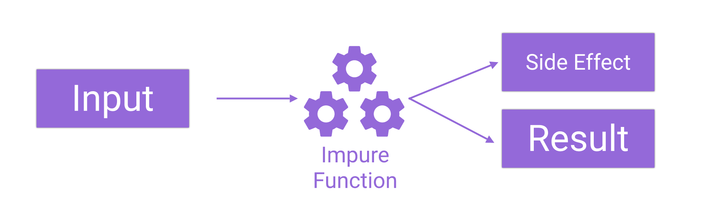

You will probably agree with me, that angular applications can become quite hard to overlook as they become bigger. Information is passed from parent-components to child-components, @Output goes into @Input, and at the end of the day, nobody knows where the malformed result came from.

But it doesn't have to be like this. The solution to the problem is called [Redux ](http://redux.js.org/docs/introduction/Motivation.html)and it's angular implementation ngrx& ngrx store.

<Demo gitHub="LukasMarx/redux-currency-conversion" />

Simply put, Redux is a principle of organizing your applications code structure, to keep the state of your application at a central place.

In this tutorial, you will not only learn the details of the Redux architecture you will also learn, how to implement Redux into your own angular applications using the [ngrx](https://ngrx.io/) library.

We will take a close look at reducers, actions and especially state. Doing so, we will create a functional angular application, to show you how to implement ngrx store & Redux step-by-step.

Let's get started!


## It's all about state

First of all, let's talk about what is causing the problem.

The point of the whole JavaScript (web)-application thing is, to manage at least some of the states of the application client side. What do I mean by that?

Originally, web-pages where plain HTML. Everything that was visible on the screen had to be rendered by a web-server. No matter if you filled a form or clicked a button. It all had to trigger a request to the server if you wanted to change the appearance of the page.
There was only one problem: Re-rendering the page caused your form to disappear and take your information with it. But what if we still needed it?

A common solution was (and still is), to create so-called sessions. Those sessions had ids, that the user had to send back to the server with every request.


That way, the state of the application, for example, the content of your shopping cart, could be preserved through page-reloads. But overall it was managed by the server.

We don't have that kind of problems in client-side applications. Because our page is never fully reloaded, we do not have to worry about losing information. Also, we have this very nice feature called JavaScript. JavaScript enables us, to keep your information in variables or arrays. We can calculate with them and change them in any possible way, without the need of talking to a server. But that freedom only created other kinds of problems...


## State in Angular

In angular, the state of the application is distributed in many small components. The shopping cart component manages all it's containing items and the sidebar component has a list of all pages.


While the separation into many different components is actually great for scaling an application, that goes not for the state. When splitting up the state, many different problems emerge, as the application increases in size.

### Persisting the state

One common example is saving the state of the application. Let's say, we want to persist the current state of the app to disk, so when the user revisits our app, it looks exactly like when he left it. This behavior is often expected in games, that preserve the current progress, but also in regular applications. The shopping cart is a great example of this.

While the task of saving the state to disk seems to be easy on paper, it is not when it comes to full-blown application. In fact, you would need to iterate over all components or services that contain any state, to collect it all to a global state.


Of course, that problem does not only occur when saving but also when loading the state. The whole procedure has to run in reverse.

### The flow of the state

In angular, it is also possible, to pass objects between components. This can be done using the @Input & @Output decorators or via a shared service. Either way, keeping track of which components alters the state becomes an impossible task quite quickly. Especially when working with a big application and/or team.

Furthermore, angular also allows a bi-directional flow. A component can not only receive data but also change and return it back. That makes tracking the value of a state even more complicated.

In such a scenario, tracking down bugs can be a quite challenging task.


## Resolving the chaos with redux

Redux promises to resolve the issues mentioned above, by saving the state in one single object, called the store. This concept is called the Single Source of Truth.
It also ensures a one-directional flow, by making the state read-only.

### The single source of truth principle

With that principle in place, saving or transferring our application state becomes incredibly easy. All we have to do is to serialize that one objects (store) e.g. into JSON.


Using this technique, our application also becomes more easy to debug, as all important variables are stored in that one object.

### Read-Only state

Everything saved in the store is read-only.

> The only way to change the state is to emit an action, an object describing what happened.
>
> -- [redux docs](http://redux.js.org/docs/introduction/ThreePrinciples.html)

If we want to change the state in any way, we have to make a request in the form of an action. The advantage of that is that these actions can be saved and act as a kind of transaction log. That way, we can easily revert or replay an action, e.g when implementing an undo-functionality.

This also prevents unwanted side-effects, because all changes happen centralized and in a strict order.

### Pure functions

We will later learn, that we can not only make requests in using actions but can also react to an action. For that, we will register a reducer. This reducer is a [pure function](https://medium.com/@jamesjefferyuk/javascript-what-are-pure-functions-4d4d5392d49c). That means, it takes the state, makes a copy of it and then applies the changes to the copy.


It also is not allowed to modify any variable that is outside of its block-scope.



This is a principle that comes from functional programming and is meant to greatly reduce side-effects.
We will take a look at pure functions when we talk about reducers.


## Should you use Redux in your Angular project?

Before we dive into the dirty details of Redux and it's implementation in angular, I want to give a word of warning here.

Redux is great at bringing a maintainable structure to angular projects. But it also brings a LOT of boilerplate code. And I really mean A LOT.

As you will notice, as we progress, each different sub-state requires the creation of some files each containing some functions. Even with just one or two variables, the amount of additional work is immense.

I will be honest with you. I haven't worked with Redux before preparing for this article, so my experience with it is quite limited.

Furthermore, while writing the example application, we will create together in this article, I had some "F\*\*\* this!" moments, and I'm certain, you will understand what I mean if you decide to follow me through this article.

### Redux is not for everyone & everything

While I agree, that Redux can cause a lot of pain, especially if you are not used to it, I can also see the huge benefits, it adds at a certain scale. So here is what I would recommend:

> You Might Not Need Redux
>
> -- [Dan Abramov](https://twitter.com/dan_abramov/status/777983404914671616)

If you would call your application "tiny" or "small", I would suggest not to waste a thought on using Redux. Using services and components to manage the state is completely sufficient here and not worth the overhead Redux brings to the party.

If your application is going to be "large", "huge" or "monolithic", on the other hand, Redux can bring some huge benefits to the table, that are definitely worth considering. You probably should use Redux here.

It becomes a little bit more tricky for any "medium" size application. It turns out, Redux is not the only solution for managing state efficiently. There are other principles/frameworks like [MobX](https://github.com/mobxjs/mobx), that have a lot less overhead than Redux.


## Install ngrx into your angular application

ngrx is a collection of reactive libraries for angular, containing a redux implementation and many other useful libraries.

In this tutorial, we are going to use ngrx to build an example application featuring the redux store and asynchronous effects.

### The Example application

The example application will be a currency conversion app. The user will be able to enter a custom amount of USD into an input field. The application will then calculate the current amount in many other currencies.

### Installation

To get started, we first need to create a new application. We can use the angular-cli to do so.

```
 ng new currency-conversion
```

Once the project is set up, we also need to install a bunch of external packages.

```
npm install @ngrx/core @ngrx/effects @ngrx/store

```


## Actions: Events in Redux

If you are familiar with events, actions are quite simple to understand. Because they are just that. They report that something happened. Nothing more.
Actions do not describe, how the state has to be changed.

Instead, they precisely describe what happened. Every action has a type. The type is typically a string, that describes what happened. For example 'MouseDown'.

Actions can also carry an (optional) payload. That is because often times, we need additional information, about the event. For example, we probably want to know, where the mouse went down.
This payload can be any JavaScript object.

### NgRx example: Amount

Our example application needs an input field, with the amount in dollar, that we want to convert to other currencies. This amount will be part of our applications state. Because of that, we will also need an action, to report, that the amount was changed by the user.

For that, we create a new folder called actions in our app directory. In there, we create a file called amount.ts.

Next, we create a class that implements the Action interface. That interface forces us to define the Type of our action. For that, we define a constant string. The value of that constant can be any string, as long as it is unique.

```typescript title=src/app/actions/amount.ts
import { Action } from '@ngrx/store'

export const AMOUNTCHANGE = '[Amount] Change'

export class AmountChangeAction implements Action {
  type = AMOUNTCHANGE

  constructor(public payload: number) {}
}
```

We also define a constructor, that takes our payload, which is the new amount.

Simple, isn't it?

### NgRx example: Currency-rates

Later in our application, we will also need two more actions. The first one indicates that new currency data was requested. The second one specifies, that new currency data has been downloaded.

```typescript title=src/app/actions/currency.ts
import { Currency } from './../models/currency'
import { Action } from '@ngrx/store'

export const CURRENCIESUPDATE = '[Currency] UpdateAll'
export const CURRENCIESUPDATED = '[Currency] UpdatedAll'

export class CurrenciesUpdateAction implements Action {
  type = CURRENCIESUPDATE
}

export class CurrenciesUpdatedAction implements Action {
  type = CURRENCIESUPDATED

  constructor(public payload: Currency[]) {}
}
```

You probably noticed that we are using the "Currency" interface here. So let's create that one.
I like to store such files in a "models" folder because it describes a data structure. Go ahead and create that folder inside the app directory.

```typescript title=src/app/models/currency.ts
export interface Currency {
  code: string
  value: number
}
```

The code will contain the short of the currency. E.g. EUR for euro.
The value will contain the value of the currency compared to the dollar.


## Changing the state with Redux reducers

Now that we have events in the form of actions, we need corresponding event listeners. These listeners are called reducers. These reducers are the only structure that is allowed to alter the state. All state changes are implemented inside of reducers.

After all, a reducer is just a function. It takes the current state and the action as parameters. All we need to do is to create a function with that interface and register it at our store.

### NgRx example: Amount

As we have two different sections of the state, the amount and the list of currency-rates, we need two different reducers. One for each section or sub-state. Otherwise, you would end up with one giant switch/case statement. The reducers we create are later merged by the framework into one large reducer. So let's see how a reducer for the amount looks like:

```typescript title=src/app/reducers/amount.ts
import { ActionReducer, Action } from '@ngrx/store'
import * as amount from '../actions/amount'

export function reducer(state: number = 1, action: amount.AmountChangeAction) {
  switch (action.type) {
    case amount.AMOUNTCHANGE:
      return action.payload
    default:
      return state
  }
}
```

Reducers are typically created in their own directory. Create the directory and file shown above.

In this simple case, the sub-state amount is just a number. Because of that, we can either return the new amount, if the action is AMOUNTCHANGE or return the current state. Notice that we import the previously created action here.

### NgRx example: Currency-Rates

Of course, we also require a reducer for our currency-rates. This reducer looks quite the same as the previous one. The only difference is, that our sub-state is now an array of currency rates.

```typescript title=src/app/reducers/currency.ts
import { Currency } from './../models/currency'
import * as currency from '../actions/currency'

export function reducer(state = [], action: currency.CurrenciesUpdatedAction) {
  switch (action.type) {
    case currency.CURRENCIESUPDATED:
      return action.payload
    default:
      return state
  }
}
```

### The principle of immutable objects & pure functions

At the beginning of this article I mentioned, that reducers have to be pure functions. So, what is a pure function?

A pure function is called pure if it produces always the same output (return) when given the same input (parameter). Deterministic functions like this are especially easy to debug and test.

```typescript title=Pure Function
function add(a, b) {
  return a + b
}
```

...

```typescript title=Impure Function
let c = 1
function add(a, b) {
  return a + b + c
}
```

Also, a pure function is not allowed to produce any side effects. This is done, to ensure, that a function can always do its job, without depending on any other function to be called before.

For a complete walk-through of the topic, read this [great article about impure functions](https://medium.com/javascript-scene/master-the-javascript-interview-what-is-a-pure-function-d1c076bec976).

### Creating the application state

Now we have two sub-states of our application. The amount and the currency-rates. Next, we need to create one "Application State" out of this sub-states. This is because our Redux store can only consist of one JavaScript object.

To define the application state, go ahead and create a new file called "index.ts" inside of the reducers folder. Inside of that file, we first create the interface of our app's state.

```typescript title=src/app/reducers/index.ts
import { Currency } from './../models/currency'
export interface State {
  amount: number
  currencies: Currency[]
}
```


## A NgRx store example

For the store to be instantiated in our application, we need to register it at some point.
Doing so is quite easy. All we need to do is to import it into our app-module.

When registering the store, we also need to tell it about its reducers. For that, it expects a map of all reducers, we want to register. So first, go ahead and create that map. We can do so inside of the previously created index.ts.

```typescript title=src/app/reducers/index.ts
import * as fromAmount from './amount'
import * as fromCurrency from './currency'

export const reducers = {
  amount: fromAmount.reducer,
  currencies: fromCurrency.reducer,
}
```

Afterward, we can import the store into our app-module. Here we import the map of reducers and pass it as a parameter.

```typescript title=src/app/app.module.ts
import { BrowserModule } from '@angular/platform-browser'
import { FormsModule } from '@angular/forms'
import { NgModule } from '@angular/core'

import { AppComponent } from './app.component'
import { StoreModule } from '@ngrx/store'
import { reducers } from './reducers/index'

@NgModule({
  declarations: [AppComponent],
  imports: [BrowserModule, FormsModule, StoreModule.forRoot(reducers)],
  bootstrap: [AppComponent],
})
export class AppModule {}
```


## Dispatching actions

OK! Now we have actions and their reducers. For actual changes to occur to the state, these actions have to be dispatched, just like you would dispatch events.

Dispatching an action is quite easy. First, we need a reference to our store. We can get one via [dependency injection](https://malcoded.com/posts/angular-fundamentals-dependency-injection).

For our user to actually change the amount, we need an input field. So let's create one! For simplicity, we will use our app.component.html for this example.

```html title=src/app/app.component.html
<input (ngModelChange)="onAmountChange($event)" />
```

Whenever the input's value changes, the specified method is called inside of our component. All we need to do is to create that method. But first, we need to request the store instance in our constructor

```typescript title=src/app/app.component.ts
import { AmountChangeAction } from './actions/amount'
import { Component } from '@angular/core'
import { Store } from '@ngrx/store'

import * as fromRoot from './reducers'

@Component({
  selector: 'app-root',
  templateUrl: './app.component.html',
  styleUrls: ['./app.component.css'],
})
export class AppComponent {
  constructor(public store: Store<fromRoot.State>) {}

  onAmountChange(amount: string) {
    const number = parseFloat(amount)
    if (!isNaN(number)) this.store.dispatch(new AmountChangeAction(number))
  }
}
```

But that alone is not sufficient. We actually need a two-way binding to our store...


## Using the state in components

Using the state in our components is fortunately quite simple. That is when you are comfortable with RxJs. If not, I recommend reading my [guide on RxJs especially designed for angular developers](https://malcoded.com/posts/rxjs-for-angular-devs).

But before we can begin, we need to define some selectors.

### NgRx selectors

Selectors are a concept of ngrx-store. They are just small and simple functions, that allows us, to get only the part of the application state, that we are interested in. I've created these functions in the index.ts inside of the reducers directory.

```typescript title=src/app/reducers/index.ts
export const getAmountState = (state: State) => state.amount

export const getCurrnecyRates = (state: State) => state.currencies
```

All they do is to return a sub-state from the big application state for convenience.

### Creating observables from the store

Now that we have the selectors in place, we can get our observables from the store. For that, we can use the select() method.

```typescript title=src/app/app.component.ts
import { Currency } from './models/currency'
import { AmountChangeAction } from './actions/amount'
import { Component } from '@angular/core'
import { Store } from '@ngrx/store'

import * as fromRoot from './reducers'
import { Observable } from 'rxjs'

@Component({
  selector: 'app-root',
  templateUrl: './app.component.html',
  styleUrls: ['./app.component.css'],
})
export class AppComponent {
  public amount$: Observable<number>
  public currencyRates$: Observable<Currency[]>

  constructor(public store: Store<fromRoot.State>) {
    this.amount$ = store.select(fromRoot.getAmountState)
    this.currencyRates$ = store.select(fromRoot.getCurrnecyRates)
  }

  onAmountChange(amount: string) {
    const number = parseFloat(amount)
    if (!isNaN(number)) this.store.dispatch(new AmountChangeAction(number))
  }
}
```

We have created to public variables amount$ & currencyRates$ which are both of the type Observable. In our constructor, we then get an observable of the corresponding sub-state using the select() method. To get updates from our store-state, we would subscribe to that observable or use an async pipe.

### Displaying state in components with the async pipe

The [async pipe](https://angular.io/api/common/AsyncPipe) is a little helper angular provides. It allows us, to resolve observables directly from our template's HTML code. It takes care of all the technical difficulties, including unsubscribing from the observable.

To show the value of our state on the screen, we can easily use the async pipe.

```html title=src/app/app.component.html
<input [ngModel]="amount$ | async" (ngModelChange)="onAmountChange($event)" />
```

Pipes are represented by a single vertical line '|'. After that, the name of the pipe follows. With the code above, our input field now always represents the state of "amount".
We can also display our currency rates on the screen with this technique. Let's implement that, as well, although we don't have filled this state with value yet.

```html title=src/app/app.component.html
<input [ngModel]="amount$ | async" (ngModelChange)="onAmountChange($event)" />
<p *ngFor="let currency of (currencyRates$ | async)">
  {{currency.code + ' ' + currency.value * (amount$ | async)}}
</p>
```

This small snippets now shows the short-code of the currency next to the amount multiplied by the conversion rate.

Note: This is not supposed to work yet, as we have not downloaded any currency-conversion-rates.


## Dealing with side-effects (ngrx/effects)

As you may have noticed through this tutorial, that side-effects are considered "evil" in the ngrx ecosystem. But sometimes, they can not be avoided.

The most common example of a side effect is a HTTP-request. We make it at some point, but we don't know when it comes back. It is an asynchronous operation. To deal with this kind of side-effects, the ngrx team has created a module called ngrx/effects.

The goal of this module is, to wrap the side-effects and isolate them from the rest of the code.

### Creating an effect

Creating a ngrx effect is easy. All we need to do is to use the @Effect() decorator to decorate a method of an @Injectable. For our example, we need an effect, that downloads our currency-conversion-rates from an API.

For that, we are listening on the observable of all actions, until an action of the type CURRENCIESUPDATE comes along. For each of these actions of the type CURRENCIESUPDATE we call currencyService and ask it for the current rates.

This service, that we will create later, then returns an observable itself. Every value of that observable does then create a new CurrenciesUpdateAction containing the downloaded data, that is automatically dispatched to the store.

```typescript title=src/app/effects/currencyEffects.ts
import { CurrenciesUpdatedAction } from './../actions/currency'
import { CurrencyService } from './../services/currency.service'
import { Observable } from 'rxjs'
import { Injectable } from '@angular/core'
import { Action } from '@ngrx/store'
import { HttpClient } from '@angular/common/http'
import { of } from 'rxjs/observable/of'

import * as currency from '../actions/currency'

import { Actions, Effect, ofType } from '@ngrx/effects'
import { switchMap, map } from 'rxjs/operators'

@Injectable()
export class CurrencyEffects {
  @Effect()
  update$: Observable<Action> = this.actions$.pipe(
    ofType(currency.CURRENCIESUPDATE),
    switchMap(() =>
      this.currencyService
        .getRates()
        .pipe(map(data => new CurrenciesUpdatedAction(data)))
    )
  )

  constructor(
    private currencyService: CurrencyService,
    private actions$: Actions
  ) {}
}
```

### The currency service

That service is quite simple. All we do here is to call the API-Endpoint and return the response as an observable. We also have to convert the answer from an object with key-value-pairs to an array of the type Currency. We do so by using the map operator.

```typescript title=src/app/services/currency.service.ts
import { HttpClient } from '@angular/common/http'
import { Currency } from './../models/currency'

import { Injectable } from '@angular/core'
import { map } from 'rxjs/operators'
import { Observable } from 'rxjs'

@Injectable()
export class CurrencyService {
  constructor(private http: HttpClient) {}

  getRates(): Observable<Currency[]> {
    return this.http
      .get<any>('https://api.exchangeratesapi.io/latest?base=USD')
      .pipe(
        map(result => {
          return Object.keys(result.rates).map((key, index) => {
            return { code: key, value: result.rates[key] }
          })
        })
      )
  }
}
```

### Dispatching the action

For our effect to be triggered, we have to dispatch a CurrencyUpdateAction. For simplicity, I've done so once, when the app.component is initialized. You probably want to update the value periodically in a real application.

```typescript title=src/app/app.component.ts
import { CurrenciesUpdateAction } from './actions/currency'
import { Currency } from './models/currency'
import { AmountChangeAction } from './actions/amount'
import { Component, ChangeDetectionStrategy, OnInit } from '@angular/core'
import { Store } from '@ngrx/store'

import * as fromRoot from './reducers'
import { Observable } from 'rxjs'

@Component({
  selector: 'app-root',
  templateUrl: './app.component.html',
  styleUrls: ['./app.component.css'],
  changeDetection: ChangeDetectionStrategy.OnPush,
})
export class AppComponent implements OnInit {
  public amount$: Observable<number>
  public currencyRates$: Observable<Currency[]>

  constructor(public store: Store<fromRoot.State>) {
    this.amount$ = store.select(fromRoot.getAmountState)
    this.currencyRates$ = store.select(fromRoot.getCurrnecyRates)
  }

  // Dispatch the Action
  ngOnInit() {
    this.store.dispatch(new CurrenciesUpdateAction())
  }

  onAmountChange(amount: string) {
    const number = parseFloat(amount)
    if (!isNaN(number)) this.store.dispatch(new AmountChangeAction(number))
  }
}
```

### Registering the effect

Last but not least, we have to register our effect in the applications app.module. We also have to import the EffectsModule of ngrx. Also, don't forget to provide our CurrencyService at this point.

```typescript title=src/app/app.module.ts
import { CurrencyService } from './services/currency.service'
import { CurrencyEffects } from './effects/currencyEffects'
import { BrowserModule } from '@angular/platform-browser'
import { FormsModule } from '@angular/forms'
import { NgModule } from '@angular/core'

import { AppComponent } from './app.component'
import { StoreModule } from '@ngrx/store'
import { reducers } from './reducers/index'
import { HttpClientModule } from '@angular/common/http'

import { EffectsModule } from '@ngrx/effects'

@NgModule({
  declarations: [AppComponent],
  imports: [
    BrowserModule,
    FormsModule,
    HttpClientModule,
    StoreModule.forRoot(reducers),
    EffectsModule.forRoot([CurrencyEffects]),
  ],
  providers: [CurrencyService],
  bootstrap: [AppComponent],
})
export class AppModule {}
```

## Conclusion

I guess you see now, what I meant when I said "a LOT of code". What normally takes about two lines of code in plain angular, escalated to a tree of files and functions.

But I hope you also see, that this clearly defined structure can be very useful when it comes to large applications with thousands of components inside.

Although Redux is not for everyone, I think everybody should least know what it is and what it does, so you can decide if you actually want to use it.

If you liked this article, click the buttons below, and share it with your friends and colleges!

Never miss a post, by following me on twitter [@malcoded](https://twitter.com/intent/user?screen_name=malcoded).
