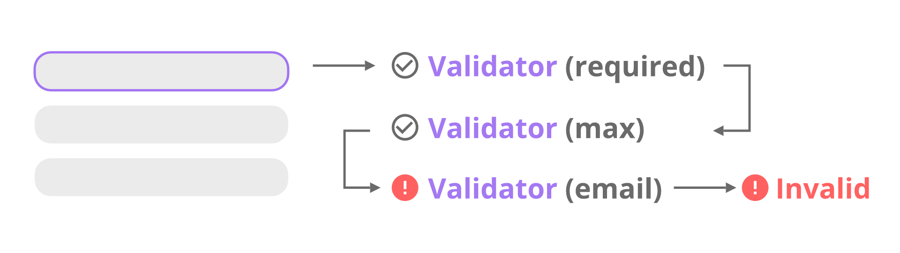

Forms are a fundamental part of every angular application.

One of the greatest features of forms is, that you can validate the input of the user before it is send to the server.

In this tutorial you are going to learn how you can validate your angular reactive forms.

We are going to create a basic form and discover, how we can validate each field using angular validators.

You will learn how to make a field "required" or how to validate an email address with built-in angular features.

<Demo gitHub="LukasMarx/angular-reactive-form-validation" />

Also, you will see how the create a custom angular validator, that can validate any value you like.

Ready?

Let's get started!


## What is a reactive form in angular?

There are two approaches to forms in angular. The first, template-driven forms, are using angular template-directives to generate the model of the the form.

Reactive forms on the other hand rely on the programmer to define the form-model. This is done in the component class istead of the template.

You can learn more about the fundamentals in [this post about reactive forms](/posts/angular-fundamentals-reactive-forms/).


## What is form validation in angular?

Whenever the value of a form input is changed, angular tries to validate the value. To do that properly, it requires a list of validators that are
specific to the input of the form.

These validators are run one after another on every change of the input-value. Each validator is either returning null if the value is valid, or
a list of errors if the value is invalid. An invalid response of one of the validators makes the input of the form invalid.



So, let's take a look how validators work in practice!


## Creating a new angular project

To get started, let's create a new angular project first.
Of course, you can also use an existing angular-cli project.

To create a new project, we are going to use the angular-cli.
Just type the following command:

```
 ng new angular-form validation

```

That is already it.


## A basic reactive form

Before we can get into validating forms, we first create a form first, right?

Our form will live in a separate component called contact, because we are going to create a contact form.
To create that component we again use the angular cli:

```
 ng generate component contact

```

### Defining the form group

In this tutorial, we are going to use the reactive approach to forms. So to create a form we need to define a [FormGroup](https://angular.io/api/forms/FormGroup).
We are doing this in a method called createFromGroup

```typescript title=src/app/contact/contact.component.ts
 createFormGroup() {
  return new FormGroup({
    email: new FormControl(''),
    mobile: new FormControl(''),
    country: new FormControl('')
  });
}

```

We then create a field called contactForm and initialize this field in the component constructor using our new method.
Also, we need some options for the select-element we will use later.

```typescript title=src/app/contact/contact.component.ts
 countries = ['', 'USA', 'Germany', 'Italy', 'France'];
contactForm: FormGroup;

constructor() {
  this.contactForm = this.createFormGroup();
}

```

### Submit & revert

Our will also need submit and revert functionality.
For that, we create two methods, as well.

```typescript title=src/app/contact/contact.component.ts
 revert() {
  this.contactForm.reset();
}

onSubmit() {
  // ...
}

```

That's all we need to add to our component.ts for now.

### The template

Now that we have our FormControl, it is time to define the visuals in our template.

For that, we are using just a regular form tag. We then assign our FromControl to it. Also we assign our onSubmit callback.
The form itself does only contain of some input fields and a select-element.

```html title=src/app/contact/contact.component.html
<form [formGroup]="contactForm" (ngSubmit)="onSubmit()">
  Email: <input formControlName="email" /> <br />

  Mobile: <input formControlName="mobile" /> <br />

  Country:
  <select formControlName="country">
    <option *ngFor="let country of countries" [value]="country"
      >{{country}}</option
    >
  </select>
  <br />

  <button type="submit" [disabled]="!contactForm.valid">Save</button>
  <button type="reset" (click)="revert()">Revert</button>
</form>
```

We also assign each field of our FormControl to one HTML-Element using "formControlName".

You might have noticed, that we are using our first form of validation here. The submit-button will disabled while our contactForm is not valid.

If that was a little bit to fast for you, check out my [guide on reactive forms in angular](https://malcoded.com/posts/angular-fundamentals-reactive-forms), where you can find much more detailed information about reactive forms.


## Making fields "required"

Now that we have created a form to validate, we can finally start thinking about the actual validation.

Probably the first and easiest requirement for form-input that comes to mind is to make fields "required".
Fortunately, angular has a required-validator included so implementing that feature is quite simple.

All we need to do, is to extend the definition of our FormGroup.

It turns out, that the construnctor of FromControl does not only take the default value, but also an array of validators.
So let's make all of our fields required like this:

```typescript title=src/app/contact/contact.component.ts
 createFormGroup() {
  return new FormGroup({
    email: new FormControl('', [Validators.required]),
    mobile: new FormControl('', [Validators.required]),
    country: new FormControl('', [Validators.required])
  });
}

```

That is all there is to it!
You should now notice, that the submit-button is disabled until all form-fields have a value.


## Validating email addresses with the built-in angular validator

Now that we have talked about the first use-case that comes to mind, let's talk about the second one: email address validation.

Actually this one is quite easy, as well, because angular comes with an email-validator, as well.
We can just add it to the array of validators like this:

```typescript title=src/app/contact/contact.component.ts
 createFormGroup() {
  return new FormGroup({
    email: new FormControl('', [Validators.required, Validators.email]),
    mobile: new FormControl('', [Validators.required]),
    country: new FormControl('', [Validators.required])
  });
}

```

Easy, right?


## Using a custom validator to validate a number

That was very basic, wasn't it?

But what if we want to validate something a little bit more unusual?

For that, we can create a custom validator.

A custom validator is just a function with a specifiic signature that we pass into the vlaidators-array just like any other validator.

To validate our phone number, we are going to create a custom validator, that will check if the input actually is a number (let's keep it simple for this example).

### Defining a custom validator

To do that, create a new folder called validators inside of the app directory. Then create a new file called phone-validator.ts.

Inside of that file we need to export a function, that takes a FromControl and either returns a JavaScript map or null.

```typescript title=src/app/validators/phone-validator.ts
import { AbstractControl } from '@angular/forms'

export function phoneNumberValidator(
  control: AbstractControl
): { [key: string]: any } | null {}
```

Inside of that function, we then read the value of the FormControl. We then return null if the value should be valid, or an object if not.
This object is meant to describe why the value is invalid. We will later use it to prompt specific messages to the user.

```typescript title=src/app/validators/phone-validator.ts
import { AbstractControl } from '@angular/forms'

export function phoneNumberValidator(
  control: AbstractControl
): { [key: string]: any } | null {
  const valid = /^\d+$/.test(control.value)
  return valid
    ? null
    : { invalidNumber: { valid: false, value: control.value } }
}
```

In this example, we use a simple regex to test if the value is valid.

### Using the custom validator

To use our new validator, we need to import it first.

```typescript title=src/app/contact/contact.component.ts
import { phoneNumberValidator } from '../validators/phone-validator'
```

Afterward, we just use it like any other validator:

```typescript title=src/app/contact/contact.component.ts
 createFormGroup() {
  return new FormGroup({
    email: new FormControl('', [Validators.required, Validators.email]),
    mobile: new FormControl('', [Validators.required, phoneNumberValidator]),
    country: new FormControl('', [Validators.required])
  });
}

```


## Letting the user know why the value is invalid

With custom validators, we now have the possibility to check the input in many ways.

But in case the value is invalid, all that happens for the user is the submit-button stays disabled. That is not what a great user experience looks like.

To give the user some feedback whats wrong, we can display a specific error message on the screen, based on which validator failed.

### Defining Getter

To be able to check the status of each form-field, we need an easy way to access each control.
To do that, we are defining some getters in our component.

```typescript title=src/app/contact/contact.component.ts
 get mobile() {
  return this.contactForm.get('mobile');
}

get email() {
  return this.contactForm.get('email');
}

```

### Adjusting the template to show error messages

Now we can access each form-controll and check if it valid.

For example, if the value is missing or not a valid number:

```html title=src/app/contact/contact.component.html
Mobile: <input formControlName="mobile" />
<span *ngIf="mobile.invalid && mobile.errors.required">
  Mobile is required.
</span>
<span *ngIf="mobile.invalid && mobile.errors.invalidNumber">
  Value has to be a number.
</span>
```

Notice, that "invalidNumber" is the value we defined in our custom validator.

### Only showing errors if the user touched the control

With that we have done above, the errors are also shown when the page just loaded and the user has not even started to fill values in.

We don't want that. Instead it would be nice, if the errors would only appear after the user started typing.

To implement that, we also need to check if the control is dirty or got touched (on mobile).

```html title=src/app/contact/contact.component.ts
Mobile: <input formControlName="mobile" />
<span
  *ngIf="(mobile.dirty || mobile.touched) && mobile.invalid && mobile.errors.required"
>
  Mobile is required.
</span>
<span
  *ngIf="(mobile.dirty || mobile.touched) && mobile.invalid && mobile.errors.invalidNumber"
>
  Value has to be a number.
</span>
```

### Applying that to all fields

If we the apply that to all fields of the form, your template should look like this:

```html title=src/app/contact/contact.component.html
<form [formGroup]="contactForm" (ngSubmit)="onSubmit()">
  Email: <input formControlName="email" />
  <span
    *ngIf="(email.dirty || email.touched) && email.invalid && email.errors.required"
  >
    Email is required.
  </span>
  <span
    *ngIf="(email.dirty || email.touched) && email.invalid && email.errors.invalidEmail"
  >
    Value has to be a valid email address.
  </span>
  <br />

  Mobile: <input formControlName="mobile" />
  <span
    *ngIf="(mobile.dirty || mobile.touched) && mobile.invalid && mobile.errors.required"
  >
    Mobile is required.
  </span>
  <span
    *ngIf="(mobile.dirty || mobile.touched) && mobile.invalid && mobile.errors.invalidNumber"
  >
    Value has to be a number.
  </span>
  <br />

  Country:
  <select formControlName="country">
    <option *ngFor="let country of countries" [value]="country"
      >{{country}}</option
    >
  </select>
  <br />

  <button type="submit" [disabled]="!contactForm.valid">Save</button>
  <button type="reset" (click)="revert()">Revert</button>
</form>
```


## Using angular CSS classes to highlight invalid form fields

If showing a plain error message is not enough, we can also adjust the appearance of each form-controll using CSS.

For that, angular automatically assigns some classes to each control, depending of its status.

```
 .ng-valid
.ng-invalid
.ng-pending
.ng-pristine
.ng-dirty
.ng-untouched
.ng-touched

```

For example, if we wanted invalid controls to appear red and valid ones to be green, we could use a style sheet like this to accomplish that.

```css title=src/app/contact/contact.component.css
.ng-valid,
.ng-valid.required {
  background-color: lightgreen;
}

.ng-invalid:not(form) {
  background-color: lightcoral;
}
```

## Conclusion

In this tutorial, we have learned how to validate our reactive forms with angular.

If you want to see the full source code, take a look at the [GitHub repository](https://github.com/LukasMarx/angular-reactive-form-validation).

If you liked this read, please share it!

Happy coding!
