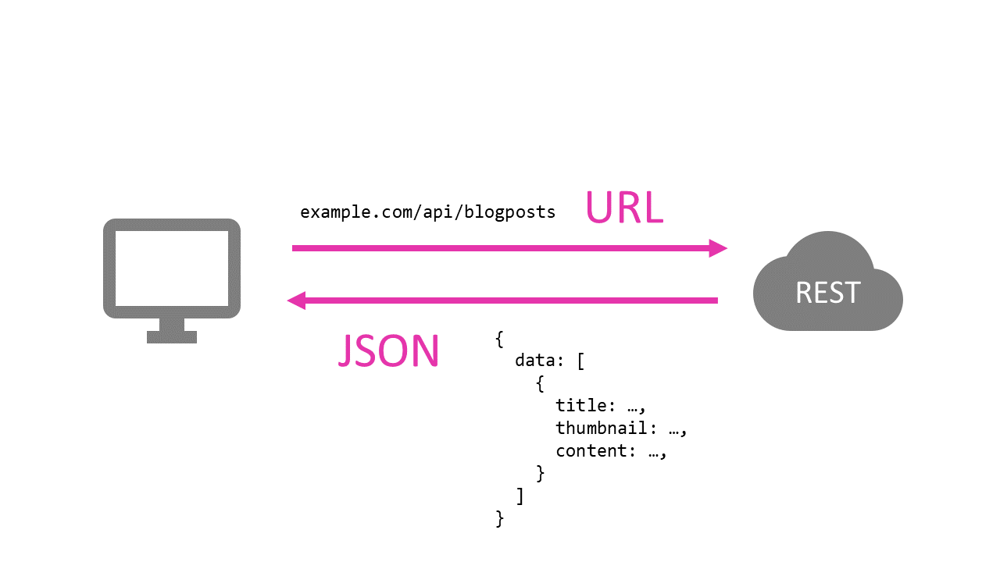
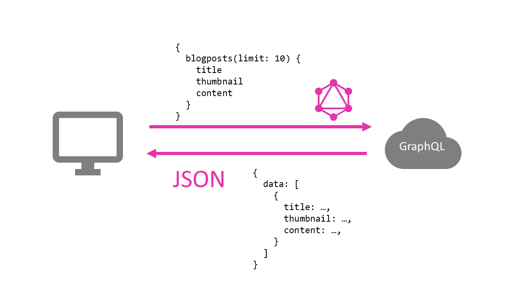

When it comes to angular applications, there is almost always a webserver running an API, as well.

If you have built such an API before, you are probably familiar with the REST-protocol. If you did, you probably also had some issues using it. Certainly, when it comes to more complex queries, REST seems kind of limited.

That is why you should take a look at a GraphQL backend. Other than REST, GraphQL is a full-fledged query language, designed to shine where REST is lacking behind.

It is much more natural to use and also very easy to integrate into your angular application.

In this tutorial, you will learn how to setup your own GraphQL API using node.js and express. Afterwards, we will take a look at how you can easily integrate a GraphQL client into your angular application using apollo-angular.

Let's get started!


## GraphQL vs REST

When creating an API, you have the choice of using REST or utilizing a query language like GraphQL.

To do so, you need to know how both of them work and what consequences you will have to deal with.

Either good or bad ones.

### The Network-Protocol

First, let's take a look at how both look like a network-level.

REST
REST is fully utilizing the HTTP-protocol.

That means, that request are either get, post, put or delete requests.

For that, it uses an object-oriented endpoint approach, that is modeled using the URL of the resource.

```
 http://example.com/api/blogposts

```

Depending on the chosen request-method, the request has a different effect.

Get-request are typically used for read-only operations, while post creates a new instance of the chosen object.

Put is used to update an object and delete should delete an object.



For advanced requests, a combination of sub-routes and URL-parameter is used. For example, if we would want to fetch only 10 blog-posts, we would use an URL-parameter like this:

```
 http://example.com/api/blogposts?limit=10

```

The response of the server is typically a JSON-document.

GraphQL
Often times, GraphQL endpoints use HTTP, as well, but the query language is not limited to that.

It is also possible to use for example the [websocket](https://developer.mozilla.org/en-US/docs/Web/API/WebSockets_API)-protocol to transmit the requests over the network.

For a better comparison, let's assume we are using a GraphQL API via [HTTP](https://developer.mozilla.org/en-US/docs/Web/HTTP).

GraphQL APIs typically have only one endpoint.

```
 http://example.com/api

```

All request are sent to that endpoint, independent from the requested object-type (blog-posts) or the desired crud (create, read, update, delete) operation.



They also only use either the HTTP-get or HTTP-post method (one per API) to send the request.

To specify a request, we use the query language itself. The language looks a little bit like JSON, but its syntax is different.

Here is the same example from above for querying 10 blog-posts.

```
 {
	blogposts(limit: 10) {
		title
		thumbnail
		content
	}
}

```

Again, we are using the limit parameter, to limit the number of returned objects.

But while REST typically returns the full object with every field, we have to specify which fields of our object we want to receive using GraphQL.

The response of a GraphQL is a JSON-document.

### Overfetching & Underfetching

The above shows example one of the great improvements of GraphQL over REST very nicely.
Let's take a look at the reason why.

Again, using our blog-post example, we could have a front-page showing all our blog-post and a detail-page, showing the actual content of each post.

The requirements to the API of both pages are quite different.

While the front-page only requires the title and the thumbnail of each post, the detail page requires all attributes of the post, including the relatively large content.

The problem with a REST-API is a problem called overfetching. Because we can not easily specify which attributes of our blog-posts we want to receive, our blog-application would have to fully download all blog-post to display the front-page.

This results in huge loading times and a lot of unnecessary transferred data.

GraphQL, on the other hand, takes an approach called underfetching. This is exactly what we have seen in the last example. If not explicitly stated, a GraphQL-API does not return any fields of an object. That way, we only get the attributes of our blog-post that we really need.

The request of our front-page could look something like this, only requesting the title and the thumbnail of all posts.

```
 {
	blogposts(limit: 10) {
		title
		thumbnail
	}
}

```

The detail-page, on the other hand, is requesting one specific post (e.g. with the id: 1) with all available attributes.

```
 {
	blogpost(id: 1) {
		title
		thumbnail
		content
	}
}
```


## Creating a GraphQL API with Express

Now that we know enough about both approaches, you should start implementing your own API-server.

Don't worry! We will discuss the missing parts of GraphQL as we are implementing it.

To set up our node.js server, we will be using the express framework.

### Setting up a new Node.js Project

To get started, create a new directory for our new project. You can call it whatever you want.

Next, we initialize a new npm-project by opening the console inside of our new directory and executing the following command:

```
 npm init

```

It will ask you some questions.
Answer them and hit enter, until the setup has finished.

Afterwards, create a new JavaScript file and call it server.js.

We will also need a file named schema.js.

Now go ahead and open both files with your favorite IDE/Editor.

### External Dependencies

Before we start coding, we need to install some external dependencies first. That shouldn't take too long.

```
 npm i --save express express-graphql graphql graphql-tools

```

Here we go! Ready to write some code?


## Defining GraphQL Types

Every GraphQL API has a schema. The schema is the definition that defines which resources are available. The schema consists of type-definitions and resolvers.

Our API will have only one resource. The blog-posts.
Because GraphQL is a typed language, we first have to define a type for our blog-post. If you are familiar with Typescript, the syntax should look quite familiar.

### GraphQL Types

To create the new type, open the schema.js file and add a new variable like this:

```javascript title=schema.js
let typeDefs = `
type blogpost {
    id: String!
    title: String!
    thumbnail: String
    content: String
}`
```

The variable typeDefs will contain all our types for our API.
Here we have created the type "blog-post". Each blog-post has a set of fields.

Every field has a type, as well. The type is defined after the colon. In this example, all fields are of the type "String".

```javascript title=schema.js
content: String
```

You can also define if a field is required. To do so, we add an exclamation mark behind the type. For example:

```javascript title=schema.js
 id: String!

```

### Input Types

GraphQL differentiates between types for reading and for input purposes. These types are called Input Types and are defined with the input keyword.
This is useful because some fields are filled by the server and therefore don't need to be fed in.

In our example, the id of a blog-post can't be defined by the user but is generated by the server automatically. Therefore our input type does not contain a filed called id.

Because we want our API to accept new blog-posts, as well, we add an input called blog-post to our type-definition:

```javascript title=schema.js
let typeDefs = `
type blogpost {
    id: String!
    title: String!
    thumbnail: String
    content: String
}

input blogpostInput {
    title: String!
    thumbnail: String
    content: String
}`
```

The types inside of that new input type are defined in the same way as a normal type.

### Query

The query-type is the root-type of all queries of your API. Inside of that Query-type, we define methods, that can be called via the API.
For our example, we want to be able to query for one or for all blog-posts. Because of that, we will need to define two methods inside the query-type.

The definition of query-methods looks quite similar to normal Typescript methods.

```
 type Query {
    blogposts(limit: Int): [blogpost]
    blogpost(id: String!): blogpost
}

```

The parameters of the method, as well as the return type, are typed in GraphQL. To define an array of a type we place the type in brackets.
Notice that we are using our newly created type "blog-post" here.
Also, notice that the type "Query" has to be named exactly like this.

Let's add the query-type to our type-definition:

```javascript title=schema.js
let typeDefs = `
type blogpost {
    id: String!
    title: String!
    thumbnail: String
    content: String
}

input blogpostInput {
    title: String!
    thumbnail: String
    content: String
}

type Query {
    blogposts(limit: Int): [blogpost]
    blogpost(id: String!): blogpost
}`
```

### Mutations

The queries we defined above are all read only. That means we can use them to get blogposts, but not to upload new ones.
That is what mutations are for.

Just like input-types to types are mutations related to queries.

Here we define a method to create a new blog-post:

```
 type Mutation {
    addBlogpost(post: blogpostInput!): blogpost
}

```

We are using our new input-type as parameter because every parameter has to be either a native type (String, Int, ...) or an input-type.

Afterwards, we add the mutation to our type-definition, as well.

```javascript title=schema.js
let typeDefs = `
type blogpost {
    id: String!
    title: String!
    thumbnail: String
    content: String
}

input blogpostInput {
    title: String!
    thumbnail: String
    content: String
}

type Query {
    blogposts(limit: Int): [blogpost]
    blogpost(id: String!): blogpost
}

type Mutation {
    addBlogpost(post: blogpostInput!): blogpost
}
`
```

Our type-definition is now complete. Go ahead and add methods to update or delete a post if you like!
Would you place them into Query or Mutation?


## Building GraphQL Resolvers

Now that we have type-definitions, that describe our API, we also need to define some functions, that are triggered, when the defined API-methods are called. These functions are called resolvers and are just JavaScript functions.

To let GraphQL know, which function to call to which API-method, we need to create an object, that has exactly the same structure as our definition.

For our example, the resolvers look like this:

```javascript title=schema.js
let resolvers = {
  Query: {
    blogposts: getAllBlogposts,
    blogpost: getBlogpost,
  },
  Mutation: {
    addBlogpost: addBlogpost,
  },
}
```

Next, we need to implement the three functions getAllBlogposts, getBlogpost and addBlogpost that we have registered here.

You can implement these functions however you want. Typically these functions contain a call to the database to filter and receive the requested objects.
Once you have the object you want to send back, just return it.

Notice that the returned object needs to have the fields you defined in the type definition.

Here are the three methods for our example. I have created some fake-data, so you can test your API later.

```javascript title=schema.js
let getAllBlogposts = (obj, args, context, info) => {
  // the args object contains the GraphQL-parameters of the function

  // do database stuff
  const limitInput = args.limit || '10'
  const limit = parseInt(limitInput)

  const array = []
  for (let i = 0; i < limit; i++) {
    array.push({
      id: i,
      title: 'Blogpost no. ' + i,
      content: 'Some boring content...',
      thumbnail: 'some URL',
    })
  }
  return array
}

let getBlogpost = (obj, args, context, info) => {
  // the args object contains the GraphQL-parameters of the function

  // do database stuff
  return {
    id: args.id,
    title: 'Blogpost no. ' + args.id,
    content: 'Some boring content...',
    thumbnail: 'some URL',
  }
}

let addBlogpost = (obj, args, context, info) => {
  // the args object contains the GraphQL-parameters of the function

  // do database stuff
  return args.post
}
```


## Creating a GraphQL Schema

Last but not least, we have to merge our type-defintions and our resolvers to one schema-object.
To do that, we use a library called "graphql-tools".

We need to import the required function to merge our schema from that library. To do that, add this line on top of our schema.js file.

```
 let makeExecutableSchema = require('graphql-tools').makeExecutableSchema;

```

We use that method at the bottom of the file like this:

```
 module.exports = makeExecutableSchema({
    typeDefs: typeDefs,
    resolvers: resolvers
});

```

Finally your schmema.js file should look like this:

```javascript title=schema.js
let makeExecutableSchema = require('graphql-tools').makeExecutableSchema

let typeDefs = `
type blogpost {
    id: String!
    title: String!
    thumbnail: String
    content: String
}

input blogpostInput {
    title: String!
    thumbnail: String
    content: String
}

type Query {
    blogposts(limit: Int): [blogpost]
    blogpost(id: String!): blogpost
}

type Mutation {
    addBlogpost(post: blogpostInput!): blogpost
}
`

let getAllBlogposts = (obj, args, context, info) => {
  // the args object contains the GraphQL-parameters of the function

  // do database stuff
  const limitInput = args.limit || '10'
  const limit = parseInt(limitInput)

  const array = []
  for (let i = 0; i < limit; i++) {
    array.push({
      id: i,
      title: 'Blogpost no. ' + i,
      content: 'Some boring content...',
      thumbnail: 'some URL',
    })
  }
  return array
}

let getBlogpost = (obj, args, context, info) => {
  // the args object contains the GraphQL-parameters of the function

  // do database stuff
  return {
    id: args.id,
    title: 'Blogpost no. ' + args.id,
    content: 'Some boring content...',
    thumbnail: 'some URL',
  }
}

let addBlogpost = (obj, args, context, info) => {
  // the args object contains the GraphQL-parameters of the function

  // do database stuff
  return args.post
}

let resolvers = {
  Query: {
    blogposts: getAllBlogposts,
    blogpost: getBlogpost,
  },
  Mutation: {
    addBlogpost: addBlogpost,
  },
}

module.exports = makeExecutableSchema({
  typeDefs: typeDefs,
  resolvers: resolvers,
})
```


## Creating the GraphQL Express Server

To run our GraphQL-API, we need to set up a web server first. For that, we will use express.
Open your server.js file and paste the following:

```javascript title=server.js
const express = require('express')
const graphql = require('express-graphql')
const schema = require('./schema')

const app = express()

app.use(
  '/graphql',
  graphql({
    schema: schema,
    graphiql: true,
  })
)

app.listen(3000)
```

If you want to know more about express, read my guide on [building a backend for angular with express](https://malcoded.com/posts/angular-backend-express).

That's it. You can now start the server

```
 node server.js

```

and open your APIthe browser. You should be presented with a nice UI called [graphiQL](https://github.com/graphql/graphiql).

Try some of the example-queries from above to see if it is working!


## Angular GraphQL Integration using Apollo

As promised we will now take a look at how to consume our new GraphQL API with an angular application.

We are going to use a library called [Apollo ](https://www.apollographql.com/docs/angular/index.html)for that. Apollo Angular is a GraphQL client that is very convenient and easy to use. It also comes with features like a client-side cache for free.

For this part, I will assume that you already know the basics of Angular. If that is not the case, feel free to check out my [guide for angular beginners](https://malcoded.com/posts/angular-beginners-guide).

### Setting up a new Angular Project

For demonstration purposes, let's create a new angular-cli application.

```
 ng new graphql-example

```

Afterward, we need to install some external dependencies. Open a terminal in the application directory and type:

```
 npm install apollo-angular apollo-angular-link-http apollo-client apollo-cache-inmemory graphql-tag graphql --save

```

### Integrating Apollo into Angular

Next, we need to set up the Apollo client. Therefore we need to add some modules to our new app.module.

Furthermore, we need to initialize Apollo in the module's constructor.

Please replace the URL with the actual URL of your GraphQL server.

```typescript title=src/app.module.ts
import { NgModule } from '@angular/core'
import { BrowserModule } from '@angular/platform-browser'
import { FormsModule } from '@angular/forms'

import { AppComponent } from './app.component'
import { HelloComponent } from './hello.component'

import { HttpClientModule } from '@angular/common/http'
import { ApolloModule, Apollo } from 'apollo-angular'
import { HttpLinkModule, HttpLink } from 'apollo-angular-link-http'
import { InMemoryCache } from 'apollo-cache-inmemory'

@NgModule({
  imports: [
    BrowserModule,
    FormsModule,
    HttpClientModule,
    ApolloModule,
    HttpLinkModule,
  ],
  declarations: [AppComponent, HelloComponent],
  bootstrap: [AppComponent],
})
export class AppModule {
  constructor(apollo: Apollo, httpLink: HttpLink) {
    apollo.create({
      link: httpLink.create({ uri: 'http://localhost:3000/graphql' }),
      cache: new InMemoryCache(),
    })
  }
}
```

Afterward, we can use Apollo anywhere in our app using dependency injection.

Here is an example querying all blog-posts and their title and printing them to the console.

```typescript title=src/app.component.ts
import { Component } from '@angular/core'
import { Apollo } from 'apollo-angular'
import gql from 'graphql-tag'

@Component({
  selector: 'my-app',
  templateUrl: './app.component.html',
  styleUrls: ['./app.component.css'],
})
export class AppComponent {
  constructor(apollo: Apollo) {
    apollo
      .query({
        query: gql`
          {
            query {
              blogposts {
                title
              }
            }
          }
        `,
      })
      .subscribe(console.log)
  }
}
```

Feel free to turn this component into something useful...

## Conclusion

In this tutorial, we learned how to set up a node.js server-application from scratch and created a very basic but functional GraphQL-API using the express framework.

I hope you enjoyed this post.

If you did please hit the share buttons below and help other people building their own GraphQL-APIs, as well.

Have a fantastic day!
