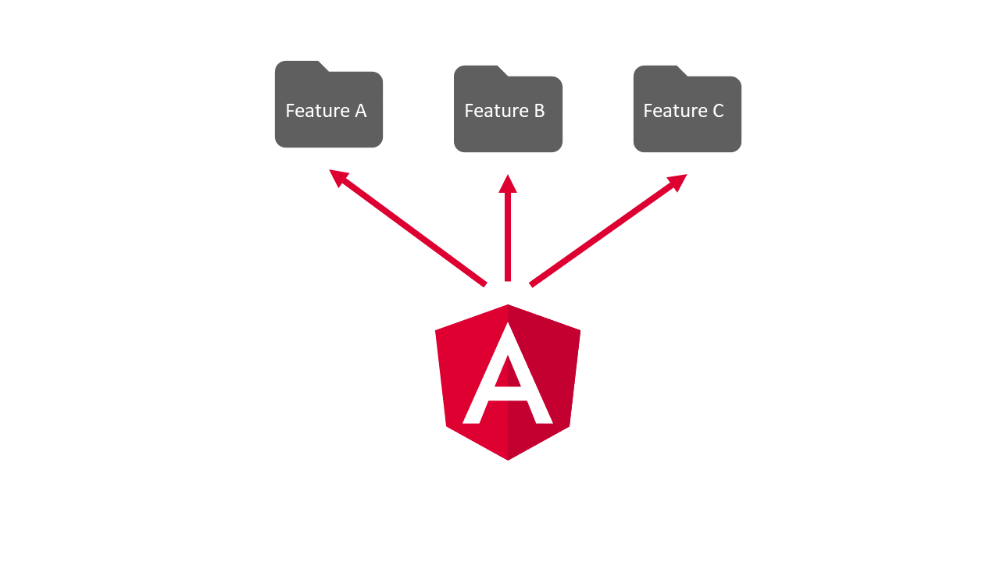
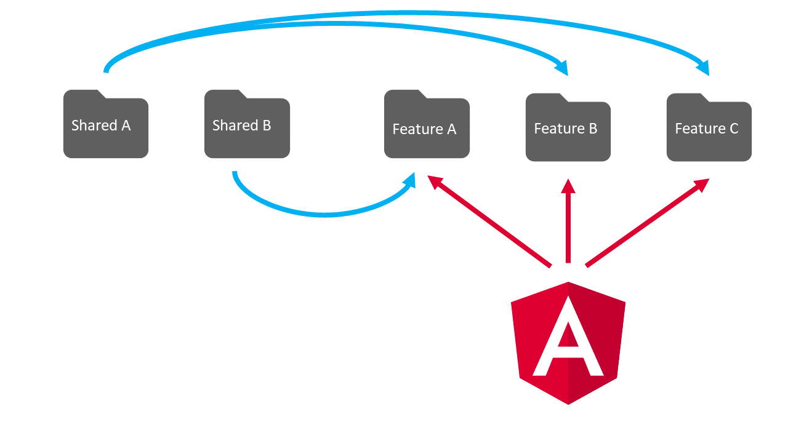
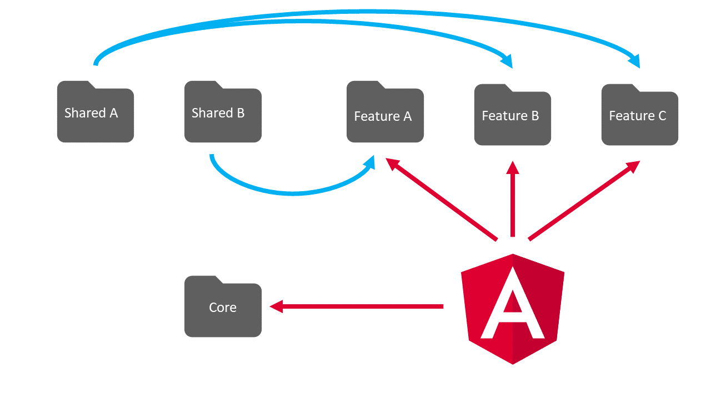
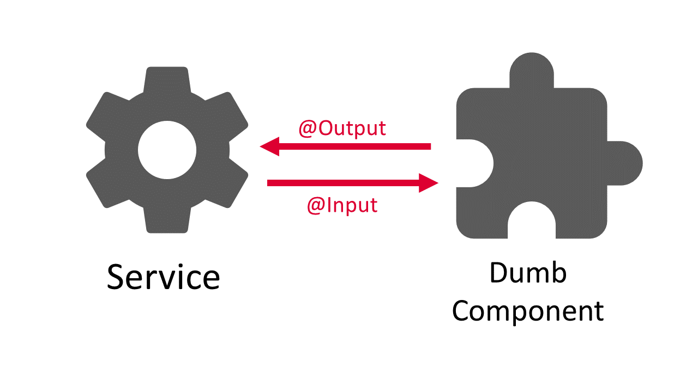

Angular can have quite a learning curve.

Building applications that are maintainable and easy to read, is a form of art by itself.

In this article I will share 5 actionable tips and tricks with you, that can help you improve the quality of your code.

<AffiliateAd tag="angular" />

From most basic things, like how to name your files, to kind of complex topics like redux and state management.

We will discover how we can unitize those things to increase the quality of our angular applications.

Let's get started!


## 1. Follow the Convention

One of the core arguments to choose angular over other single page application frameworks is its clearly defined way of how things are supposed to be done.
It has an opinion, so to speak.

That defined way enables the creation of a uniform code base across an organization, without worrying about defining certain rules.
Angular already comes with these rules out of the box.

Following them does not only increase the uniformity and therefore the quality of the code. It makes your application easier to understand, too.
That is, if you are already familiar with angular.

This strict approach also comes in handy across cooperation borders.
It enables new developers to integrate into a new team very quickly, because of the high familiarity with the code.

What I want to say is, you should definitely follow the angular design-guidelines to get the most out of the angular framework.
It will make your life a lot easier, when coming into new projects and will increase the quality of your code almost automatically.

Here is the complete set of rules! You should at least have seen them once!
[Angular Style Guide](https://angular.io/guide/styleguide)

### "We like to do things in our own way! We don't like to follow the rules of someone else!"

Why did you choose angular then?
If this is your organization, I highly encourage you to re-consider the choice of your fronted-framework.
There are a lot of other frameworks out there, that suite your expectations a lot better.
You will not be happy with angular, neither in the short nor in the long run!

### Example: File Names

One example of these rules is the naming of files.

Files in angular follow a very specific theme, called a naming convention.
Every file that contains an angular-structure, like a component, a module or a pipe, is named like this:

```
 [name].[structure].[file-extension]

```

So if we want to create a component to display our customers, the name would be "customer". The structure would be component an the file extension is either ".ts", ".css" or ".html".
For example:

```
 custumer.component.ts

```

If you are using the angular-cli, that part is taken care of, by using the ng-generate commands to create any structure. The resulting file will automatically follow the naming convention.
If you want to learn more about the angular-cli and the ng-generate command, check out my [tutorial on the angular-cli](https://malcoded.com/posts/angular-fundamentals-cli).


## 2. Bundle your Code into Modules

A very common thing to do, when learning angular is to place everything into the app-module.
Needless to say, that your application will evolve into a complete mess. Modules are there for a reason!

Modules help to organize your code into smaller bundles to make finding things easier. But they are not only a cosmetic thing.
With the help of lazy-loaded modules, you can also increase the user-experience by only downloading the parts of the application, that are required at that moment.

If you don't know about modules yet, I highly recommend rading my [guide on modules (including lazy-loading)](https://malcoded.com/posts/angular-fundamentals-modules).

But having the freedom to structure our modules however like we feel today, would not help to increase maintainability.
In fact, it would make things even worse.

Fortunately, angular has some opinions on how we should decide our apps into modules.

### Feature Modules

One category of modules are the so-called "Feature Modules". As you probably have guessed already, they are created to contain one specific feature.

These modules are created in a separate folder with the name of the feature.

For example, the feature-module for the feature "feature" would be placed into a directory called feature. The module file itself follows the naming convention mentioned above: feature.module.ts



But why do we create feature-modules?

Well, first of all, they provide a way to structure our code in a way that is reasonable and easy to understand.
They also separate different features completely. That way there can't be any weird overlap that could cause confusion and potential bugs.

Another great advantage of feature-modules is that they allow us to use a technique called lazy-loading.
With lazy loading, we only download a module to the client device, if the module is actually needed.

<AffiliateAd tag="angular" />

For example, if we have an administration-section for a blog, it would not make much sense to serve the code for the admin-section to every user visiting the site.

Instead, we separate the admin-section into a feature-module and load it using lazy-loading. Now, if a user is entering the site, he only has to download the code for the blog-section. Only if he is navigating to the admin-section, the additional JavaScript code is downloaded.

### Core and Shared-Module

Using feature-modules, every component, directive or pipe is encapsulated in a separate module. That way, it can't be used elsewhere in our application, without importing its module.

But that would not make any sense, would it?

Imagine our feature module of the blog section would have to import the admin-module just to use a simple utility-directive. That would not only be a quite confusing structure but would also eliminate the benefits of lazy-loading.

Shared-Modules

What we should do instead, is to create one or more shared modules that are meant to be used by feature modules. A common use case for this are utility components, directives or pipes.



For example, we could create a text-formatting module, that would contain a bunch of pipes to properly format text in certain ways.

That module could then be used by all of our feature modules, without breaking the strict encapsulation of the modules themselves.

Core-Module
It turns out, feature and shared modules are not enough to cover all of our needs.

We also need a pace for all of our application-wide singleton services.

That is what the core-module is for. It is placed in a directory called "core" and is name CoreModule.



Inside of the core-module we provide all application-wide singleton-services we might need.

The core module is then imported into the app-module.

That way, out app-module stays nice and tidy.

But the core-module is not just for services. Everything that is used application-wide but to simple to create a new shared-module for, can be declared in the core-module.

An example for that are loading-spinners for the start of the application. They are never used anywhere else so creating a extra shared-module would be kind of overkill.

### Provide Private Services in your Component

Most services in angular are designed to act on a global scope. They are then provided at an application level (AppModule).

This makes sense if the use of the global-singleton-pattern is required. For example, if your service is responsible for caching things. In this case, you want one global instance. Otherwise, each component has its individual cache. This is because of the scoped [dependency injection](https://malcoded.com/posts/angular-fundamentals-dependency-injection) in angular.

But there are definitely services that do not need to be provided globally. Especially if they are used by just one component.

In that case, it can make sense to provide that service inside of the component, instead of the service. That is if the service is directly tied to that component.

Otherwise, you should try to provide the services in a module, so that can only be accessed from everywhere it is needed.

That way, services can be related to features (feature-modules), which makes them easier to find and understand in the right context.

Also, they are contained by a feature module, which --again-- enables lazy-loading capabilities.

It also minimizes the risk of dead code, in case the only module that uses the service is deleted.


## 3. Keep Logic out of your Components

As you build your application, it may be a good idea to keep your logic and especially state out of your components.

Why?

There are a couple of reasons for that, that each can increase the quality of your code.



First of all, testing the user-interface and therefore testing components is quite hard in comparison. At least compared to testing pure logic.
So having your business logic in a separate service can help you write more efficient and easier to understand tests faster.

Furthermore, your logic can be used by other components, too, when separated as a service. That allows us to reuse more of our code and therefore write less of it.
Code that does not exist can increase the overall code-quality by a lot.

Last but not least, having logic in a separate file makes the code also easier to read.

### State

When it comes to state, there are a bunch of problems that emerge from each component having its own state.

Simply put, you lose track of which component is in which state pretty fast. That can make debugging a quite hard task and results in these kinds of bugs, nobody wants to have.

Especially in large applications, this can be a huge problem.

More on the topic of centralized state in chapter 5.


## 4. Get your async Code right

As we already discussed above, angular is an opinionated framework.

To get reach our goal of code-consistency, we need to follow the opinion of the framework.

This is the case with asynchronous code, as well.

In this case, the angular team has decided to use the rxjs library for all asynchronous functions.

The library utilizes the [observer-pattern](http://www.dofactory.com/javascript/observer-design-pattern). If you want to learn more about the rxjs library, check out my guide on [rxjs for angular developers](https://malcoded.com/posts/rxjs-for-angular-devs).

### Avoid Promises

RxJs partly overlaps with its functionality with the standard JavaScript promise. Both are meant to handle asynchronous code.

But rxjs can do so much more! Other than promises, the so-called rxjs-observables can resolve to more than just one value. Instead, they are a stream of values, we can contentiously listen to.

Of course, it is also possible to pass only one result to that stream, which creates this overlap with the promise.

So what should we use? The simple promise, that allows us to use the TypeScript await operator? Or the much more powerful rxjs-observables? Why not both?

Those questions are not easy to answer. In fact, people have different opinions on this.

<AffiliateAd tag="angular" />

Here is what I think:

I really like the style of the await operator for promises, but I think we should stick to the opinion of the framework. And this opinion is quite clear.

Use rxjs everywhere.

We can see that, by looking at the angular HTTP-client. It returns rxjs-observables, even when it is clear, that a HTTP-call can never result in more than one response.

I also don't think that mixing it up is a good solution. That way, you have completely different implementations, that are hardly compatible with each other in different parts of your application. Depending on who wrote the code. After all, that is exactly what we try to avoid by using angular.

### Use the Async Pipe

As stated above, rxjs-observables are a little bit more complex. Not using them correctly can lead to serious bugs.

The most common mistake I make is forgetting to unsubscribe from the observable. This does not only lead to memory leaks, but also unnecessary calculations and potential unexpected changes in the state of your application.

```typescript title=Don't do that
 public result;
  ngOnInit() {
    this.http.get('').subscribe(result => {
      this.result = result;
    })
  }

```

But avoiding this mistake is quite easy in angular. All you need to do is to use the angular async pipe. This pipe will automatically unsubscribe from the observable, once the component is destroyed.

```typescript title=Do this instead
   public result$;
  ngOnInit() {
    this.result$ = this.http.get('');
  }

```

And bind in the template to the observable using the async pipe:

```html title=And This...
<p>{{result$ | async}}</p>
```

A nice side effect of this is, that the code looks a look simpler and cleaner, as well.


## 5. Try Centralized State Management (like Redux)

As your app grows, the code-quality of can decrease dramatically. Hundreds of components, each having their own state is not only confusing.
It also is almost impossible to debug.

That is why centralized state management is so (over-)hyped at the moment.

Centralized state management means, that all of our application state is stored in one single location, instead of being distributed all over the app.
It usually also means, that the state is controlled by one instance, that is the only one to make changes to the state.

Having such a central state brings some advantages:

The first point might be obvious: You don't have to search for it.

As it is all in one place, you don't need to navigate through the component tree (e.g. with debugging-tools like [augury](https://augury.angular.io/)).


This central state is also much easier to transfer between applications or persist the state to disk. It does not have to be collected from various places beforehand. It is just one object.

Problems like component to component communication are solved by this, as well. They just react to state-changes.

Depending on which form of central state management you choose, you also get nice features likes time-travel-debugging (Redux/ngrx).

### So should you just use Redux/ngrx?

Again, there are millions of opinions out there. After all, you will have to come up with your own one.

But here are is my point of view:

Despite of the hype, I don't think that everybody should start re-writing their apps to integrate redux. Even if you start from scratch, I don't think redux is the way to go a lot of time.

Of course, that highly depends on the kind of application you plan to build.

Are you building large applications with hundreds of components, developed by a large team?
Sure, go ahead and use redux. It will save you a lot of trouble.

Are you building medium sized-applications? Not larger than the average app on the app store? Working with up to 10 people?
Maybe redux is not for you. Redux comes with a ton of boilerplate. A TON!
Pumping up your application (seriously, it can triple the number of files you have) is probably not worth it. At least that is what I think.
I would prefer a slim code base at any time.

Also, there are other possibilities out there. For example, you could just create observable store-services. You can read more about that in this great article by Jure Bajt about [state management in angular with observable store services](https://jurebajt.com/state-management-in-angular-with-observable-store-services/).

Are you building a small application? A side-project or a prototype even? Don't touch redux!
The value that redux could provide in those situations is almost zero. At the cost of creating hundreds of boilerplate-files.
You will not only make your app a lot more complex than it needs to be, but it will also take away all the fun you might have had otherwise.

As you can see, I am not a fan of boilerplate code.

But there is hope!

There is currently a library in the works, that promises zero boilerplate-code while still using redux with ngrx.
It is called [angular-ngrx-data](https://github.com/johnpapa/angular-ngrx-data) and is maintained by John Papa.
Definitely, check that out!

## Conclusion

These are my 5 recommendations on how to increase the quality of your angular code base.

I hope you liked it!

<AffiliateAd tag="angular" />

If you did, please share this article with your friends and colleges and help them improve their code-quality, as well!

Happy Coding!
