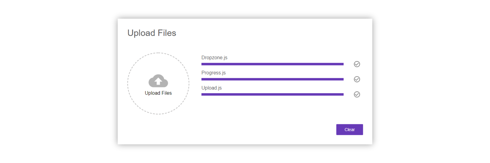

Creating a file upload component is a common task in web development.

Unfortunately it can be quite intimidating.

In this tutorial you will learn how to create a working file upload component with react from scratch using no dependencies other than react itself.

You will learn how to upload files and display the upload progress using react.

Here is what the result will look like:



Also, we will start by building a server we can upload files to using nodejs and express. We will walk through the full full-stack process to make sure you end up with a working system.

<AffiliateAd tag="react" />

Ready?

Let's get started!


## Creating the express server to upload to

Before we can have a react app upload anything, we need to have a server we can upload to, right?

In this tutorial, we are going to implement a file upload server using node.js and express, that allows file to be uploaded in in the multipart format.

### Setting up a new project

To set up a new project, create a new project directory containing two folders app and server.

Next, open the command line pointing at the server directory and initialize a new npm-project using the

```
 npm init

```

command. It will ask you for some information. You can pass it in or just hit enter.

For the server, we will also need two JavaScript files. Create the following files in the project directory:

server.js
upload.js

Go ahead and create them inside of the server directory.

### External Dependencies

Our server will have three external dependencies.

The first one is obviously express. [Express](http://expressjs.com) is a framework, that makes creating API very easy.
To install express, you can use this command inside of the server directory:

```
 npm install express

```

Because we want to access the API from a react application that is probably served from another origin, the server needs to allow cross-origin requests.
Therefore we are going to use a simple module called CORS.
To install it, type:

```
 npm install cors

```

Also, express itself is not very good at understanding forms. Because we will be uploading our files in the multipart/form-data format, we need to be able to parse this format.
The library "formidable" does this and is quite easy to use.
Install formidable using this command:

```
 npm install formidable

```

That's all we need. Now it is time to start building our file upload server...


## Setting up a basic express server

First, we need to create a basic express server in the server.js file. This part looks always the same and consists of only 3 lines.

```javascript title=server/server.js
const express = require('express')

const server = express()

server.listen(8000, () => {
  console.log('Server started!')
})
```

Good job! You have build your first express server (in case you haven't done so before).

Although it does nothing useful, you can fire it up using the

```
 node server.js

```

command. As this is using a relative path, make sure you have opened the terminal at the server directory. Otherwise, you need to adjust the relative path (for example server/server.js).

### Enabling CORS

To be able to access our API from a react application with a different origin, we need to enable cors.
To do so, we first need to require CORS.

```javascript title=server/server.js
const cors = require('cors')
```

Next, we configure it to allow any domain by creating an option-object.

```javascript title=server/server.js
var corsOptions = {
  origin: '*',
  optionsSuccessStatus: 200,
}
```

Finally, we tell express to use the cors-middleware with our configuration.

```javascript title=server/server.js
server.use(cors(corsOptions))
```

### Registering the upload route

Afterward, we need to configure a route for our file upload.

For that, we require our upload.js file and register a route with the HTTP-post method.

```javascript title=server/server.js
const upload = require('./upload')
server.post('/upload', upload)
```

Now we are done with the server.js file. It should look like this by now:

```javascript title=server/server.js
const express = require('express')
const upload = require('./upload')
const cors = require('cors')

const server = express()

var corsOptions = {
  origin: '*',
  optionsSuccessStatus: 200,
}

server.use(cors(corsOptions))

server.post('/upload', upload)

server.listen(8000, () => {
  console.log('Server started!')
})
```


## Implementing the upload route

Let's start implementing the upload functionality. We will place it into the upload.js file.

First, we need to require a class called IncomingForm from the "formidable" library.

```javascript title=server/upload.js
const IncomingForm = require('formidable').IncomingForm
```

After that, we need to export the callback function, we are using in our server.js to register the route. This function will be called, every time somebody hits the '/upload' URL.

<AffiliateAd tag="react" />

This callback gives us a request-object (req), that stores information about the request that hit the route.

We also get a response-object (res). We can use this object, to send back a response.

```javascript title=server/upload.js
module.exports = function upload(req, res) {}
```

Inside of that method, we create a new form.

```javascript title=server/upload.js
var form = new IncomingForm()
```

We then register callbacks on that form. The first callback is called for every file in the form:

```javascript title=server/upload.js
form.on('file', (field, file) => {
  // Do something with the file
  // e.g. save it to the database
  // you can access it using file.path
})
```

The uploaded files are stored in a temporary directory somewhere on your machine. To do something with them, you can copy them from there using the node.js file-system API.

The second callback is called when the form is completely parsed. In this case, we want to send back a success status code.

```javascript title=server/upload.js
form.on('end', () => {
  res.json()
})
```

We then trigger the parsing of the form using:

```javascript title=server/upload.js
form.parse(req)
```

That's all we will do for the upload functionality. It is not production ready, but it will help us to test our upload-component of the react application we actually want to build.

Here is the complete upload.js file:

```javascript title=server/upload.js
const IncomingForm = require('formidable').IncomingForm

module.exports = function upload(req, res) {
  var form = new IncomingForm()

  form.on('file', (field, file) => {
    // Do something with the file
    // e.g. save it to the database
    // you can access it using file.path
  })
  form.on('end', () => {
    res.json()
  })
  form.parse(req)
}
```


## Creating a new react project

Now it is time to start implementing the actual file upload component.

Before we can do that, we need to create a new react project inside of our project directory. Let's create one by using the create-react-app CLI.

```
 create-react-app app

```

We call the project app, because we want it to go into the app folder we have created before.


## Adjusting the create-react-template

For our component to be displayed, we need to adjust the code, the CLI has generated for us, a little bit.

Of course, we need to place the upload component we are going to create on the DOM. In this case, it is wrapped by two divs that are responsible for the card-look you can see in the final result.

```jsx title=app/src/App.js
import React, { Component } from 'react'
import './App.css'
import Upload from './upload/Upload'

class App extends Component {
  render() {
    return (
      <div className="App">
        <div className="Card">
          <Upload />
        </div>
      </div>
    )
  }
}

export default App
```

To make it look nice, we add some stylesheets:

```css title=app/src/App.css
.App {
  text-align: center;
  background-color: rgb(206, 213, 223);
  min-height: 100vh;
  display: flex;
  flex-direction: column;
  align-items: center;
  justify-content: center;
  font-size: calc(10px + 2vmin);
}

.Card {
  background-color: white;
  padding: 32px;
  width: 50%;
  display: flex;
  align-items: flex-start;
  justify-content: flex-start;
  box-shadow: 0 15px 30px 0 rgba(0, 0, 0, 0.11), 0 5px 15px 0 rgba(0, 0, 0, 0.08);
  box-sizing: border-box;
}
```

### Creating the upload component

For this to work properly, we need to create the upload component we have used inside the app component.

To do that, create a new folder inside the apps' src-directory called "upload".

Inside of that directory, create two files. Upload.js and Upload.css.

Next, create an empty component inside of the Upload.js file:

```jsx title=app/src/upload/Upload.js
import React, { Component } from 'react'
import './Upload.css'
```

```jsx title=app/src/upload/Upload.js
class Upload extends Component {
  constructor(props) {
    super(props)
  }

  render() {
    return <p>Upload</p>
  }
}
```

While we are at it, we can also add the overall layout of the component.

The file upload component will be split into two parts. On the left side will be a file dropzone to add new files, while on the right side there will be the list of files to be uploaded and their respective upload progress.

Finally, on the bottom right there will be an actions-section containing the upload button.

To accomplish this, the HTML layout looks like this:

```jsx title=app/src/upload/Upload.js
import React, { Component } from 'react'
import './Upload.css'

class Upload extends Component {
  constructor(props) {
    super(props)
  }

  render() {
    return (
      <div className="Upload">
        <span className="Title">Upload Files</span>
        <div className="Content">
          <div />
          <div className="Files" />
        </div>
        <div className="Actions" />
      </div>
    )
  }
}
```

To arrange the divs in the way described above, we are using flexbox in our stylesheet:

```css title=app/src/upload/Upload.css
.Upload {
  display: flex;
  flex-direction: column;
  flex: 1;
  align-items: flex-start;
  text-align: left;
  overflow: hidden;
}

.Content {
  display: flex;
  flex-direction: row;
  padding-top: 16px;
  box-sizing: border-box;
  width: 100%;
}

.Files {
  margin-left: 32px;
  align-items: flex-start;
  justify-items: flex-start;
  flex: 1;
  overflow-y: auto;
}

.Actions {
  display: flex;
  flex: 1;
  width: 100%;
  align-items: flex-end;
  flex-direction: column;
  margin-top: 32px;
}

.Title {
  margin-bottom: 32px;
  color: #555;
}
```


## How to build a file dropzone component

Next, we need to create the file dropzone component, which will enable the user by selecting them in a file dialog or simply dropping them onto the component.

You can learn how to create a [file dropzone component with react in this article](https://malcoded.com/posts/react-dropzone).

Just as described in the article, our dropzone will be placed inside a directory called "dropzone" under the src-directory. So if you created your dropzone component following that article, you can just copy and paste that folder into this project.

```javascript title=app/src/upload/Upload.js
import Dropzone from '../dropzone/Dropzone'
```

Afterward, place the dropzone component into the upload component like so:

```jsx title=app/src/upload/Upload.js
 render() {
    return (
      <div className="Upload">
        <span className="Title">Upload Files</span>
        <div className="Content">
          <div>
            <Dropzone
              onFilesAdded={this.onFilesAdded}
              disabled={this.state.uploading || this.state.successfullUploaded}
            />
          </div>
          <div className="Files">
            {this.state.files.map(file => {
              return (
                <div key={file.name} className="Row">
                  <span className="Filename">{file.name}</span>
                  {this.renderProgress(file)}
                </div>
              );
            })}
          </div>
        </div>
        <div className="Actions">{this.renderActions()}</div>
      </div>
    );
  }

```

As you can see, the dropzone component takes two properties. The first one, "onFilesAdded" expects a callaback that gets notified when new files were added by the user.

With the disabled property, we can control whether the dropzone is accepting input.

### Adjusting the components' state

To keep track of the upload components' state, we want to introduce some state variables.

First of all, we need an array containing all files to be uploaded.

<AffiliateAd tag="react" />

Other than that, we need to keep track if the component is currently busy uploading files or if the upload succeeded.

Finally, we want to keep track of the upload progress of all files. For that we use a JavaScript object to create a map.

```jsx title=app/src/upload/Upload.js
 constructor(props) {
    super(props);
    this.state = {
      files: [],
      uploading: false,
      uploadProgress: {},
      successfullUploaded: false
    };

    this.onFilesAdded = this.onFilesAdded.bind(this);
    this.uploadFiles = this.uploadFiles.bind(this);
    this.sendRequest = this.sendRequest.bind(this);
    this.renderActions = this.renderActions.bind(this);
  }

```

Because we are changing the constructor anyway, let's add some bindings for future methods, as well.

### Handling new files

To handle new files added via the dropzone, we need to implement a method called "onFilesAdded".

In this mehtod, we simply add the new files to the already added files by setting the state accordingly.

```jsx title=app/src/upload/Upload.js
 onFilesAdded(files) {
  this.setState(prevState => ({
    files: prevState.files.concat(files)
  }));
}

```


## Showing the list of files

Next, we are going to display the files that should be uploaded in a nice list.

Doing so is quite simple. All we need to do is map each element in our files state variable to a new row of our list.

```jsx title=app/src/upload/Upload.js
 render() {
    return (
      <div className="Upload">
        <span className="Title">Upload Files</span>
        <div className="Content">
          <div>
            <Dropzone
              onFilesAdded={this.onFilesAdded}
              disabled={this.state.uploading || this.state.successfullUploaded}
            />
          </div>
          <div className="Files">
            // Add this:
            {this.state.files.map(file => {
              return (
                <div key={file.name} className="Row">
                  <span className="Filename">{file.name}</span>
                </div>
              );
            })}
          </div>
        </div>
        <div className="Actions">

        </div>
      </div>
    );
  }
}

```

Again, there is some CSS involved to make everything look nice:

```css title=app/src/upload/Upload.css
.Filename {
  margin-bottom: 8px;
  font-size: 16px;
  color: #555;
}

.Row {
  display: flex;
  flex: 1;
  flex-direction: column;
  justify-content: space-between;
  height: 50px;
  padding: 8px;
  overflow: hidden;
  box-sizing: border-box;
}
```


## Building a progress bar with react

Now that we know we want to display the upload progress to the user, we should also have a nice progress bar component right?

As always go ahead and create a new component called Progress by creating JavaScript and CSS files in a directory called progress.

The progress component is quite simple. It takes one property, which is the percentage to display in a range between 0 and 100.

For the progress bar effect we are using a nested div element:

```jsx title=app/src/progress/Progress.js
import React, { Component } from 'react'
import './Progress.css'

class Progress extends Component {
  constructor(props) {
    super(props)
    this.state = {}
  }
  render() {
    return (
      <div className="ProgressBar">
        <div
          className="Progress"
          style={{ width: this.props.progress + '%' }}
        />
      </div>
    )
  }
}

export default Progress
```

To make these divs look like progress bars, use CSS similar to this:

```css title=app/src/progress/Progress.css
.ProgressBar {
  width: 100%;
  height: 8px;
  background-color: rgb(183, 155, 229);
  border-radius: 5px;
}

.Progress {
  background-color: rgba(103, 58, 183, 1);
  height: 100%;
  margin: 0;
  border-radius: 5px;
}
```

### Adding the progress bar to the file list

Ok, let's add the progress bar to each file in the list. Because we need to check for multiple conditions, the rendering is extracted into a method called "renderProgress".

```jsx title=app/src/upload/Upload.js
 ...
{this.state.files.map(file => {
  return (
    <div key={file.name} className="Row">
      <span className="Filename">{file.name}</span>
	  // Add this:
      {this.renderProgress(file)}
    </div>
  );
})}
...

```

Inside of the "renderProgress" method, we are extracting the upload progress from the state of the component, by using the name of the file.

Then, we check whether the file is currently being uploaded or if the upload succeed. Only if one of these conditions is true, we want to render a progress bar.

```jsx title=app/src/upload/Upload.js
 renderProgress(file) {
  const uploadProgress = this.state.uploadProgress[file.name];
  if (this.state.uploading || this.state.successfullUploaded) {
    return (
      <div className="ProgressWrapper">
        <Progress progress={uploadProgress ? uploadProgress.percentage : 0} />
        
      </div>
    );
  }
}

```

Afterwards, we pass the progress to the progress component. Additionally you can add an icon that is displayed on the right side of the progress bar, when the upload completed successfully.
The visibility of this icon is controlled by its opacity, to avoid an rearrangement of the progress bar.

You can add any icon you want. Just place it in the apps public folder and use the filename in the src-attribute of the image above.

The icon used in this example can be found at the [material design icons website](https://material.io/tools/icons/?search=check&style=baseline).

Also, we need to add some CSS classes:

```css title=app/src/upload/Upload.css
.CheckIcon {
  opacity: 0.5;
  margin-left: 32px;
}

.ProgressWrapper {
  display: flex;
  flex: 1;
  flex-direction: row;
  align-items: center;
}
```


## Rendering Actions to upload the files

There is still one section of the user interface, we haven't implemented yet. The action-section containing the button to trigger the upload.

Because the rendering of the button also depends on some conditions, the rendering was extracted to another mehtod called "renderActions".

```jsx title=app/src/upload/Upload.js
 ...
<div className="Actions">{this.renderActions()}</div>
...

```

This is because we want the button to have different text and behave in a different way, when the upload completed. In that case, we want the button to clear the file list and reset the components state.

Otherwise, the button should trigger the upload of the files.

Also, the button should be disabled when the file list is empty or the component is currently uploading files:

```jsx title=app/src/upload/Upload.js
 renderActions() {
  if (this.state.successfullUploaded) {
    return (
      <button
        onClick={() =>
          this.setState({ files: [], successfullUploaded: false })
        }
      >
        Clear
      </button>
    );
  } else {
    return (
      <button
        disabled={this.state.files.length < 0 || this.state.uploading}
        onClick={this.uploadFiles}
      >
        Upload
      </button>
    );
  }
}

```

For the buttons to look nice, we need to include some CSS:

```css title=app/src/upload/Upload.css
button {
  font-family: 'Roboto medium', sans-serif;
  font-size: 14px;
  display: inline-block;
  height: 36px;
  min-width: 88px;
  padding: 6px 16px;
  line-height: 1.42857143;
  text-align: center;
  white-space: nowrap;
  vertical-align: middle;
  -ms-touch-action: manipulation;
  touch-action: manipulation;
  cursor: pointer;
  -webkit-user-select: none;
  -moz-user-select: none;
  -ms-user-select: none;
  user-select: none;
  border: 0;
  border-radius: 2px;
  background: rgba(103, 58, 183, 1);
  color: #fff;
  outline: 0;
}

button:disabled {
  background: rgb(189, 189, 189);
  cursor: default;
}
```


## Uploading files

Let's implement the "uploadFiles" method we referenced above.

Other than the other methods, this method is async so we can wait until all files are uploaded successfully.

```jsx title=app/src/upload/Upload.js
 async uploadFiles() {
  this.setState({ uploadProgress: {}, uploading: true });
  const promises = [];
  this.state.files.forEach(file => {
    promises.push(this.sendRequest(file));
  });
  try {
    await Promise.all(promises);

    this.setState({ successfullUploaded: true, uploading: false });
  } catch (e) {
    // Not Production ready! Do some error handling here instead...
    this.setState({ successfullUploaded: true, uploading: false });
  }
}

```

So what is happening here?

First of all, we clear any uploadProgress that may be left from a previous upload. Also, we set the uploading-flag to true.

Next, we create an array to hold a promise for each file upload. This array is filled by calling the "sendRequest" method (which we will implement next) for each file, triggering the upload of the file.

<AffiliateAd tag="react" />

Then, we wait until every upload is completed by awaiting .all promises.

Finally, we set the successfullUploaded-flag to true and the uploading-flag to false.

### Uploading files to the server using XMLHttpRequest

To upload the files to the server, we implement the "sendRequest" method.

All this method does for now, is creating a new Promise. Inside of that promise, we create a new XMLHttpRequest and send that to the url of our file upload server using a post request and the file to upload wrapped into a FromData object.

```jsx title=app/src/upload/Upload.js
 sendRequest(file) {
  return new Promise((resolve, reject) => {
    const req = new XMLHttpRequest();

    const formData = new FormData();
    formData.append("file", file, file.name);

    req.open("POST", "http://localhost:8000/upload");
    req.send(formData);
  });
}

```


## Reporting file upload progress

The last piece that is missing is to fill our uploadProgress state variable with some actual progress data.

To get this data, we can add some event listener to the XMLHttpRequest object.

Namely there are the "progress", "load" and "error" events we need to listen to.

In each case, the state is then updated containing the new progress data.

```jsx title=app/src/upload/Upload.js
 sendRequest(file) {
 return new Promise((resolve, reject) => {
  const req = new XMLHttpRequest();

  req.upload.addEventListener("progress", event => {
   if (event.lengthComputable) {
    const copy = { ...this.state.uploadProgress };
    copy[file.name] = {
     state: "pending",
     percentage: (event.loaded / event.total) * 100
    };
    this.setState({ uploadProgress: copy });
   }
  });
   
  req.upload.addEventListener("load", event => {
   const copy = { ...this.state.uploadProgress };
   copy[file.name] = { state: "done", percentage: 100 };
   this.setState({ uploadProgress: copy });
   resolve(req.response);
  });
   
  req.upload.addEventListener("error", event => {
   const copy = { ...this.state.uploadProgress };
   copy[file.name] = { state: "error", percentage: 0 };
   this.setState({ uploadProgress: copy });
   reject(req.response);
  });

  const formData = new FormData();
  formData.append("file", file, file.name);

  req.open("POST", "http://localhost:8000/upload");
  req.send(formData);
 });
}

```

## Conclusion

In this tutorial, we learned how to set up a node.js server-application from scratch and created a very basic file-upload route.


We also created a react file-upload component and styled it to look good.

You can find the full source code at the corresponding [GitHub repository](https://github.com/LukasMarx/react-file-upload).

I hope you enjoyed this post.

<AffiliateAd tag="react" />

If you did please hit the share buttons below and help other people building their own file-upload-components, as well.

Thanks for reading!
