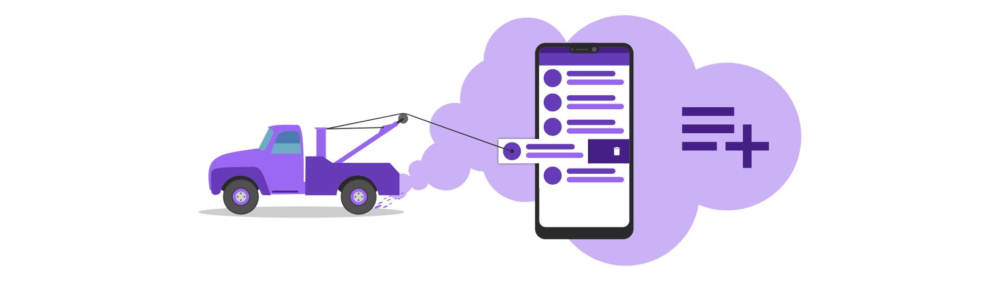

In this tutorial, you will learn how to create a react list component where each element can be swiped to trigger an action.

A typical example of this is "swipe to delete" used in many android applications.

We will discover, how we can build such a list using nothing but react itself.

Also, you will learn, how to add smooth animations to make the list feel even more natural to use.

Ad the end you will have a generic component, that can be used across all of your projects:


Ready?

Let's get started!


## Setting up a new React project

Before we get started, we need to set up a new react project. To do we will create the create-react-app-tool.

To create a new project, open a new terminal window and type:

```
 npx create-react-app swipeable-list

```

Because this project has no dependencies other than react, that is all that we need to do.


## Creating a swipeable list component

Let's start by creating the swipeable list component. To do that, go ahead and create a directory called SwipeableList inside of the src directory. This is to keep our component nice and tidy in one folder.

Afterward, create two new files called SwipeableList.js and SwipeableList.css inside of the SwipeableList directory.

The SwipeableList component will not have any functionality other than to wrap the SwipeableListItem components we are going to create later. This wrapper would allow us to add some styling to the overall list, e.g. apply padding.

So all we do is rendering the components' children inside of a wrapper-div with the class "List".

```jsx title=src/SwipeableList/SwipeableList.js
import React, { Component } from 'react'
import './SwipeableList.css'

class SwipeableList extends Component {
  render() {
    const { children } = this.props
    return <div className="List">{children}</div>
  }
}

export default SwipeableList
```

The CSS for the "List" class is quite simple. We just set the div to match its parent dimensions. Feel free to add styling as you like!

```css title=src/SwipeableList/SwipeableList.css
.List {
  flex: 1;
  width: 100%;
  height: 100%;
}
```



## Creating the swipeable list item

Now that we have created the SwipeableList component we can go ahead and create the actual list item. This is where all the swipe-magic is going to happen.

Again, we create a new component by creating two new files called SwipeableListItem.js and SwipeableListItem.css inside of the SwipeableList directory.

We start with a very basic component like this:

```jsx title=src/SwipeableList/SwipeableListItem.js
import './SwipeableListItem.css'
import React from 'react'

class SwipeableListItem extends React.Component {
  render() {
    return <></>
  }
}

export default SwipeableListItem
```

The layout
Next, we are going to take a look at the layout of our component.

The component has two layers. A foreground, which will contain the content of the list item and can be swiped from right to the left, and a background, that appears in a different color and has some text to it.

```jsx title=src/SwipeableList/SwipeableListItem.js
import './SwipeableListItem.css'
import React from 'react'

class SwipeableListItem extends React.Component {
  render() {
    return (
      <>
        <div className="Wrapper">
          <div className="Background">
            <span>Delete</span>
          </div>
          <div className="ListItem">{this.props.children}</div>
        </div>
      </>
    )
  }
}

export default SwipeableListItem
```

Again, the SwipeableListItem does not contain the content itself. Instead, it expects it to be passed via its children (this.props.children). That way, we keep the component reusable, because any content can be projected inside of the container.

For example:

```
 <SwipeableListItem>
  <h1>Hello World</h1>
</SwipeableListItem>

```

Adding element references
To be able to manipulate the different layers and implement the swipe functionality later, we need a direct reference to the DOM element.

We can save a reference by using the ref attribute provided by react:

```jsx title=src/SwipeableList/SwipeableListItem.js
import './SwipeableListItem.css'
import React from 'react'

class SwipeableListItem extends React.Component {
  // DOM Refs
  listElement
  wrapper
  background

  render() {
    return (
      <>
        <div className="Wrapper" ref={div => (this.wrapper = div)}>
          <div ref={div => (this.background = div)} className="Background">
            <span>Delete</span>
          </div>
          <div ref={div => (this.listElement = div)} className="ListItem">
            {this.props.children}
          </div>
        </div>
      </>
    )
  }
}

export default SwipeableListItem
```

Binding functions
In the next chapter, we are going to create a lot of methods. To be able to keep the this-reference inside of them, we need to bind them. Let's do so in the components' constructor.

```jsx title=src/SwipeableList/SwipeableListItem.js
 constructor(props) {
    super(props);

    this.listElement = null;
    this.wrapper = null;
    this.background = null;

    this.onMouseMove = this.onMouseMove.bind(this);
    this.onTouchMove = this.onTouchMove.bind(this);
    this.onDragStartMouse = this.onDragStartMouse.bind(this);
    this.onDragStartTouch = this.onDragStartTouch.bind(this);
    this.onDragEndMouse = this.onDragEndMouse.bind(this);
    this.onDragEndTouch = this.onDragEndTouch.bind(this);
    this.onDragEnd = this.onDragEnd.bind(this);
    this.updatePosition = this.updatePosition.bind(this);
    this.onSwiped= this.onSwiped.bind(this);
  }

```

While we are at it, we can also initialize the ref-variables to null.


## How to implement the swipe functionality?

Alright! Let's start implementing the swipe functionality itself!

To do so, we need to create some properties inside of the component.

```jsx title=src/SwipeableList/SwipeableListItem.js
// Drag & Drop
dragStartX = 0
left = 0
dragged = false
```

When the user is touching the list item, we keep track of where exactly he started dragging by setting the "dragStartX" variable. Also we set the "dragged" variable to true. We then update the variable "left" every time the cursor (or the finger) moves.

Here is what that looks like in more detail:

onDragStart
When the user starts dragging the item, we need to react to that by setting "dragStartX" and "dragged" accordingly.

To do so, we define two methods. One for the mouse event and one for the touch event. We need to do so because their API is slightly different. If you don't care about mouse support, feel free to drop that part.

```jsx title=src/SwipeableList/SwipeableListItem.js
 onDragStartMouse(evt) {
  this.onDragStart(evt.clientX);
  window.addEventListener("mousemove", this.onMouseMove);
}

onDragStartTouch(evt) {
  const touch = evt.targetTouches[0];
  this.onDragStart(touch.clientX);
  window.addEventListener("touchmove", this.onTouchMove);
}

```

Both of these methods calling a general method called onDragStart. This is where the shared logic is placed. Afterward, both methods add an event listener for the move event.

Inside of the onDragStart method, we adjust our properties. Then, we use the [requestAnimationFrame ](https://developer.mozilla.org/en-US/docs/Web/API/window/requestAnimationFrame)function to request a callback. Inside of this callback, we will take care of the style adjustments that need to happen to move the foreground to the position of the cursor.

```jsx title=src/SwipeableList/SwipeableListItem.js
 onDragStart(clientX) {
  this.dragged = true;
  this.dragStartX = clientX;
  requestAnimationFrame(this.updatePosition);
}

```

These methods are registered accordingly at the div-element of the foreground:

```jsx title=src/SwipeableList/SwipeableListItem.js
<div
  ref={div => (this.listElement = div)}
  onMouseDown={this.onDragStartMouse}
  onTouchStart={this.onDragStartTouch}
  className="ListItem"
>
  {this.props.children}
</div>
```

onTouchMove
When the user is touching the list item, we are registering new event listeners to the "touchmove" and "mousemove" events. Now we need to react to these position changes by adjusting the "left" variable accordingly.

We do so by subtracting the value of dragStartX, which is the offset of the cursor to the top-left of the list item, from the position of the cursor. Without the offset, the top-left corner would always jump to the position of the cursor. We don't want that.

```jsx title=src/SwipeableList/SwipeableListItem.js
 onMouseMove(evt) {
  const left = evt.clientX - this.dragStartX;
  if (left < 0) {
    this.left = left;
  }
}

onTouchMove(evt) {
  const touch = evt.targetTouches[0];
  const left = touch.clientX - this.dragStartX;
  if (left < 0) {
    this.left = left;
  }
}

```

We also make sure that the result is always lower than zero. This is because we only want to allow swiping to the left but not to the right.

onDragEnd
Finally, we need to handle the event that the user finished dragging the list item.

Again, we need three methods. Two for the mouse and touch specific part and one for the shared logic.

In the specific methods we only make sure to unsubscribe from the move-event as we don't need it anymore.

```jsx title=src/SwipeableList/SwipeableListItem.js
 onDragEndMouse(evt) {
  window.removeEventListener("mousemove", this.onMouseMove);
  this.onDragEnd();
}

onDragEndTouch(evt) {
  window.removeEventListener("touchmove", this.onTouchMove);
  this.onDragEnd();
}

```

In the shared method "onDragEnd" we need to evaluate if the user has moved the list item over a certain threshold that triggers the deletion of the item.

If that is the case, we set the "left" variable to a very low value. This will cause the element to disappear to the left.

Otherwise, we set left to zero. That way the list item will return to its origin.

```jsx title=src/SwipeableList/SwipeableListItem.js
 onDragEnd() {
  if (this.dragged) {
    this.dragged = false;

    const threshold = this.props.threshold || 0.3;

    if (this.left < this.listElement.offsetWidth * threshold * -1) {
      this.left = -this.listElement.offsetWidth * 2;
      this.onSwiped();
    } else {
      this.left = 0;
    }
  }
}

```

In this example, the threshold can be controlled via a property called "threshold". If that property is not provided, a fallback value of 0.3 is used. This means that the list item has to be moved around a third of its width to the left to trigger the delete event.

In that case, the property "onSwipe" is called if possible. That is done using the "onSwipe" method:

```jsx title=src/SwipeableList/SwipeableListItem.js
   onSwiped() {
    if (this.props.onSwipe) {
      this.props.onSwipe();
    }
  }

```

The required event listeners for this are added when the component mounts

```jsx title=src/SwipeableList/SwipeableListItem.js
 componentDidMount() {
  window.addEventListener("mouseup", this.onDragEndMouse);
  window.addEventListener("touchend", this.onDragEndTouch);
}

```

Removing event listeners
To prevent memory leaks, we need to remove these listeners when the component is destroyed:

```jsx title=src/SwipeableList/SwipeableListItem.js
 componentWillUnmount() {
  window.removeEventListener("mouseup", this.onDragEndMouse);
  window.removeEventListener("touchend", this.onDragEndTouch);
}

```

Updating the list item position
All that is left to do, is to update the position.

We move the list item to the left by applying the style-attribute "translateX" to the value of "left" we computed.

To do so, we are using the element reference we created earlier.

Rember: updatePosition is not called by us but by the browser approximately 60 times per second. We told the browser to do so by using the requestAnimationFrame function.

Adding Styles
For the background and the foreground to be on top of each other, one of the elements has to have the CSS position attribute set to absolute.
In our case, it is the background.

For the background to actually appear in the background, it has to have a lower z-index than the foreground.

```css title=src/SwipeableList/SwipeableListItem.css
.ListItem {
  width: 100%;
  align-items: center;
  box-sizing: border-box;
  background-color: #fff;
  height: 100%;
  display: flex;
}

.Background {
  position: absolute;
  width: 100%;
  height: 100%;
  z-index: -1;
  display: flex;
  flex-direction: row;
  justify-content: flex-end;
  align-items: center;
  padding-right: 16px;
  color: white;
  background-color: #663bb7;
  box-sizing: border-box;
}

.Wrapper {
  position: relative;
  overflow: hidden;
  width: 100%;
}
```


## Adding animations

To make our swipeable list feel right, we need to add some animations when the user is done dragging the item.

If the threshold is reached the item should swipe out to the left. Otherwise, the item should bounce back to its original position.

Since we are already modifying the translateX attribute accordingly, all we need to do is to add a CSS transition to that attribute:

```
 transition: transform 0.5s ease-out;

```

There is only one problem: We only want this animation to appear when the user is not dragging the item anymore. Otherwise, the item lags behind the cursor.

To fix that, we are creating a second CSS class called "BouncingListItem" and switch it out with the original "ListItem" when onDragEnd is called:

```jsx title=src/SwipeableList/SwipeableListItem.js
 onDragEnd() {
  if (this.dragged) {
    this.dragged = false;

    const threshold = this.props.threshold || 0.3;

    if (this.left < this.listElement.offsetWidth * threshold * -1) {
      this.left = -this.listElement.offsetWidth * 2;
      this.wrapper.style.maxHeight = 0;
      this.onSwiped();
    } else {
      this.left = 0;
    }

    // Add this:
    this.listElement.className = "BouncingListItem";

    this.listElement.style.transform = `translateX(${this.left}px)`;
  }
}

```

When the user starts dragging again, we switch it back to the original "ListItem" class:

```jsx title=src/SwipeableList/SwipeableListItem.js
 onDragStart(clientX) {
  this.dragged = true;
  this.dragStartX = clientX;

  // Add this:
  this.listElement.className = "ListItem";

  requestAnimationFrame(this.updatePosition);
}

```

The corresponding CSS class looks like this:

```css title=src/SwipeableList/SwipeableList.css
.BouncingListItem {
  transition: transform 0.5s ease-out;
  width: 100%;
  align-items: center;
  box-sizing: border-box;
  background-color: #fff;
  height: 100%;
  display: flex;
}
```

Fading the background in and out (optional)
Another nice effect is to fade the background in and out depending on the distance the item has been moved from the right.

To do that, we use the "left" variable to set the opacity style attribute accordingly:

```jsx title=src/SwipeableList/SwipeableListItem.js
 updatePosition() {
  if (this.dragged) requestAnimationFrame(this.updatePosition);


    this.listElement.style.transform = `translateX(${this.left}px)`;

    // Fade the opacity
    const opacity = (Math.abs(this.left) / 100).toFixed(2);
    if (opacity < 1 && opacity.toString() !== this.background.style.opacity) {
      this.background.style.opacity = opacity.toString();
    }
    if (opacity >= 1) {
      this.background.style.opacity = "1";
    }
}

```

Shrinking the list item when swiped (optional)
Also, we can let the list item slow shrink when it is removed from the screen. That makes for a better effect than just letting it disappear from one second to another.

To do that, we need to use the max-height attribute. First, we apply a very high max-height attribute to the Wrapper CSS class. Also, we add a transition to the max-height attribute:

```css title=src/SwipeableList/SwipeableList.css
.Wrapper {
  position: relative;
  transition: max-height 0.5s ease;
  max-height: 1000px;
  transform-origin: top;
  overflow: hidden;
  width: 100%;
}
```

When the user is done swiping and the threshold is passed, we set the max-height to zero like so:

```jsx title=src/SwipeableList/SwipeableListItem.js
 onDragEnd() {
  if (this.dragged) {
    this.dragged = false;

    const threshold = this.props.threshold || 0.3;

    if (this.left < this.listElement.offsetWidth * threshold * -1) {
      this.left = -this.listElement.offsetWidth * 2;

      // Add this:
      this.wrapper.style.maxHeight = 0;
      this.onSwiped();
    } else {
      this.left = 0;
    }

    this.listElement.className = "BouncingListItem";
    this.listElement.style.transform = `translateX(${this.left}px)`;
  }
}

```


## Improving reusability

We already made the component pretty reusable by projecting the content into the swipeable list item component. But what about the background?

Maybe the user of the component (you) does not want to use the list to delete stuff. So having a hard-coded "delete" text in there seems pretty inappropriate.

Alright, so why don't we create a property that can contain any JSX element?

That way, it is completely up to the user what he wants to see in the background.

It is also pretty simple to implement. Just change the background-div to this:

```jsx title=src/SwipeableList/SwipeableListItem.js
<div ref={div => (this.background = div)} className="Background">
  {this.props.background ? this.props.background : <span>Delete</span>}
</div>
```

Now the user of the component can override the background like so:

```jsx title=src/App.js
import React, { Component } from 'react'
import SwipeableListItem from './SwipeableList/SwipeableListItem'
import SwipeableList from './SwipeableList/SwipeableList'
import './App.css'

const background = <span>Archive</span>
const fakeContent = (
  <div className="FakeContent">
    <span>Swipe to delete</span>
  </div>
)

class App extends Component {
  render() {
    return (
      <div className="App">
        <SwipeableList>
          <SwipeableListItem background={background}>
            {fakeContent}
          </SwipeableListItem>
          <SwipeableListItem background={background}>
            {fakeContent}
          </SwipeableListItem>
          <SwipeableListItem background={background}>
            {fakeContent}
          </SwipeableListItem>
        </SwipeableList>
      </div>
    )
  }
}

export default App
```

Going even further
But what if I want to replace the background of every list element? Specifying the property for every component seems quite verbose.

Luckily, we can adjust the SwipeableList component to pass the background property to every child. That way we do not have to specify it on every item:

```jsx title=src/SwipeableList/SwipeableList.js
import React, { Component } from 'react'
import './SwipeableList.css'

class SwipeableList extends Component {
  render() {
    const { children } = this.props

    const childrenWithProps = React.Children.map(children, child => {
      if (!child.props.background) {
        return React.cloneElement(child, { background: this.props.background })
      }
      return child
    })

    return <div className="List">{childrenWithProps}</div>
  }
}

export default SwipeableList
```

Now we have to pass the property only to the list:

```jsx title=src/App.js
import React, { Component } from 'react'
import SwipeableListItem from './SwipeableList/SwipeableListItem'
import SwipeableList from './SwipeableList/SwipeableList'
import './App.css'

const background = <span>Archive</span>
const fakeContent = (
  <div className="FakeContent">
    <span>Swipe to delete</span>
  </div>
)

class App extends Component {
  render() {
    return (
      <div className="App">
        <SwipeableList background={background}>
          <SwipeableListItem>{fakeContent}</SwipeableListItem>
          <SwipeableListItem>{fakeContent}</SwipeableListItem>
          <SwipeableListItem>{fakeContent}</SwipeableListItem>
          <SwipeableListItem>{fakeContent}</SwipeableListItem>
          <SwipeableListItem>{fakeContent}</SwipeableListItem>
        </SwipeableList>
      </div>
    )
  }
}

export default App
```

## Conclusion

In this tutorial, we learned how to create a swipeable list component.


You can find the full source code at the corresponding [Github Repository](https://github.com/LukasMarx/react-swipeable-list-tutorial).

I hope you enjoyed this post.

If you did please hit the share buttons below and help other people building their own swipeable list components, as well.

Thanks for reading!
