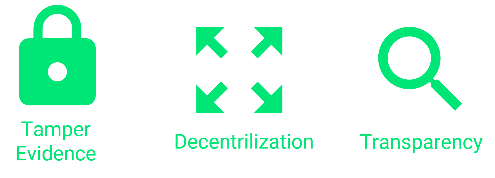
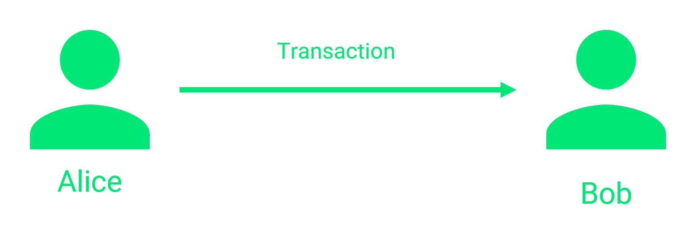
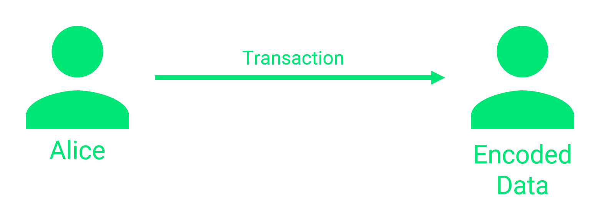
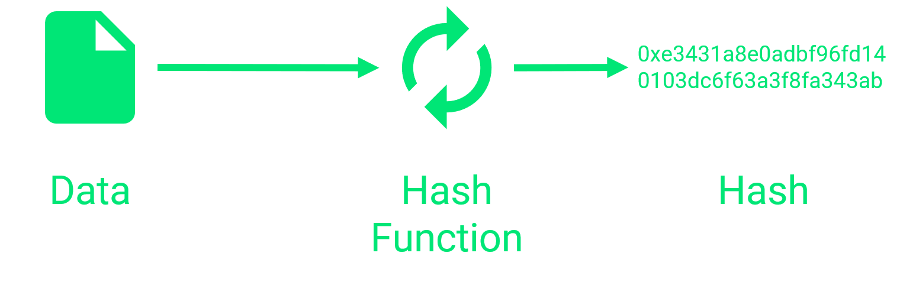
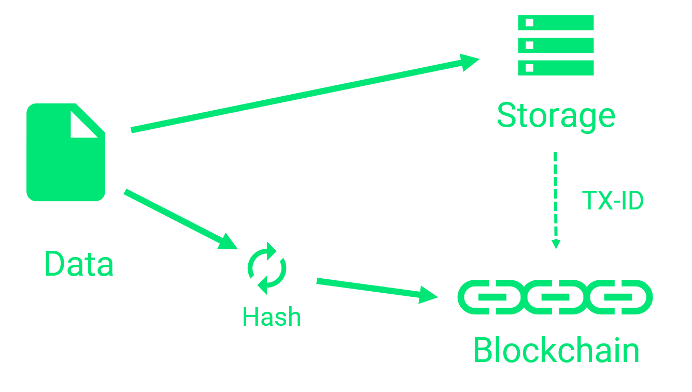
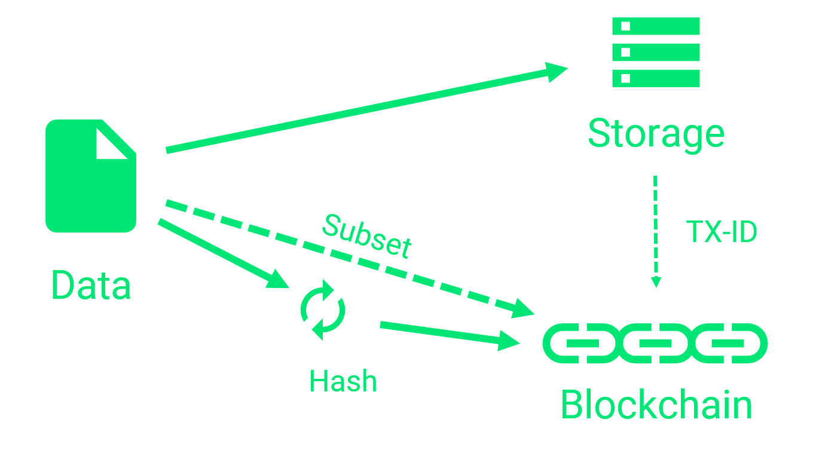

Storing data on the blockchain is not as simple as it sounds. There are many problems that can make this task quite difficult.

In this tutorial we are going to take a look at the problem from a developers point of view. No fancy business slides or buzzword bullshit!
We will take a look how we could actually build a blockchain application.

That said, we will not dive into code here. I will leave that up for another post.
Instead we will discuss the architecture and design decisions one would have to make before actually writing the first line of code.

As we will discover, there are many possible solutions for the problem of storing data on the blockchain.
None of them is far superior. None is absolutely useless.

It all depends on your use case.

After reading this, you will have an overview of all possible approaches.
It will then be up to you to choose your solution.

Ready?

Let's get started!

## Why would you want to store data on the Blockchain?

The fist question you have to ask yourself is: "Why do you want to use a blockchain?"

If you don't know the answer right now, you don't need a blockchain. Period.
Don't let people confuse you with all this hype going on!

Why am I so harsh on this?

Well, let me put it this way. Blockchain sucks. Except in 2 or 3 edge cases.

It's slow, complex, expensive and hard to work with.

Choosing blockchain because it is hip and trendy is like bringing a tank to a race.

It might look impressive and you are bulletproof, but after all, you will loose the race big time.

Look, all I want to say is, you should always choose the right tool for the job.

Rant over!

### Where Blockchain really shines

You should only use blockchain if one or more point(s) apply to your use case:

Tamper-Evidence
You want to be able to tell, when a dataset has changed. You need proof that/when it was (not) changed.

Decentralization
You don't want to have a central authority. Instead you want to give the control over the data to the network, because you can't trust the parties involved.

Transparency
You want your data to be visible to everyone to establish trust.

## Using Transactions to store data on the Blockchain

Blockchains, especially the ones designed to host a currency, are using a transaction model.

For example "Alice send money to Bob" is a transaction. This transaction holds the address of the sender (Alice), the address of the receiver (Bob), the amount of money transferred.

This approach is very intuitive when it comes to money-transactions, but how on earth are we supposed to store data with this concept?

To store our custom data on the blockchain, we need to package our data into transactions to be able to store it.

### Using the Protocol

Some blockchains offer the possibility to append data to a transaction within their protocols. In this case we can simply append our data to our transaction.

If that is not the case, we need to get a little bit more creative.

### Getting creative

Some blockchains do not have that feature.

In this case we can still store a tiny amount of data on the chain by using addresses.

To save some data we just encode it (if necessary) and use it as an address to send a transaction to.
By doing so, the data is stored in the blockchain. Instead of using some payload field inside of the transaction, the data is encoded into the receiving address.

The downside of this technique is, that the amount of data cannot be larger than the blockchains address size (which is tiny).
Furthermore, we not only have to pay the transaction fee, but also have to burn a little bit of money.

That is, because we do not own the address we send the transaction to, so the money we transfer is lost.

## Why is storing Data On-Chain a Problem?

The biggest problem of storing data on a blockchain is the amount of data you can store. This is either because the amount is limited by the protocol or because of the huge transaction fees you would have to pay.

### The Cost of Storing Data

So why is storing data on the chain is so expensive?
Because the amount of data you store has to be stored by every full node on this planet. Everyone that downloads the blockchain is downloading your piece of data, as well.

This is why even storing kilobytes can cost you are fortune.

When storing data on the blockchain, most often we do pay a base price for the transaction itself plus an amount per byte we want to store.
If smart contracts are involved, we also pay for the execution time of the smart contract.

### How much Data can be stored in a Blockchain?

Nether the less, the amount of data we can store is quite limited.
To give you a feeling, most chains allow something in the range of kilobytes or less.

Theoretically we could circumvent that limitation by splitting up our data into many small chunks. That would allow us to store larger files/data but also would significantly increase our costs.
This is because we would have to pay the (large) base price of the transaction multiple times.

So after all, the amount of data we can store is quite limited.

### Storing Sensible Information on the Blockchain

Another problem when storing data on the blockchain emerges, when we consider saving personal or confidential data.

Actually there are two problems here:

1. If we chose a public blockchain like ethereum, the data we store would be available to everyone. This is because in a blockchain network, (almost) every participant has a copy of the entire chain. But even if you decided to build our own private chain, every participant would get a copy. The difference here is, that we have control over who is joining the network and gets a copy.

2. Most personal or confidential information needs to be deleted at some point. Especially considering the new GDPR. Unfortunately, deleting data from the chain is not possible by design.

One solution to this problem could be the encryption of the data. The downside of this approach is, that we now have to deal with encryption keys (which have to be stored somewhere else) and their distribution.

Another solution could be storing hashes of the data instead of the data itself. We will discuss this approach in a later chapter in more detail.

### Where did my data go? Querying data from the Blockchain

Alright. Despite the problems described above, we somehow managed to get our data on the blockchain...

How do we get the back, in case we need them?

A blockchain is no SQL server where we could query for our data.

In fact, most blockchains only allow for downloading transactions by their id (hash).

So how do we solve all these problems?

## How to store large Datasets on the Blockchain

So, if storing data on the blockchain comes with so many downsides, does it even make sense to store anything on the blockchain?

Yes it does!

It turns out, there are many ways to store data on the blockchain. Storing the raw data is one of them.

But what are the other options?

### Storing Hashes on the Blockchain

One way of getting the benefits of a blockchain while not paying a fortune for transactions is only storing the hash of the data in the blockchain.

What is a hash?
A hash is a generated string, that is computed using our data is input. With the same input, the output hash will always be the same. Other input does result in another hash.

That way we can tell if our data was modified by just looking at the hash.

Using traditional storage mechanisms
The only thing we store on the blockchain is the hash of our data. In comparison to our data, the hash is very small so the cost of a transaction is relatively low.

The raw data can be stored in any way we want. For example, we could use a relational database or just a file system.

All we need to do, is to make sure, that we assign the id (hash) of the blockchain transaction to our raw data. In a relational database we would add another column to store the transaction id.

That way, we can utilize the advantages of traditional storage mechanisms (like queries) while still getting the tamper-evidence of the blockchain.

Any time, there is doubt about the data, we can hash the raw data and compare it to the hash in the assigned transaction in the blockchain.

Depending on your storage mechanism, benefits like decentralization and transparency are lost.

### Storing a Subset of the Data on the Blockchain

We can get back those benefits to a certain degree, by storing the hash of the data and parts of the data on the blockchain.

Depending on the parts of the data we get back some transparency, because the data is now publicly accessible again.

Also, the subset of the data is stored decentralized instead of stored in a central database.

## Options for Storing Data Off-Chain

As we discovered already, it is probably a good idea to use some sort of off-chain mechanism to store large amounts of data.

As always, there are many options to choose from. Some are totally old-school and some where developed in the last couple of years to work especially with blockchain.

### Traditional Database

Let's start with the obvious choice. A traditional database like MySQL or even a, a little bit more modern, MongoDB.

Pros

- Strong querying capabilities
- Cheap storage for large amounts of data

Cons

- Single point of failure
- Controlled by one central authority
- Missing Transparency

### Distributed Database

In a distributed database, the data is replicated across many nodes in many locations. This does create a redundancy in case of failure of a single machine. It also can reduce latency for world-scale applications.
Examples could be MongoDB with replica-sets enabled or cloud-solutions like Azure CosmosDB.

Pros

- Strong enough querying capabilities
- Cheap storage for large amounts of data compared to blockchain
- Redundancy of the data

Cons

- Controlled by one central authority
- Missing Transparency

### Distributed Filesystem

Distributed filesystems store their files across many machines, as well. Again, this is to create redundancy in case of a failure. The difference to distributed databases is, that a file system does not have the strong query capabilities. Instead, files can only be accessed by knowing the name/path of the file.

Also, some distributed file-systems like IPFS (Inter-Planetary File System) are meant as a community effort. Just like with blockchain there is a public network where everybody can store their files. The difference here is, that not everybody has to store a copy of the data. A redundancy of x copies is considered enough.

Pros

- Storage for large amounts of data compared to blockchain
- Redundancy of the data
- Transparency
- Decentralized

Cons

- No query capabilites

## Conclusion

In this tutorial we got an overview of the problems and solutions for storing (large amounts of) data on the blockchain.

I hope you now have a feeling for the situation and the possible directions. After all, it is up to you to choose the right solution for your special use case.

If you liked this overview, please consider sharing it!
