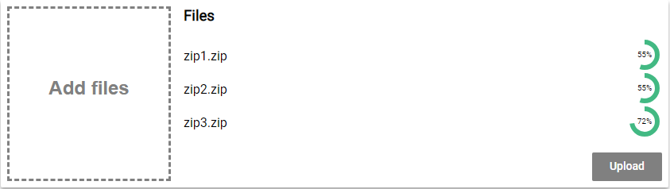

Creating file-upload components can be quite hard.

Not only because you need to deal with files in JavaScript. Also, because you need an API to test against before you can actually start coding.

In this tutorial, we will learn how to do both.

<AffiliateAd tag="vue" />

First, we will create a simple express server with just one route to accept file uploads.
This server will be written entirely in TypeScript.

Afterward, we will create a vue application from scratch and build a beautiful file-upload component using nothing but vue itself with TypeScript.

Here is what the final result will look like:



Ready?

Let's start coding!


## Creating the Express Server to Upload To

Before we can start writing our angular file-uploader, we need to have an API to upload to right?

In this tutorial, we are going to create a simple node.js server using express, that allows files to be uploaded in the multipart-format.

### Setting up a new Project

To set up a new server project, create a new directory and initialize a new project using the

```
 npm init

```

command. It will ask you for some information. You can pass it in or just hit enter.

We will also need two TypeScript files. Create the following files in the project directory:

server.ts
upload.ts

### External Dependencies

Our server will have three external dependencies.

The first one is obviously express. [Express](http://expressjs.com/de/) is a framework, that makes creating API very easy.
To install express, you can use this command

```
 npm install express

```

Because we want to access the API from an angular application, the server needs to allow cross-origin requests.
Therefore we are going to use a simple module called [CORS](https://de.wikipedia.org/wiki/Cross-Origin_Resource_Sharing).
To install it, type:

```
 npm install cors

```

Also, express itself is not very good at understanding forms. Because we will be uploading our files in the multipart/form-data format, we need to be able to parse this format.
The library "formidable" does this and is quite easy to use.
Install formidable using this command:

```
 npm install formidable

```

### Types

Because we will be using TypeScript for our server, we also have to install the type for each library.
We can easily do so like this:

```
 npm install -D @types/formidable @types/express @types/cors

```

Also, we need to add TypeScript to the project.

```
 npm install -D typescript

```

tsconfig.json
To let the TypeScript compiler know how to compile our files to JavaScript, we need to specify a tsconfig.json.

Create a file called "tsconfig.json" inside of the projects root directory.

The file itself looks like this:

```javascript title=tsconfig.json
 {
  "compilerOptions": {
    "module": "commonjs",
    "esModuleInterop": true,
    "target": "es6",
    "noImplicitAny": true,
    "moduleResolution": "node",
    "sourceMap": true,
    "outDir": "dist",
    "baseUrl": ".",
    "paths": {
      "*": ["node_modules/*", "src/types/*"]
    }
  },
  "include": ["src/**/*"]
}

```

### Scripts

Last but not least, we set up a script in the package.json script section. We will later use that script to compile and start our server:

```javascript title=package.json
 ...
"scripts": {
    "start": "tsc && node dist/server.js"
  },
...

```


## Setting up a basic Express Server

First, we need to create a basic express server in the server.ts file. This part looks always the same and consists of only 3 lines.

```typescript title=src/server.ts
import express from 'express'

const server = express()

server.listen(3000, () => {
  console.log('Server started!')
})
```

This is already a working express server. Although it is not doing anything useful, we could start it using the

```
 npm start

```

command.

### Enabling CORS

To be able to access our API from an angular application, we need to enable cors.
To do so, we first need to require CORS.

```typescript title=src/server.ts
import cors from 'cors'
```

Next, we configure it to allow any domain by creating an option-object.

```typescript title=src/server.ts
const corsOptions = {
  origin: '*',
  optionsSuccessStatus: 200,
}
```

Finally, we tell express to use the cors-middleware with our configuration.

```typescript title=src/server.ts
server.use(cors(corsOptions))
```

### Registering The Upload Route

Afterward, we need to configure a route for our file upload.

For that, we require our upload.js file and register a route with the HTTP-post method.

```typescript title=src/server.ts
import { upload } from './upload'
server.post('/upload', upload)
```

Now we are done with the server.js file. It should look like this by now:

```typescript title=src/server.ts
import express from 'express'
import { upload } from './upload'
import cors from 'cors'

const server = express()

const corsOptions = {
  origin: '*',
  optionsSuccessStatus: 200,
}

server.use(cors(corsOptions))

server.post('/upload', upload)

server.listen(3000, () => {
  console.log('Server started!')
})
```


## Implementing the Upload Route

Let's start implementing the upload functionality. We will place it into the upload.js file.

First, we need to import a class called IncomingForm from the "formidable" library.

```typescript title=src/upload.ts
import { Request, Response } from 'express'
import { IncomingForm } from 'formidable'
```

After that, we need to export the callback function, we are using in our server.js to register the route. This function will be called, every time somebody hits the '/upload' URL.
This callback gives us a request-object (req), that stores information about the request that hit the route.

We also get a response-object (res). We can use this object, to send back a response.

```typescript title=src/upload.ts
export function upload(req: Request, res: Response) {}
```

Inside of that method, we create a new form.

```typescript title=src/upload.ts
const form = new IncomingForm()
```

We then register callbacks on that form. The first callback is called for every file in the form:

```typescript title=src/upload.ts
form.on('file', (field, file) => {
  // Do something with the file
  // e.g. save it to the database
  // you can access it using file.path
})
```

The uploaded files are stored in a temporary directory somewhere on your machine. To do something with them, you can copy them from there using the node.js file-system API.

The second callback is called when the form is completely parsed. In this case, we want to send back a success status code.

```typescript title=src/upload.ts
form.on('end', () => {
  res.json()
})
```

We then trigger the parsing of the form using:

```typescript title=src/upload.ts
form.parse(req)
```

That's all we will do for the upload functionality. It is production ready, but it will help us to test our upload-component of the angular application we actually want to build.

Here is the complete upload.ts file:

```typescript title=src/upload.ts
import { IncomingForm } from 'formidable'
import { Request, Response } from 'express'

export function upload(req: Request, res: Response) {
  const form = new IncomingForm()
  form.on('file', (field, file) => {
    // Do something with the file
    // e.g. save it to the database
    // you can access it using file.path
    console.log('file', file.name)
  })
  form.on('end', () => {
    res.json()
  })
  form.parse(req)
}
```


## Creating a new Vue project

Before we begin, we need to install the vue-cli, if you haven't done so already.
For this tutorial, we are going to use version 3 of the cli.
You can install it using this command:

```
 npm install -g @vue/cli

```

Afterward, we can use the vue-cli to create a new project for us.
It's probably a good idea to create this project in a different directory than the server project.
To do this, we use the create command followed by the name of our new project:

```
 vue create vue-file-upload

```

It will then ask you to either pick a preset or select features manually. Since we are going to use TypeScript, which is not the default, we want to choose "Manually select features".

Next, we are asked which features we want. Babel and a linter a pre-selected. Let's remove Babel and select TypeScript instead. We do so by navigating with the arrow keys and use space to toggle a feature. Once you are done, press return.

Now, we are asked if we want to use class-style components. Since they are pretty nice in combination with TypeScript, we choose yes.

<AffiliateAd tag="vue" />

Afterward, we have to decide whether we want to use Babel alongside TypeScript. This depends on the browsers you are targeting. If you only want to target the evergreen browsers (Chrome, Firefox, Edge) we are fine with TypeScript itself. Otherwise, you may want to enable polyfills, as well.

At the next step, you can choose whatever linter you want. I'm going with TSLint. Also, since this is just an example, I'm only linting on save (next step).

Finally, we want dedicated config files for each tool.

Afterward, open the project directory with your favorite code editor.


## Creating the Drop-Zone component

The first component we are going to create will be the Drop-Zone component. This component will be a sub-component and be used to add files by clicking or dragging & dropping files onto it.

Let's create a file called DropZone.vue inside of the src/components folder.
As of all components, this file has the following base structure:

```typescript title=src/components/DropZone.vue
 <template>

</template>

<script lang="ts">

</script>

<style scoped>

</style>

```

The first part will contain our template written in HTML. The second part will hold the component's logic written in TypeScript (lang="ts") and the last part will contain the style-sheets (CSS).
The CSS will be scoped, that means that the style does only apply for the component itself, not for other components or the entire app, as that would normally be the case.

### The Drop-Zone template

We will kick this off by taking a look at the template first.

```html title=src/components/DropZone.vue
<template>
  <div
    class="dropzone"
    v-on:click="openFileSelection"
    v-on:dragover="onDragOver"
    v-on:dragleave="onDragLeave"
    v-on:drop="onDrop"
    v-bind:class="{hightlight: hightlight, disabled: !enabled}"
  >
    <div>Add files</div>
    <input
      ref="fileInput"
      class="file-input"
      type="file"
      multiple
      v-on:change="onFileChanged"
    />
  </div>
</template>
```

This is just normal HTML with some special attributes that are meant for vue. For example, we are assigning a bunch of event listeners to the "dropzone" div. But instead of doing so with JavaScript, we are using the v-on directives.
The values we are assigning are actually methods, we will define later.

Also, we are using the v-bind directive here. This enables us to apply CSS-classes to an element based on conditions. In our case, we want the highlight-class to be applied, if the highlight field of our component is true. Again, we will define this field in the next step.

That's already everything to say about this. So let's move on to the script-part of the component.

### The Drop-Zone script

Before we do anything else, we need to import some decorators from a module called 'vue-property-decorator'. This module is automatically installed by the vue-cli, given the settings we chose.

```typescript title=src/components/DropZone.vue
 <script lang="ts">
import { Component, Prop, Vue, Emit } from 'vue-property-decorator';
</script>

```

We also chose to use class-style components. So to define a component, we need to create a class and extend from Vue. We decorate that class with the @Component decorator. Under the hood, that decorator then transforms the class-style component into a regular vue component.

```typescript title=src/components/DropZone.vue
 <script lang="ts">
import { Component, Prop, Vue, Emit } from 'vue-property-decorator';

@Component
export default class DropZone extends Vue {

}
</script>

```

Properties & Fields
Now it's time to implement all the fields, properties and methods we already referenced in out template.
Let's start with the property enabled. This property is meant to control, whether the Drop-Zone will actually accept files. Because we want to control that from outside of the component, we make this field a property by decorating it with the @Prop (=property) decorator.

```
  @Prop({ default: true })
  private enabled!: boolean;

```

Properties are fields that can be set from outside of the component. They are an input, so to speak. If they change (by reference), the component is rendered again.
In this case, we want that property to have a default value, as well. Just in case there is no input for the property.

Next, we need a field called highlight. This field controls the hover-effect, when a file is dragged over the Drop-Zone.

```
 private hightlight = false;

```

Event callbacks
As we have seen there are a bunch of callbacks to be implemented. All of them are triggered by some sort of event.

Let's start by implementing the callback to open the file selection menu, that is triggered by the click-event.

To open the file selection men, we need to use a little hack. We have to virtually trigger a click event on the input element.
To do so, we reference it by the defined reference (ref="fileInput) in the template and call the click method.

Oh, and in case the component is not enabled, we simply return...

```typescript title=src/components/DropZone.vue
 openFileSelection(): void {
  if (!this.enabled) return;
  (<HTMLElement>this.$refs.fileInput).click();
}

```

Next, are the dagover and dragleave callbacks. These are just controlling whether the div is highlighted or not.

```typescript title=src/components/DropZone.vue
 onDragOver(event: DragEvent): void {
  if (!this.enabled) return;
  event.preventDefault();
  this.hightlight = true;
}

onDragLeave(event: DragEvent): void {
  this.hightlight = false;
}

```

Last but not least, there are the onDrop and the onFileChanged callbacks. Both receive a [FileList](https://developer.mozilla.org/en-US/docs/Web/API/FileList) and both convert that FileList into a normal array.
They then emit an event called "filesAdded".

Remember how props are the input of a component? These events are the output.
That way we leave it to a higher component to handle the state.

```typescript title=src/components/DropZone.vue
 onDrop(event: DragEvent): void {
  if (!this.enabled) return;
  event.preventDefault();
  const files = event.dataTransfer.files;
  let result: File[] = [];
  for (var i = 0; i < files.length; i++) {
    result.push(<File>files.item(i));
  }
  this.$emit('filesAdded', result);
  this.hightlight = false;
}

onFileChanged(event: any) {
  let files: FileList = event.target.files;
  let result: File[] = [];
  for (var i = 0; i < files.length; i++) {
    result.push(<File>files.item(i));
  }
  this.$emit('filesAdded', result);
}

```

That's it for the scrip-part. Here is the full section again:

```typescript title=src/components/DropZone.vue
 <script lang="ts">
import { Component, Prop, Vue, Emit } from 'vue-property-decorator';

@Component
export default class DropZone extends Vue {
  @Prop({ default: true })
  private enabled!: boolean;

  private hightlight = false;

  openFileSelection(): void {
    if (!this.enabled) return;
    (<HTMLElement>this.$refs.fileInput).click();
  }

  onDragOver(event: DragEvent): void {
    if (!this.enabled) return;
    event.preventDefault();
    this.hightlight = true;
  }

  onDragLeave(event: DragEvent): void {
    this.hightlight = false;
  }

  onDrop(event: DragEvent): void {
    if (!this.enabled) return;
    event.preventDefault();
    const files = event.dataTransfer.files;
    let result: File[] = [];
    for (var i = 0; i < files.length; i++) {
      result.push(<File>files.item(i));
    }
    this.$emit('filesAdded', result);
    this.hightlight = false;
  }

  onFileChanged(event: any) {
    let files: FileList = event.target.files;
    let result: File[] = [];
    for (var i = 0; i < files.length; i++) {
      result.push(<File>files.item(i));
    }
    this.$emit('filesAdded', result);
  }
}
</script>

```

### The Drop-Zone styles

I'm not a designer and not a CSS expert. These are just some styles I hacked together to make it look somewhat appealing.
I think there is no need to explain them in detail.

```css title=src/components/DropZone.vue
 <style scoped>
.dropzone {
  position: relative;
  border: 3px dashed #42b983;
  color: #42b983;
  font: bold 24px/200px arial;
  height: 100%;
  width: 100%;
  box-sizing: border-box;
  text-align: center;
  cursor: pointer;
}

.hightlight {
  background-color: #b3dbc9;
}

.disabled {
  border: 3px dashed grey;
  color: grey;
}

.file-input {
  display: none;
}
</style>

```


## Creating a circular progress spinner

Because I wanted to have no external dependencies for this project, I decided to build my own progress-indicator.
However, I will not go into detail and just leave this here:

```typescript title=src/components/Progress.vue
 <template>
    <div class="svg-box">
        <svg v-if="state==='pending'" class="svg-box-content" viewbox="0, 0, 112, 112" :height="radius*2 +12" :width="radius*2 +12">
            <circle
                class="progress-ring-circle"
                :stroke="color"
                stroke-width="6"
                :stroke-dasharray="circumference"
                :stroke-dashoffset="strokeDashoffset"
                fill="transparent"
                :r="radius"
                :cx="radius +6"
                :cy="radius +6"/>
                <text x="22" y="25"  class="small" text-anchor="middle">{{Math.floor(percentage) + '%'}}</text>
        </svg>
        <svg v-if="state==='done'"  width="42" height="42" viewBox="0 0 24 24">
            <path d="M0 0h24v24H0z" fill="none"/>
            <path d="M12 2C6.48 2 2 6.48 2 12s4.48 10 10 10 10-4.48 10-10S17.52 2 12 2zm-2 15l-5-5 1.41-1.41L10 14.17l7.59-7.59L19 8l-9 9z" :fill="color"/>
        </svg>

        <svg v-if="state==='error'"  width="42" height="42" viewBox="0 0 24 24">
            <path d="M0 0h24v24H0z" fill="none"/>
            <path d="M12 2C6.48 2 2 6.48 2 12s4.48 10 10 10 10-4.48 10-10S17.52 2 12 2zm1 15h-2v-2h2v2zm0-4h-2V7h2v6z" :fill="errorColor"/>
        </svg>

    </div>
</template>

<script lang="ts">
import { Component, Prop, Vue, Watch } from 'vue-property-decorator';

@Component
export default class Progress extends Vue {
  @Prop() public percentage!: number;

  @Prop({ default: '#42b983' })
  public color!: string;

  @Prop({ default: '#f66' })
  public errorColor!: string;

  @Prop({ default: 'pending' })
  public state!: string;

  public radius: number = 16;
  private circumference = this.radius * 2 * Math.PI;
  private strokeDashoffset = this.circumference;

  @Watch('percentage')
  onPercentageChanged(val: number, oldVal: number) {
    const offset = this.circumference - val / 100 * this.circumference;
    this.strokeDashoffset = offset;
  }

  mounted() {
    this.onPercentageChanged(this.percentage, 0);
  }
}
</script>

<style scoped>
.progress-ring-circle {
  transition: stroke-dashoffset 0.3s;
  transform: rotate(-90deg);
  transform-origin: 50% 50%;
}

.small {
  font-size: 10px;
}

.svg-box {
  display: block;
}
</style>

```


## Creating a ListItem component

To display the files we want to upload, we will create a little wrapper component to represent each file in the list. Each of those list items will get the filename, the current upload state ('idle', 'pending', 'done', 'error') and the progress of the upload in percent.

All it does with the information is to display it (in case of the filename) or pass it to the Progress-component.

```
 <template>
    <div class="row">
        <div class="text">
            {{ filename }}
        </div>
        <div class="progress">
            <Progress :percentage="percentage" :state="uploadState" />
        </div>
    </div>
</template>

<script lang="ts">
import { Component, Prop, Vue } from 'vue-property-decorator';
import Progress from './Progress.vue';

@Component({
  components: {
    Progress
  }
})
export default class ListItem extends Vue {
  @Prop({ default: '' })
  private filename!: string;
  @Prop({ default: 'idle' })
  private uploadState!: string;
  @Prop({ default: 0 })
  private percentage!: number;
}
</script>

<style scoped>
.progress {
  float: left;
}

.text {
  float: right;
  flex: 1;
}
.row {
  height: 42px;
  display: flex;
  flex-direction: row;
  align-items: center;
}
</style>

```

<Box>
  Note, that we need to register components we are using inside of the component
  by specifying them inside of the @Component decorator.
</Box>


## Bringing it all together

Now its time to bring it all together.

We have the DropZone and we have the ListItems. All we need to do is to arrange them in a nice way, right?

<AffiliateAd tag="vue" />

Unfortunately, we need to deal with things like managing the state (for example the list of the files) and uploading the files, as well.

But let's begin by defining the template.

### The App template

Our final design will look like this:


The Drop-Zone on the left and the file list and some buttons on the right.

Implementing the Drop-Zone is quite easy now. We just place our DropZone-component and give it its required inputs. For example, the Drop-Zone should only be enabled, if we are not uploading.
Also, we register to get a callback when files are added.

On the left side, we create one ListItem for each file in the "file" array. As the key for the loop, we are using the name of the file. Also, we pass that name to the list item.

The ListItem also requires the current upload state of its file and the progress in percent. We pass these values as well. To do that, we access the file by its name from a JavaScript object we use as a dictionary.
We also provide default values, just in case the dictionary does not have that key/value pair yet.

```html title=src/App.vue
<template>
  <div id="app">
    <div class="card">
      <div class="dropzone">
        <DropZone :enabled="!uploading" v-on:filesAdded="onFilesAdded" />
      </div>
      <div class="left-side">
        <div class="file-list">
          <h3 style="margin-top:0">Files</h3>
          <ListItem
            v-for="file in files"
            :key="file.name"
            :filename="file.name"
            :uploadState="uploadProgress[file.name] ? uploadProgress[file.name].state : 'idle'"
            :percentage="uploadProgress[file.name] ?  uploadProgress[file.name].percentage : 0"
          />
        </div>
        <button
          v-if="!successfullUploaded"
          v-on:click="uploadFiles"
          :disabled="uploading"
        >
          Upload
        </button>
        <button v-if="successfullUploaded" v-on:click="clearFileList">
          Clear
        </button>
      </div>
    </div>
  </div>
</template>
```

We also place two buttons on the left side. Based on the "successfullUploaded"-flag there is only one button visible at any time. The first one will be used to start the upload while the second one is responsible for clearing the file-list.
The first button will also be disabled when we are currently uploading a file.

### The App script

There are a lot of variables we are referencing in our template.
These variables now all have to implement in the script section.

But before we do that, we import our DropZone- and ListItem-components, alongside with the required decorators.

```typescript title=src/App.vue
 <script lang="ts">
import { Component, Vue } from 'vue-property-decorator';
import DropZone from './components/DropZone.vue';
import ListItem from './components/ListItem.vue';
</script>

```

Next, we create our component. Notice that we import our custom components in @Component decorator.

```typescript title=src/App.vue
@Component({
  components: {
    DropZone,
    ListItem,
  },
})
export default class App extends Vue {}
```

Next, we declare all the fields we need. There is an array called files, which will hold all the files selected by the user.

Also, there is our dictionary uploadProgress which holds the upload state and the progress for each file.

Finally, there are two flags called uploading and succesfullUploaded. Depending on the state of the upload, we will change these flags to triggers some changes in the user interface.

```typescript title=src/App.vue
@Component({
  components: {
    DropZone,
    ListItem,
  },
})
export default class App extends Vue {
  private files: File[] = []
  private uploadProgress: {
    [key: string]: { state: string; percentage: number }
  } = {}
  private uploading = false
  private successfullUploaded = false
}
```

Implementing callbacks
Afterward, it is time to implement the callbacks we have already referenced in our template.

First, there is the "onFilesAdded"-method. This gets called when there are new files added by the user using the Drop-Zone.
In that case, we want to add these new files into our files-array.

We are using the spread-operator here because we need the array reference to change for vue to pick up the changes.

```typescript title=src/App.vue
 onFilesAdded(files: File[]) {
  this.files = [...files, ...this.files];
}

```

Next, we implement the uploadFiles method. This one is triggered by the "upload"-button in our template.
If the button is pressed, we set the flag "uploading" to true, because that is what we are going to do.

Also, we reset the uploadProgress dictionary.
Then we are calling a method "sendRequest" for each file. This method is responsible for actually uploading the file. We will implement this method later.

This method is returning a [promise](https://developer.mozilla.org/de/docs/Web/JavaScript/Reference/Global_Objects/Promise). We collect the promise for each file-upload in an array called promises.

Afterward, we wait for all the promises to resolve using the Promise.all method.

When this promise-bundle resolves, it means all files are uploaded. We can then adjust our flags to represent the current state.

```typescript title=src/App.vue
 async uploadFiles() {
  this.uploading = true;
  this.uploadProgress = {};
  const promises: Promise<any>[] = [];
  this.files.forEach(file => {
    promises.push(this.sendRequest(file));
  });
  try {
    await Promise.all(promises);
    this.uploading = false;
    this.successfullUploaded = true;
  } catch (e) {
    console.log(e);
    this.uploading = false;
    // Just do this for now...
    this.successfullUploaded = true;
  }
}

```

Before we start thinking about the "sendRequest"-method, let's first implement the clearFilesList method real quick.

This method is called by the "clear"-button in our template.

All we do in this method is clear the "files" array. We also reset the "successfullUploaded" flag.

```typescript title=src/App.vue
 clearFileList() {
  this.files = [];
  this.successfullUploaded = false;
}

```

### Uploading the files to the server

Now it's finally time to upload the files to the server.

All we need to do for that is to implement the "sendRequest" method in our App-component.

This method is taking a file as input. It then creates a new [XMLHttpRequest](https://developer.mozilla.org/de/docs/Web/API/XMLHttpRequest) and appends the file to a [FormData](https://developer.mozilla.org/de/docs/Web/API/FormData) object. Before we then send the request to the server, we are registering a bunch of event listeners.

The first one is to listen to to the 'progress' event. That way we can update the progress for that file in our "uploadProgress"-dictionary. Again, once we made changes to that dictionary, we need to override it with a copy of itself. Otherwise, vue would not pick up the change.

The second one is for the 'load' event. This event is fired when the upload was successful. In that case, we update the upload progress and resolve the surrounding promise.

The third event is fired in case of an 'error'. Again, we update the upload progress accordingly but reject the promise this time.

Finally, we are sending the request to the server using its open and send methods.

```typescript title=src/App.vue
 sendRequest(file: File) {
  return new Promise((resolve, reject) => {
    const req = new XMLHttpRequest();

    req.upload.addEventListener('progress', (event: ProgressEvent) => {
      if (event.lengthComputable) {
        this.uploadProgress[file.name] = { state: 'pending', percentage: event.loaded / event.total * 100 };
        this.uploadProgress = { ...this.uploadProgress };
      }
    });
    req.upload.addEventListener('load', (event: Event) => {
      this.uploadProgress[file.name] = { state: 'done', percentage: 100 };
      resolve(req.response);
    });
    req.upload.addEventListener('error', (event: any) => {
      this.uploadProgress[file.name] = { state: 'error', percentage: 0 };
      this.uploadProgress = { ...this.uploadProgress };
      reject(req.response);
    });

    const formData = new FormData();
    formData.append('file', file, file.name);

    req.open('POST', 'http://localhost:3000/upload');
    req.send(formData);
  });
}

```

Here is the complete script section of the App.vue file:

```
 <script lang="ts">
import { Component, Vue } from 'vue-property-decorator';
import DropZone from './components/DropZone.vue';
import ListItem from './components/ListItem.vue';

@Component({
  components: {
    DropZone,
    ListItem
  }
})
export default class App extends Vue {
  private files: File[] = [];
  private uploadProgress: { [key: string]: { state: string; percentage: number } } = {};
  private uploading = false;
  private successfullUploaded = false;

  onFilesAdded(files: File[]) {
    this.files = [...files, ...this.files];
  }

  async uploadFiles() {
    this.uploading = true;
    this.uploadProgress = {};
    const promises: Promise<any>[] = [];
    this.files.forEach(file => {
      promises.push(this.sendRequest(file));
    });
    try {
      await Promise.all(promises);
      this.uploading = false;
      this.successfullUploaded = true;
    } catch (e) {
      console.log(e);
      this.uploading = false;
      // Just do this for now...
      this.successfullUploaded = true;
    }
  }

  sendRequest(file: File) {
    return new Promise((resolve, reject) => {
      const req = new XMLHttpRequest();

      req.upload.addEventListener('progress', (event: ProgressEvent) => {
        if (event.lengthComputable) {
          this.uploadProgress[file.name] = { state: 'pending', percentage: event.loaded / event.total * 100 };
          this.uploadProgress = { ...this.uploadProgress };
        }
      });
      req.upload.addEventListener('load', (event: Event) => {
        this.uploadProgress[file.name] = { state: 'done', percentage: 100 };
        resolve(req.response);
      });
      req.upload.addEventListener('error', (event: any) => {
        this.uploadProgress[file.name] = { state: 'error', percentage: 0 };
        this.uploadProgress = { ...this.uploadProgress };
        reject(req.response);
      });

      const formData = new FormData();
      formData.append('file', file, file.name);

      req.open('POST', 'http://localhost:3000/upload');
      req.send(formData);
    });
  }

  clearFileList() {
    this.files = [];
    this.successfullUploaded = false;
  }
}
</script>

```

Great! All that's left now is adding some styles!

### The App style sheets

Again, I will just leave this here without a comment, in case you want to use the style sheets as well.

```css title=src/App.vue
 <style>
body {
  height: 100%;
  width: 100%;
  margin: 0;
  padding: 0;
}

#app {
  font-family: 'Roboto', Helvetica, Arial, sans-serif;
  -webkit-font-smoothing: antialiased;
  -moz-osx-font-smoothing: grayscale;
  margin-top: 20%;
  box-sizing: border-box;
  display: flex;
  flex: 1;
  flex-direction: column;
}
.card {
  background: #fff;
  border-radius: 2px;
  display: flex;
  height: 50%;
  width: 50%;
  box-shadow: 0 3px 6px rgba(0, 0, 0, 0.16), 0 3px 6px rgba(0, 0, 0, 0.23);
  padding: 8px;
  box-sizing: border-box;
  align-self: center;
}

button {
  font-family: 'Roboto medium', sans-serif;
  font-size: 14px;
  height: 36px;
  min-width: 88px;
  padding: 6px 16px;
  line-height: 1.42857143;
  text-align: center;
  white-space: nowrap;
  vertical-align: middle;
  -ms-touch-action: manipulation;
  touch-action: manipulation;
  cursor: pointer;
  -webkit-user-select: none;
  -moz-user-select: none;
  -ms-user-select: none;
  width: auto;
  user-select: none;
  border: 0;
  border-radius: 2px;
  background: #42b983;
  color: #fff;
  outline: 0;
  align-self: flex-end;
}

button:disabled {
  background: grey;
}

.dropzone {
  width: 25%;
  float: left;
}

.file-list {
  float: left;
  padding-left: 16px;
  box-sizing: border-box;
  display: flex;
  flex: 1 1 auto;
  flex-direction: column;
  margin-bottom: 16px;
}

.left-side {
  display: flex;
  flex-direction: column;
  flex: 1 1 auto;
}
</style>

```

## Conclusion

In this tutorial, you have learned how to create a full file-upload experience.

<AffiliateAd tag="vue" />

Did you have trouble keeping an overview of all the source code?
Don't worry, take a look at the [GitHub Repository](https://github.com/LukasMarx/vue-file-upload)!

I hope you liked this post! If you did, please consider sharing it!

Happy coding!
